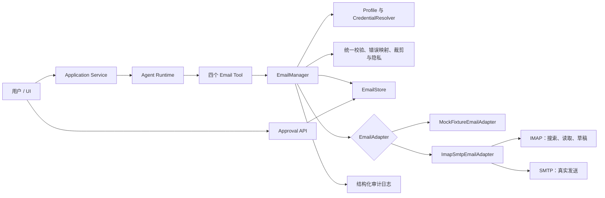
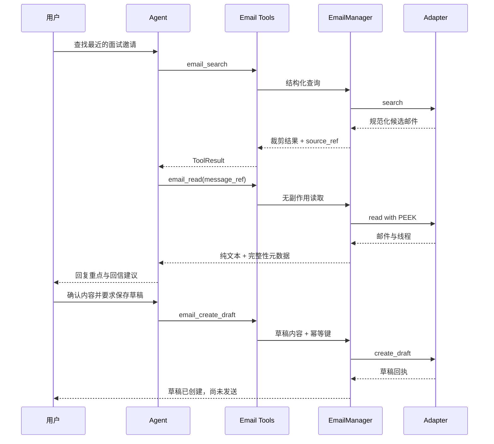
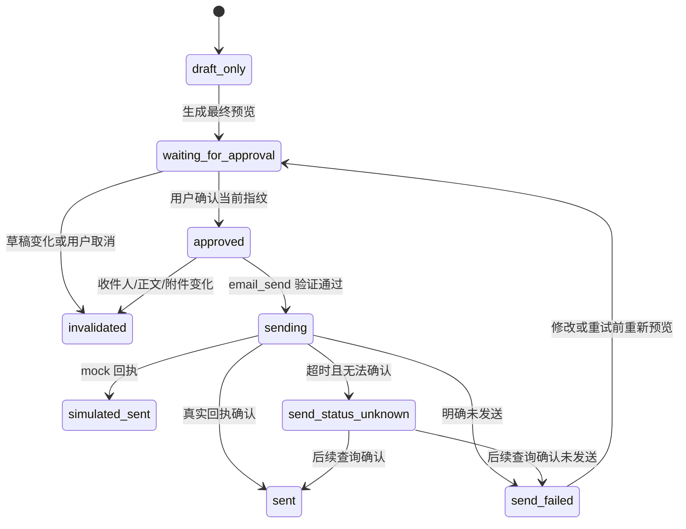

# 求职邮件工具套装设计

## 需求理解与设计目标

### 需求理解

本能力是一个有统一配置、统一状态、统一错误语义和统一安全边界的“邮件工具套装”，不是四个互不相关的邮箱工具。四个模型可见工具分别承担搜索、读取、创建草稿和发送职责，但都必须通过同一个 `EmailManager` 访问 provider、处理结果完整性、执行隐私规则并记录审计事件。

核心使用链路是：

1. 查找来自 HR、招聘方或面试协调人的邮件。
2. 读取指定邮件或线程，获得可追溯的正文和附件元数据。
3. Agent 基于邮件内容、JD、简历和用户事实总结待回复事项并生成回信内容。
4. 将用户选定的内容保存为本地或邮箱草稿。
5. 展示最终收件人、主题、正文、附件和检查结果。
6. 仅在用户对当前草稿版本明确确认后执行发送。

“总结回复重点”和“生成回信内容”由 Agent 在可追溯邮件内容及用户资料基础上完成；邮箱工具负责提供和保存可靠数据，不把模型生成的总结伪装成邮箱原始事实。首版不额外暴露总结工具，避免把内容生成与外部邮箱副作用混在一起。

### 仓库现状约束

- 工具遵循 `Tool` 抽象类，通过 `ToolRegistry` 显式注册，返回统一的 `ToolResult`。
- 当前风险等级为 `read`、`write`、`external`、`dangerous`，`ToolPolicy` 只按风险等级放行。
- Runtime 已有单工具和全体工具结果 Token 预算，并通过 `ToolResultGuard` 添加截断元数据及原始结果引用。
- 简历工具使用共享 `ResumeManager`、确定性校验、指纹和显式确认，适合作为 `EmailManager` 的组织方式参考。
- 求职搜索工具已有 profile、超时、重试、统一错误和日志脱敏方面的实践。
- Context 已实现会话摘要、长期记忆注入和通用工具结果裁剪。
- 当前仓库没有已实现的 Todo 工具或 Todo 数据模型；Todo 只出现在设计文档中。因此邮件提醒和申请状态同步只能在本设计中保留明确集成边界，不能假设现有 Todo 能力可直接调用。
- 当前 `ToolContext` 只有 `session_id` 和 `turn_id`，当前 Runtime 也没有“绑定某个草稿版本的用户审批”机制。仅依赖 `confirmed: true` 或允许 `external` 风险等级不足以保护真实发送。

### 设计目标

- 使用四个稳定、provider 无关的工具契约：`email_search`、`email_read`、`email_create_draft`、`email_send`。
- 由 `EmailManager` 统一完成 provider profile 选择、adapter 调用、错误映射、裁剪、安全检查和审计。
- mock fixture 与真实 IMAP/SMTP adapter 实现同一协议，使主要验收无需真实账号。
- 默认只启用 mock 或只读能力；不默认配置、不默认启用真实发送。
- 搜索和读取结果无论是否裁剪，都明确返回 `is_truncated`、`has_more` 和 `source_ref`。
- 草稿与已发送状态严格分离；mock 发送与真实外部发送严格分离。
- 用户确认必须绑定 provider、profile、草稿 ID、内容指纹、收件人和附件指纹；任一项变化都使确认失效。
- 凭据只通过环境变量或外部 secret manager 注入，仓库配置只保存环境变量名。
- 与现有 Runtime、`ToolResult`、日志系统和 Tool Registry 保持兼容。

### 非目标

- 本设计不实现邮箱账号注册、登录 UI 或绕过二次验证。
- 本设计不承诺自动识别所有 HR 身份；搜索结果只是基于查询条件的候选邮件。
- 本设计不允许无人值守群发。
- 本设计不把完整邮箱同步到本地，也不设计通用邮件客户端。
- 本设计不新增任务计划。

## 技术选型

### 语言与异步模型

- 继续使用 Python、`async` 工具接口、Pydantic 数据模型和现有 `ToolResult`。
- IMAP/SMTP 标准库通常是同步接口。真实 adapter 应通过受控线程执行阻塞 I/O，或采用经评估的异步库；无论选择哪种方式，都必须受 Runtime 和 adapter 双层超时约束。
- 不在工具内部执行无限重试。只对明确可重试且可安全重放的读操作进行有限重试；写入和发送通过幂等键及状态查询处理不确定结果。

### Adapter 模式

定义 provider 无关的 `EmailAdapter` 协议：

- `MockFixtureEmailAdapter`：读取固定 fixture，草稿和模拟发送写入测试临时目录或内存状态。
- `ImapSmtpEmailAdapter`：IMAP 用于搜索、读取和可选的 Drafts `APPEND`，SMTP 用于真实发送。
- Gmail、QQ 邮箱和自定义邮箱均作为 profile 配置，不在工具契约中拆成不同工具名。
- 认证细节由 `CredentialResolver` / `AuthStrategy` 处理；adapter 只取得当前调用所需的短期凭据对象，不接收仓库内明文 secret。

如果某个 provider 无法可靠通过 IMAP 创建草稿，则该 profile 的 `mailbox_draft` capability 为 `false`。系统可以显式创建 `local` 草稿，但不得静默把“邮箱草稿”降级为“本地草稿”。

### 存储

- fixture：`tests/fixtures/email/` 下的脱敏静态 JSON/EML 样本，只读。
- mock 调用状态：pytest 的 `tmp_path` 或进程内测试 store，测试间隔离。
- 生产草稿、审批和幂等记录：通过 `EmailStore` 抽象持久化，建议使用现有 SQLite 数据库中的独立表。
- 邮箱原始正文默认不长期缓存。`source_ref` 指向受访问控制的 provider 消息或短期私有 artifact；不得把完整正文放入普通日志或长期记忆。
- 本地草稿正文属于敏感数据。静态加密方案和保留周期未确认前，真实账号模式不得默认长期保存本地正文。

### 配置

在 `ToolsConfig` 下增加 email 配置模型，但示例配置只写字段和环境变量名，不写真实账号、密码、授权码、Token 或 API key。

配置结构建议如下；`null` 表示必须由用户确认后配置，不代表推荐值：

```yaml
tools:
  enabled:
    - email_search
    - email_read
    - email_create_draft
  allow_risk_levels:
    - read
    - write
  email:
    active_profile: mock
    result_max_items: 20
    body_max_chars: 12000
    profiles:
      mock:
        adapter: mock_fixture
        fixture_root: tests/fixtures/email
        real_send_enabled: false
      personal:
        adapter: imap_smtp
        mailbox_type: null
        account_env: EMAIL_ACCOUNT
        auth:
          type: null
          credential_env: EMAIL_CREDENTIAL
          oauth_client_id_env: null
          oauth_refresh_token_env: null
        imap:
          host: null
          port: null
          transport: null
        smtp:
          host: null
          port: null
          transport: null
        real_send_enabled: false
```

`email_send` 和 `external` 不出现在默认启用列表。即使用户后续显式启用它们，`real_send_enabled` 仍默认为 `false`，并且服务端草稿级审批仍是独立必要条件。

## 总体架构设计



### 分层职责

1. **Email Tool 层**
   - 暴露稳定 JSON Schema。
   - 将参数交给 `EmailManager`。
   - 把领域结果转换为现有 `ToolResult`。
   - 不直接读取环境变量，不直接连接邮箱，不自行判断确认是否有效。

2. **EmailManager 层**
   - 选择 profile 和 adapter。
   - 统一执行输入校验、capability 校验、幂等、安全检查、审批校验、错误映射和结果裁剪。
   - 生成不泄露隐私的 `display` 与 metadata。

3. **Adapter 层**
   - 处理 provider 协议差异。
   - 返回规范化领域对象或受控领域异常。
   - 不向 Agent 暴露 IMAP sequence number、原始服务器异常或凭据。

4. **Store 与 Approval 层**
   - 保存本地草稿、草稿指纹、幂等结果、发送回执和审批记录。
   - 审批记录由可信用户交互入口创建，不能由模型用布尔参数自行创建。

5. **Runtime 与 Context 层**
   - 继续执行风险等级、调用次数、超时和通用 Token 预算治理。
   - 邮件专项裁剪先于通用 `ToolResultGuard`，尽量保证保留主题、时间、行动项和来源引用。
   - 如果 Runtime 再次裁剪，保留 EmailManager 已生成的 `source_ref`，并通过现有 `raw_source_ref` 指向完整 ToolResult artifact。

### Provider 能力矩阵

每个 adapter/profile 启动时报告 capability，不根据 provider 名称盲猜：

| Capability | mock fixture | IMAP/SMTP profile |
|---|---:|---:|
| 搜索 | 是 | 取决于 IMAP |
| 无副作用读取 | 是 | 取决于 IMAP PEEK 支持 |
| 本地草稿 | 是 | 是 |
| 邮箱草稿 | 模拟 | 取决于 Drafts mailbox 与 APPEND |
| 模拟发送 | 是 | 否 |
| 真实发送 | 否 | 取决于 SMTP、配置开关与审批 |
| 附件正文下载 | 首版否 | 首版否 |

## 模块/组件设计

### 建议模块边界

```text
src/starter_agent/tools/email/
├── adapters/
│   ├── base.py
│   ├── mock_fixture.py
│   └── imap_smtp.py
├── approval.py
├── errors.py
├── manager.py
├── models.py
├── security.py
├── store.py
└── tools.py
```

`ToolRegistry` 只负责构造一次共享的 `EmailManager`，再把它注入四个 Tool；不得为每个工具各自创建 adapter 或邮箱连接配置。

### `EmailManager`

`EmailManager` 的公开职责：

- `resolve_profile(profile)`：选择显式 profile 或 active profile，验证是否存在及是否启用。
- `capabilities(profile)`：返回该 profile 的只读、草稿和发送能力。
- `search(request, context)`：规范化查询、调用 adapter、分页、裁剪并返回摘要。
- `read(request, context)`：通过 opaque message ref 读取邮件，使用 PEEK 语义，清洗正文并返回附件元数据。
- `create_draft(request, context)`：校验收件人、占位符、附件和回复关联，计算指纹并幂等创建草稿。
- `send(request, context)`：校验真实发送开关、风险策略、草稿状态、当前指纹、审批记录及幂等状态后调用 adapter。
- `map_error(error, operation)`：把 adapter 异常统一映射为稳定错误码。
- `trim_search_result(...)` / `trim_message(...)`：执行邮件领域感知裁剪。
- `audit(event, safe_fields)`：只记录脱敏和哈希后的审计字段。

Manager 不负责：

- 调用大模型生成邮件内容。
- 判断模型生成内容是否“好看”。
- 通过 provider 名称猜测 host、port 或认证方式。
- 在邮箱草稿失败后静默创建本地草稿。
- 生成用户审批或替用户确认。

### `EmailAdapter`

建议协议：

```python
class EmailAdapter(Protocol):
    async def capabilities(self) -> EmailCapabilities: ...
    async def search(self, query: EmailSearchQuery) -> EmailSearchPage: ...
    async def read(self, message_locator: MessageLocator) -> EmailMessage: ...
    async def create_draft(self, draft: DraftCreateRequest) -> AdapterDraft: ...
    async def send_draft(
        self, draft: StoredDraft, idempotency_key: str
    ) -> AdapterSendReceipt: ...
    async def find_send_result(
        self, draft_id: str, idempotency_key: str
    ) -> AdapterSendReceipt | None: ...
```

Adapter 必须把 provider 原始异常转换为领域异常；禁止把可能包含服务器地址、账号或正文的原始异常直接写入 `display` 或日志。

### `MockFixtureEmailAdapter`

- fixture 使用稳定 ID、固定时间和脱敏域名，覆盖 HR 联系、面试邀请、Offer、普通噪声邮件及多语言线程。
- 搜索、分页、读取结果与真实 adapter 使用同一规范化模型。
- 创建草稿写入隔离的 mock store，不修改只读 fixture。
- 调用发送时只产生 `simulated_sent` 回执，必须返回 `delivery_mode="mock"` 和 `external_delivery=false`；Agent 不得表述为真实邮件已发送。
- 支持 fixture 注入认证失败、超时、分页游标失效、草稿冲突和发送状态未知等场景。

### `ImapSmtpEmailAdapter`

- 搜索使用结构化查询转成 IMAP 条件，禁止直接拼接未经转义的 provider 查询字符串。
- 读取使用 UID 与 PEEK 语义，避免改变已读状态；不使用易变的 sequence number 作为外部引用。
- MIME 解析优先返回 `text/plain`；只有 HTML 时转换为安全纯文本，移除脚本、跟踪像素和远程资源。
- 首版只返回附件元数据，不自动下载附件内容。
- 创建邮箱草稿前检查 Drafts mailbox capability。若不支持，返回 `capability_not_supported`。
- SMTP 发送前重新读取或加载存储草稿并校验指纹；不得直接发送模型本次调用传入的任意正文。
- SMTP 超时后不得盲目重发。先按幂等记录和可用 provider 标识查询结果；无法确定时返回 `send_status_unknown`。
- 连接池按 profile 隔离，连接失效后重新认证；不得跨 profile 复用已认证连接。

### `CredentialResolver` 与认证策略

- 配置只保存 `*_env` 名称。
- 支持的认证类型候选为 OAuth、应用专用密码和 QQ 授权码，实际启用类型待用户确认。
- `CredentialResolver` 在调用时读取系统环境变量、未提交的 `.env` 或 secret manager。
- 凭据对象只存在于最短调用生命周期，不进入 Pydantic dump、`ToolResult`、异常文本或审计日志。
- OAuth 刷新后的 access token 也不得写回普通配置或日志。

### 结果裁剪与来源引用

邮件结果必须在 Manager 内先执行领域裁剪：

- 搜索结果按相关性和时间排序，只返回当前页有限条目。
- 每条摘要保留 `message_ref`、`thread_ref`、脱敏参与者、主题、时间、短 snippet 和独立 `source_ref`。
- 读取结果优先保留邮件头、回复所需行动项附近文本、最近线程内容和附件元数据。
- 裁剪不得产生无法解析的 JSON，不得把半个 MIME/HTML 片段返回模型。
- 每个成功结果的 metadata 都包含：

```json
{
  "is_truncated": false,
  "has_more": false,
  "source_ref": "email-source:opaque-id"
}
```

- `is_truncated=true` 表示当前对象内容被裁短。
- `has_more=true` 表示存在下一页、更多线程消息或可通过 `source_ref` 回查的内容。
- `source_ref` 是不包含账号、邮箱地址或 provider UID 的 opaque 引用。
- `source_ref` 的解析必须绑定 profile、用户和会话授权；不能被当作本地路径或任意 provider ID 使用。
- 完整正文不得仅为了支持 `source_ref` 而永久复制到通用 tool artifact。若需要短期缓存，应使用私有 Email source store、TTL 和访问控制。

### 人工确认组件

不能使用模型可自行填写的 `confirmed: true` 作为发送许可。设计采用服务端 `SendApproval`：

1. 系统对最终草稿执行确定性发送前检查并生成 `approval_challenge`。
2. UI/API 展示完整收件人、抄送、主题、正文、附件和风险提示。
3. 用户通过可信交互明确确认后，服务端创建一次性 `approval_id`。
4. `approval_id` 绑定用户/会话、provider、profile、draft ID、内容指纹、收件人指纹、附件指纹和过期时间。
5. `email_send` 只能引用已存在的 `approval_id`；`EmailManager` 在服务端验证，模型不能创建审批记录。
6. 草稿任意关键字段变化、审批过期或审批已消费时，发送被拒绝。

“二次确认”是否表示在上述最终确认之外再增加一次额外确认，仍需用户确认。无论答案如何，至少保留一次针对最终版本的可信人工确认。

### 日志与隐私保护

允许记录：

- session/turn、工具名、operation、profile 名、adapter 类型。
- 耗时、结果数量、截断状态、错误码、retryable。
- 草稿/消息/审批的 opaque ID 或短哈希。
- 收件人数、附件数和内容指纹。

禁止记录：

- 账号原文、收件人/发件人原文、主题、查询全文、正文、snippet。
- 附件名、附件内容、完整 provider UID。
- 密码、授权码、OAuth token、API key。
- 可能回显上述内容的原始 IMAP/SMTP 命令和服务器异常。

`imaplib`、`smtplib` 及相关网络库的 debug 日志默认关闭。面向用户的 `display` 只说明状态和脱敏对象，不包含凭据或完整正文。

### 与 Context、Memory 和 Todo 的关系

- 邮件正文只作为当前任务的受控 ToolResult 进入 Context，不自动写入长期记忆。
- 可长期保存的用户偏好仍走现有 Memory 确认机制；不能把 HR 邮件内容当成用户长期事实自动保存。
- 发送审批状态属于不可压缩工作流状态，不能只存在于会话摘要中；以 `EmailStore` 的结构化记录为准。
- 当前没有 Todo 工具实现。邮件发送结果可以产生不含正文的领域事件，例如 `email.sent`、`email.follow_up_suggested`，供未来 Todo/申请记录组件消费；首版邮件工具不得声称已经创建 Todo 或提醒。

## 数据模型

以下为领域模型，最终可使用 Pydantic 表达。

### `EmailProfileConfig`

| 字段 | 类型 | 说明 |
|---|---|---|
| `name` | string | 非敏感 profile 名 |
| `adapter` | enum | `mock_fixture` / `imap_smtp` |
| `mailbox_type` | enum/null | `gmail` / `qq` / `custom`，待确认 |
| `account_env` | string/null | 账号环境变量名 |
| `auth` | object | 认证类型及凭据环境变量名 |
| `imap` | object/null | host、port、transport |
| `smtp` | object/null | host、port、transport |
| `real_send_enabled` | boolean | 默认 `false` |
| `fixture_root` | path/null | 仅 mock，须限制在允许目录 |

### `EmailCapabilities`

```json
{
  "search": true,
  "read_peek": true,
  "local_draft": true,
  "mailbox_draft": false,
  "simulated_send": true,
  "real_send": false
}
```

### `EmailMessageSummary`

| 字段 | 说明 |
|---|---|
| `message_ref` | Manager 生成的 opaque 消息引用 |
| `thread_ref` | opaque 线程引用，可空 |
| `from_masked` | 脱敏发件人 |
| `to_me` | 是否发给当前账号 |
| `subject` | 邮件主题；仅返回模型，不进入日志 |
| `sent_at` | 含时区的时间 |
| `snippet` | 有长度上限的纯文本摘要 |
| `flags` | unread、answered、flagged 等规范化标记 |
| `source_ref` | 可回查来源 |

### `EmailMessage`

| 字段 | 说明 |
|---|---|
| `message_ref` / `thread_ref` | 稳定 opaque 引用 |
| `headers` | 规范化 from/to/cc/subject/date/reply-to |
| `body_text` | 已清洗纯文本，可裁剪 |
| `attachments` | 仅元数据和内容指纹，不默认含 payload |
| `reply_context` | `in_reply_to`、references、线程位置 |
| `is_truncated` / `has_more` | 完整性状态 |
| `source_ref` | 私有来源引用 |

`reply_context` 只包含确定性邮件头和线程关系，不包含模型推断的“建议怎么回复”。

### `StoredDraft`

| 字段 | 说明 |
|---|---|
| `draft_id` | Manager 统一草稿 ID |
| `provider_draft_id` | provider 草稿 ID，存储时保护，不直接暴露 |
| `profile` | 使用的 profile |
| `storage_scope` | `local` / `mailbox` / `mock` |
| `to` / `cc` / `bcc` | 敏感字段，展示时脱敏 |
| `subject` / `body_text` | 草稿内容 |
| `in_reply_to` | 可空 message ref |
| `attachments` | 附件引用、大小和 SHA-256 |
| `content_sha256` | 规范化收件人、主题、正文及附件清单的组合指纹 |
| `status` | 草稿状态 |
| `created_at` / `updated_at` | UTC 时间 |
| `idempotency_key_hash` | 幂等键哈希 |

### `SendApproval`

| 字段 | 说明 |
|---|---|
| `approval_id` | opaque 一次性引用 |
| `session_id` / `user_ref` | 审批主体 |
| `profile` / `draft_id` | 目标草稿 |
| `content_sha256` | 审批时内容指纹 |
| `recipient_sha256` | 收件人集合指纹 |
| `attachment_sha256s` | 有序附件指纹 |
| `status` | `pending` / `approved` / `consumed` / `expired` / `invalidated` |
| `approved_at` / `expires_at` | 时间边界 |

### `SendReceipt`

| 字段 | 说明 |
|---|---|
| `delivery_mode` | `mock` / `real` |
| `status` | `simulated_sent` / `sent` / `rejected` / `unknown` |
| `external_delivery` | 是否实际对外投递 |
| `message_ref` / `thread_ref` | 规范化外部引用 |
| `sent_at` | 确认的发送时间 |
| `content_sha256` | 实际发送内容指纹 |
| `recipient_count` | 收件人数 |
| `idempotency_key_hash` | 用于去重与状态查询 |

### 状态枚举

草稿状态：

```text
draft_only -> waiting_for_approval -> approved -> sending
sending -> sent | simulated_sent | send_failed | send_status_unknown
draft_only/waiting_for_approval/approved -> invalidated
```

`send_status_unknown` 不能自动变成 `send_failed` 并重发；必须先查询或由用户决定后续处理。

## API / 服务接口设计

### 通用 ToolResult

四个工具继续返回现有外层结构：

```json
{
  "ok": true,
  "data": {},
  "display": "用户可读但不泄露隐私的状态",
  "error_code": null,
  "retryable": false,
  "metadata": {
    "profile": "mock",
    "is_truncated": false,
    "has_more": false,
    "source_ref": "email-source:opaque-id"
  }
}
```

失败结果也应保持合法 `ToolResult`，不让 provider 异常中断整个 Agent 回合。

### `email_search`

- 风险等级：`read`
- 副作用：无；不得改变邮件已读状态。

输入契约：

```json
{
  "type": "object",
  "properties": {
    "profile": {"type": "string", "maxLength": 80},
    "sender": {"type": "string", "maxLength": 320},
    "recipient": {"type": "string", "maxLength": 320},
    "subject": {"type": "string", "maxLength": 300},
    "keywords": {
      "type": "array",
      "items": {"type": "string", "minLength": 1, "maxLength": 100},
      "maxItems": 10
    },
    "date_from": {"type": "string", "format": "date-time"},
    "date_to": {"type": "string", "format": "date-time"},
    "unread_only": {"type": "boolean", "default": false},
    "mailbox": {"type": "string", "maxLength": 120, "default": "INBOX"},
    "limit": {"type": "integer", "minimum": 1, "maximum": 50, "default": 10},
    "cursor": {"type": "string", "maxLength": 500}
  },
  "additionalProperties": false
}
```

至少需要一个搜索条件；不允许把空条件解释为遍历整个邮箱。HR 邮件搜索由 Agent 组合 sender/subject/keywords/date 等结构化条件完成，不以模型判断替代来源结果。

成功 `data`：

```json
{
  "profile": "mock",
  "query_summary": {
    "condition_count": 2,
    "mailbox": "INBOX"
  },
  "messages": [
    {
      "message_ref": "email-message:opaque",
      "thread_ref": "email-thread:opaque",
      "from_masked": "h***@example.test",
      "subject": "Interview invitation",
      "sent_at": "2026-07-17T03:00:00Z",
      "snippet": "We would like to invite...",
      "flags": ["unread"],
      "source_ref": "email-source:opaque"
    }
  ],
  "next_cursor": null,
  "is_truncated": false,
  "has_more": false,
  "source_ref": "email-search:opaque"
}
```

cursor 必须为 Manager 签发的 opaque 值并绑定 profile 与查询指纹，禁止直接暴露或接受任意 IMAP UID 范围。

### `email_read`

- 风险等级：`read`
- 副作用：无；强制 PEEK，不自动标为已读，不下载附件正文。

输入契约：

```json
{
  "type": "object",
  "properties": {
    "profile": {"type": "string", "maxLength": 80},
    "message_ref": {"type": "string", "minLength": 8, "maxLength": 500},
    "include_thread": {"type": "boolean", "default": true},
    "thread_limit": {"type": "integer", "minimum": 1, "maximum": 20, "default": 10},
    "max_body_chars": {
      "type": "integer",
      "minimum": 1000,
      "maximum": 50000,
      "default": 12000
    }
  },
  "required": ["message_ref"],
  "additionalProperties": false
}
```

成功 `data`：

```json
{
  "profile": "mock",
  "message": {
    "message_ref": "email-message:opaque",
    "thread_ref": "email-thread:opaque",
    "headers": {
      "from_masked": "h***@example.test",
      "to_masked": ["l***@example.test"],
      "subject": "Interview invitation",
      "date": "2026-07-17T03:00:00Z"
    },
    "body_text": "Sanitized plain text...",
    "attachments": [
      {
        "attachment_ref": "email-attachment:opaque",
        "filename_masked": "*.ics",
        "content_type": "text/calendar",
        "size_bytes": 1024,
        "sha256": "..."
      }
    ],
    "reply_context": {
      "in_reply_to": null,
      "references_count": 0,
      "thread_position": 1
    },
    "is_truncated": false,
    "has_more": false,
    "source_ref": "email-source:opaque"
  }
}
```

Agent 使用 `body_text` 和确定性线程字段总结回复重点。总结必须与 `source_ref` 一起呈现，且不得被写回成原始邮件字段。

### `email_create_draft`

- 风险等级：`write`
- 副作用：创建本地、mock 或邮箱草稿；绝不发送。

输入契约：

```json
{
  "type": "object",
  "properties": {
    "profile": {"type": "string", "maxLength": 80},
    "storage_scope": {
      "type": "string",
      "enum": ["local", "mailbox", "mock"]
    },
    "to": {
      "type": "array",
      "items": {"type": "string", "format": "email"},
      "minItems": 1,
      "maxItems": 10
    },
    "cc": {
      "type": "array",
      "items": {"type": "string", "format": "email"},
      "maxItems": 10
    },
    "bcc": {
      "type": "array",
      "items": {"type": "string", "format": "email"},
      "maxItems": 10
    },
    "subject": {"type": "string", "minLength": 1, "maxLength": 300},
    "body_text": {"type": "string", "minLength": 1, "maxLength": 50000},
    "in_reply_to": {"type": "string", "maxLength": 500},
    "attachment_refs": {
      "type": "array",
      "items": {"type": "string", "minLength": 1, "maxLength": 500},
      "maxItems": 10
    },
    "evidence_source_refs": {
      "type": "array",
      "items": {"type": "string", "minLength": 1, "maxLength": 500},
      "maxItems": 30
    },
    "idempotency_key": {"type": "string", "minLength": 16, "maxLength": 200}
  },
  "required": [
    "storage_scope",
    "to",
    "subject",
    "body_text",
    "idempotency_key"
  ],
  "additionalProperties": false
}
```

Manager 创建前执行确定性检查：邮箱格式、空正文、残留占位符、回复目标、附件存在性和指纹、明显重复收件人。含占位符或附件冲突时拒绝创建可发送草稿。`evidence_source_refs` 用于可追溯性，但不能证明模型生成事实正确；最终人工 Review 仍是必要环节。

成功 `data`：

```json
{
  "draft_id": "email-draft:opaque",
  "profile": "mock",
  "storage_scope": "mock",
  "status": "draft_only",
  "sent": false,
  "external_delivery": false,
  "to_masked": ["h***@example.test"],
  "recipient_count": 1,
  "subject": "Re: Interview invitation",
  "content_sha256": "...",
  "attachment_sha256s": [],
  "created_at": "2026-07-17T03:10:00Z",
  "requires_approval_to_send": true,
  "source_ref": "email-draft-source:opaque"
}
```

`display` 必须明确“草稿已创建，邮件尚未发送”。

### `email_send`

- 风险等级：`external`
- 默认状态：不注册或不启用；`real_send_enabled=false`。
- 副作用：mock 模式只模拟；真实模式可能向外部收件人发送。

输入契约：

```json
{
  "type": "object",
  "properties": {
    "profile": {"type": "string", "maxLength": 80},
    "draft_id": {"type": "string", "minLength": 8, "maxLength": 500},
    "expected_content_sha256": {
      "type": "string",
      "pattern": "^[a-f0-9]{64}$"
    },
    "approval_id": {"type": "string", "minLength": 8, "maxLength": 500},
    "idempotency_key": {"type": "string", "minLength": 16, "maxLength": 200}
  },
  "required": [
    "draft_id",
    "expected_content_sha256",
    "approval_id",
    "idempotency_key"
  ],
  "additionalProperties": false
}
```

Manager 必须按顺序验证：

1. profile 与 draft 匹配。
2. 当前 profile 的 send capability 及真实发送开关。
3. 草稿存在且状态允许发送。
4. 当前草稿组合指纹等于 `expected_content_sha256`。
5. 服务端审批存在、已批准、未过期、未消费，且绑定同一会话/用户、profile、草稿和全部指纹。
6. 幂等键没有对应的冲突请求。
7. 发送前确定性检查仍然通过。

成功 `data`：

```json
{
  "delivery_mode": "real",
  "status": "sent",
  "external_delivery": true,
  "message_ref": "email-message:opaque",
  "thread_ref": "email-thread:opaque",
  "sent_at": "2026-07-17T03:12:00Z",
  "profile": "personal",
  "recipient_count": 1,
  "content_sha256": "...",
  "source_ref": "email-send-receipt:opaque"
}
```

mock 成功必须为：

```json
{
  "delivery_mode": "mock",
  "status": "simulated_sent",
  "external_delivery": false
}
```

只有真实 adapter 返回可验证回执时才允许 `status="sent"` 和 `external_delivery=true`。模型文本不能作为发送成功依据。

### 审批服务接口

审批不作为模型工具开放，建议提供可信应用接口：

- `POST /v1/email/drafts/{draft_id}/approval-challenges`
  - 读取当前草稿并返回完整预览、指纹、附件检查和风险提示。
  - 不创建已批准记录。
- `POST /v1/email/approval-challenges/{challenge_id}/confirm`
  - 必须由已认证用户交互触发。
  - 创建一次性 `approval_id`。
- `GET /v1/email/approvals/{approval_id}`
  - 返回状态与脱敏绑定信息，不返回正文或凭据。
- `POST /v1/email/approvals/{approval_id}/revoke`
  - 用户可在发送前撤销。

如果当前产品没有用户认证体系，真实发送必须保持关闭；仅凭 session ID 不能充分证明确认来自正确用户。

### Tool Registry 与设置集成

- `ToolRegistry` 构建一个共享 `EmailManager`。
- 四个 Tool 依赖同一 Manager 实例。
- 未知 profile 在运行时返回 `email_profile_not_found`，不能使应用启动时泄露配置内容。
- 配置结构错误、fixture 路径越界或同名 profile 冲突属于启动期 `ConfigurationError`。
- `/v1/tools` 继续展示工具风险等级；可以额外展示 capability 摘要，但不得展示账号或 host 等敏感部署信息。

## 状态流转与交互流程

### 查找、读取和起草



搜索结果不足时，Agent 必须根据 `has_more` 使用 cursor 请求下一页，或通过 `source_ref` 对特定消息继续读取，不得把被裁剪内容当成不存在。

### 发送审批与发送



关键交互规则：

- 用户说“直接发，不用问”时仍进入 `waiting_for_approval`。
- 旧对话中的通用授权不能替代当前草稿审批。
- 多封草稿逐封生成审批，不能用一个审批 ID 批量发送。
- 发送成功后才消费审批；进入状态未知时冻结幂等键，禁止自动重发。
- mock `simulated_sent` 只表示测试流程完成，不表示外部收件人收到邮件。

### 线程回复重点

读取线程后，Agent 的回复摘要应区分：

- 对方明确提出的问题。
- 对方要求用户完成的动作。
- 明确日期、时区和地点。
- 需要用户补充但邮件中不存在的信息。
- 来源不完整或因裁剪尚未读取的内容。

每个关键结论应关联 `message_ref` 或 `source_ref`。如果 `is_truncated=true` 且被裁部分可能影响回复，Agent 应继续读取或向用户说明，不得直接生成可发送版本。

## 错误处理

### 统一错误模型

所有 adapter 错误先映射为 `EmailError`，再由 Manager 转换为 `ToolResult`：

```json
{
  "ok": false,
  "error_code": "email_authentication_failed",
  "display": "邮箱认证失败，请检查当前 profile 的授权状态",
  "retryable": false,
  "metadata": {
    "operation": "search",
    "profile": "personal",
    "failure_type": "authentication"
  }
}
```

### 统一错误码

| 错误码 | 适用操作 | retryable | 说明 |
|---|---|---:|---|
| `email_invalid_arguments` | 全部 | 否 | Schema 外的业务校验失败 |
| `email_profile_not_found` | 全部 | 否 | profile 不存在 |
| `email_profile_disabled` | 全部 | 否 | profile 未启用 |
| `email_capability_not_supported` | 全部 | 否 | adapter 不支持请求能力 |
| `email_missing_credentials` | 真实操作 | 否 | 缺少凭据环境变量 |
| `email_authentication_failed` | 真实操作 | 否 | 认证失败或凭据失效 |
| `email_insufficient_scope` | 真实操作 | 否 | 缺少读取、草稿或发送权限 |
| `email_mailbox_unavailable` | 搜索/读取/草稿 | 是 | mailbox 不存在或暂不可用 |
| `email_query_invalid` | 搜索 | 否 | 查询无法安全转换 |
| `email_cursor_invalid` | 搜索 | 否 | cursor 失效或不匹配 |
| `email_message_not_found` | 读取 | 否 | 消息不存在或已移动 |
| `email_parse_failed` | 读取 | 视情况 | MIME 或 fixture 无法解析 |
| `email_draft_not_found` | 草稿/发送 | 否 | 草稿不存在 |
| `email_invalid_recipient` | 草稿/发送 | 否 | 收件人不合法 |
| `email_placeholder_present` | 草稿/发送 | 否 | 存在未替换占位符 |
| `email_attachment_not_found` | 草稿/发送 | 否 | 附件不存在 |
| `email_attachment_changed` | 草稿/发送 | 否 | 附件指纹变化 |
| `email_draft_changed` | 发送 | 否 | 内容指纹与审批不一致 |
| `email_approval_required` | 发送 | 否 | 没有有效审批 |
| `email_approval_expired` | 发送 | 否 | 审批过期 |
| `email_approval_invalid` | 发送 | 否 | 审批绑定不匹配或已撤销 |
| `email_approval_consumed` | 发送 | 否 | 审批已使用 |
| `email_real_send_disabled` | 发送 | 否 | 真实发送开关关闭 |
| `email_rate_limited` | 读/写/发送 | 是 | provider 限流 |
| `email_provider_timeout` | 全部 | 是/未知 | 发送超时需单独判定 |
| `email_transport_error` | 全部 | 是/未知 | 网络或协议错误 |
| `email_send_rejected` | 发送 | 否 | provider 明确拒绝 |
| `email_send_status_unknown` | 发送 | 否 | 无法确认是否已发送，禁止自动重试 |
| `email_idempotency_conflict` | 草稿/发送 | 否 | 同一幂等键对应不同请求 |
| `email_fixture_invalid` | mock | 否 | fixture 格式或路径错误 |

### 异常到错误码映射

- IMAP/SMTP 的认证异常统一映射为认证或 scope 错误，不暴露服务器原文。
- socket timeout、连接重置和 DNS 错误映射为 timeout/transport；只读操作可有限重试。
- MIME 单封解析失败不能让整页搜索失败；搜索摘要标记该项不可读，读取时返回确定错误。
- 创建草稿超时后按幂等键查询，确认存在则返回原草稿；无法确认则返回可解释的未知状态。
- 发送超时后先查幂等记录或 provider 状态；不能确认时必须返回 `email_send_status_unknown`。
- Manager 未识别异常统一返回 `email_internal_error`，日志只记录异常类型和 trace ID。

## 性能与安全考虑

### 性能

- 搜索默认 10 条，单页上限 50 条；分页使用 opaque cursor。
- 单封正文默认最多 12,000 字符，硬上限 50,000 字符；先清洗后裁剪。
- 线程默认最多 10 封，优先保留最新邮件及明确行动项附近内容。
- IMAP 连接按 profile 短时复用，设置空闲失效时间；不得无限保持已认证连接。
- 搜索先取必要 envelope/header，再按需读取正文，避免一次下载整个邮箱。
- 附件首版只取元数据，不自动下载正文。
- Runtime 的 `per_tool_result_tokens` 和 `all_tool_results_tokens` 仍是最终硬闸门。
- 读操作最多进行有限指数退避；草稿和发送依赖幂等，不做盲重试。

### 安全

- 默认 profile 为 mock；真实 provider 必须显式配置。
- 默认 `real_send_enabled=false`，默认不启用 `email_send` 和 `external`。
- 风险等级放行与草稿级人工审批是两个独立闸门，必须同时通过。
- 审批必须由可信 UI/API 创建，不能由模型自行构造。
- message/draft/source/cursor 均使用 opaque 引用并进行主体、profile 和有效期校验。
- 解析 MIME/HTML 时防止路径穿越、压缩炸弹、脚本执行和远程资源加载。
- 附件引用只能指向允许的文件/文档根目录，并在发送前重新校验大小和 SHA-256。
- 限制收件人数量，禁止首版批量发送；BCC 也计入总人数。
- 不把邮件正文或外部邮件内容自动写入长期记忆。
- 不在配置、代码、fixture、测试快照、异常、日志或 ToolResult 中放置真实 secret。
- 测试地址使用保留示例域，真实账号验收只使用专用测试账号和测试收件人。

### 隐私

- `email_search` 的查询词、邮件主题、地址和 snippet 不进入普通日志。
- `email_read` 返回完成任务所需的最小正文，不默认返回完整历史或附件内容。
- source store 与通用会话日志隔离，并支持 TTL、删除和访问审计。
- 本地草稿和审批记录的数据保留周期待确认；未确认前不默认长期保存真实邮箱正文。
- UI 默认脱敏列表展示，但发送确认页必须向当前已认证用户完整展示最终内容。

## 测试策略

### 测试原则

- 自动化验收优先使用 mock fixture 和 fake adapter。
- 契约测试必须对 mock 与真实 adapter 使用同一测试向量，确保 provider 切换不改变工具语义。
- 真实 Gmail、QQ 或自定义 IMAP/SMTP 仅作为显式选择的受控验收，不作为默认测试前提。
- 验收依据必须是 ToolResult、adapter 调用记录、草稿 store、审批 store、测试邮箱实际状态和日志扫描；不能以模型声称成功作为证据。

### fixture 设计

至少包含：

- 中文 HR 主动联系邮件。
- 英文面试邀请，包含日期、时区、会议地址和两个问题。
- 多封线程及引用回复。
- Offer 沟通邮件。
- 普通非求职邮件作为搜索噪声。
- HTML-only、multipart/alternative、异常编码、超长正文。
- 有附件元数据但不下载附件内容。
- 重复 Message-ID、缺失 Message-ID 和已移动邮件。
- 分页数据及 cursor 失效。
- 认证失败、限流、超时、连接中断、草稿冲突和发送状态未知。

fixture 必须全部脱敏，不得从真实邮箱直接提交原始导出。

### 单元测试

`EmailManager`：

- profile 默认选择、显式切换、未知和禁用 profile。
- capability 校验。
- 所有 adapter 异常到统一错误码的映射。
- 搜索分页、稳定排序、裁剪和 source_ref。
- 读取 PEEK、不改变已读状态、MIME 清洗、线程裁剪。
- 本地/邮箱/mock 草稿状态不混淆。
- 草稿幂等、同键同请求返回相同结果、同键异请求冲突。
- 占位符、收件人和附件检查。
- 内容、收件人或附件变化后审批失效。
- 审批缺失、过期、撤销、已消费和跨会话复用均拒绝发送。
- mock 发送只返回 `simulated_sent`，不调用任何真实 adapter。
- 真实发送开关关闭时，在连接 SMTP 前返回 `email_real_send_disabled`。
- 超时后的状态查询及 `send_status_unknown`。
- 日志、异常和 ToolResult 的 secret/正文/地址零泄露扫描。

Tool contract：

- 四个 JSON Schema 拒绝额外字段、非法范围和错误类型。
- 风险等级分别为 `read`、`read`、`write`、`external`。
- 四个工具共享同一 Manager。
- 工具成功和失败均返回合法 `ToolResult`。

配置与 Registry：

- 未启用时工具不存在。
- 启用后 `/v1/tools` 暴露正确工具名与风险等级。
- 未配置真实凭据不影响 mock 启动。
- 配置只含环境变量名；缺少环境变量返回安全错误。
- fixture path 越界或非法 profile 在启动时失败。
- `email_send` 默认未启用，`external` 默认未允许。

Context：

- 超长搜索结果和正文经过邮件专项裁剪后仍是合法 JSON。
- `is_truncated`、`has_more`、`source_ref` 在通用 `ToolResultGuard` 再次裁剪后仍可追溯。
- 被裁内容不会被 Agent 当作不存在。
- 完整邮件正文不会被写入长期记忆。

### 集成测试

- API 强制调用 `email_search`、`email_read`、`email_create_draft` 时产生正确工具事件。
- mock 端到端：搜索面试邀请 → 读取 → Agent 总结 → 创建草稿 → 预览 → 用户确认 → 模拟发送。
- 未经确认、仅说“直接发送”时，不出现 adapter send 调用。
- 用户确认后修改草稿，旧审批不能发送。
- 同一发送请求重复提交只得到同一回执，不产生第二次 adapter send。
- tool timeout、Runtime budget 和 provider timeout 分别返回可区分状态。
- 删除本地草稿/审批后，不再可通过 source_ref 或 API 读取。

### 已授权的真实账号验收

用户已确认：项目根目录的本地 `.env` 中已提供 IMAP/SMTP 验收凭据，允许在实现完成后使用这些凭据执行真实收取与发送验收。凭据值不得被读取到设计文档、ToolResult、日志、测试输出或版本控制中；adapter 只能通过配置声明的环境变量名在运行时解析。

真实账号验收仍应以 mock fixture 自动化验收通过为前提，并使用专用测试账号、测试收件人和受控测试内容。该授权只覆盖验收，不等于产品默认开启真实发送，也不替代每封测试邮件发送前针对最终版本的人工确认：

- Gmail、QQ 或自定义 IMAP 搜索结果与邮箱 UI 对照。
- `email_read` 前后邮件已读状态不变。
- 邮箱草稿确实出现在 Drafts，且未进入 Sent。
- 未经审批不产生 SMTP 调用。
- 审批后的邮件只发往测试收件人，主题、正文、附件指纹与预览一致。
- SMTP 超时场景不会自动重复发送。
- 日志、测试输出和异常中无凭据、完整地址、主题或正文。

真实验收不使用生产招聘联系人，也不提交凭据或邮箱导出文件。若 `.env` 中的变量名尚未与 `EmailProfileConfig` 的 `account_env`、`credential_env` 等字段建立映射，应先补齐非敏感的变量名配置；不得通过打印变量值来排查配置。

## 风险与待确认事项

### 已识别风险

- **现有审批能力不足：** 当前 Runtime 只有风险级别 allowlist，没有草稿级可信审批。真实发送必须等待审批 store 与可信用户交互入口具备后才能开放。
- **用户身份边界未明确：** 如果 API 没有已认证用户，无法可靠防止审批跨用户复用；真实发送应保持关闭。
- **IMAP 草稿兼容性：** 不同邮箱的 Drafts 文件夹名称、flags 和 APPEND 行为可能不同，需要 capability 探测，不能假设所有 profile 支持邮箱草稿。
- **SMTP 发送幂等性有限：** SMTP 本身通常不提供强幂等保证；超时后可能无法立即确认结果，必须允许 `send_status_unknown`，禁止盲重试。
- **邮件引用稳定性：** IMAP UID 在邮箱迁移或 UIDVALIDITY 变化后可能失效，opaque ref 中需绑定 mailbox 与 UIDVALIDITY 并返回可理解的失效错误。
- **隐私与 Context 冲突：** 为 Agent 总结回复重点需要正文，但正文不应长期缓存或进入日志；需使用最小披露、短期 source store 和明确保留策略。
- **Todo 能力尚未实现：** 当前无法直接完成已确认需求中的提醒和申请状态跟踪。邮件套装只能输出结构化事件，不能声称已创建提醒。
- **模型事实风险：** 邮箱工具能保证邮件来源，却不能自动证明回信中关于用户的经历真实；仍需结合简历 source refs、确定性检查和人工 Review。
- **真实 provider 差异：** Gmail、QQ 和自定义服务的认证、配额、文件夹和 TLS 要求不同，不能在缺少信息时硬编码。

### 已确认事项

- 项目根目录的本地 `.env` 已提供 IMAP 和 SMTP 验收凭据。
- 允许在邮件套装实现完成、mock 自动化验收通过后，使用这些凭据执行真实邮件收取验收。
- 允许使用这些凭据向受控测试收件人执行真实发送验收。
- 真实发送验收仍必须逐封展示最终收件人、主题、正文和附件，并由用户确认当前草稿版本。
- 凭据只允许在运行时从 `.env` 或系统环境变量解析，不得复制到仓库文件、设计文档、日志、异常或测试产物。
- 上述授权仅用于验收，不代表 `email_send` 或 `real_send_enabled` 可以默认开启。

### 必须由用户确认

1. 首版邮箱类型选择：
   - Gmail。
   - QQ 邮箱。
   - 自定义 IMAP/SMTP。
   - 是否同时支持多个 profile。
2. 每个真实 profile 的 IMAP 配置：
   - host。
   - port。
   - 连接方式：SSL/TLS、STARTTLS 或其他明确方式。
3. 每个真实 profile 的 SMTP 配置：
   - host。
   - port。
   - 连接方式：SSL/TLS、STARTTLS 或其他明确方式。
4. 认证方式：
   - OAuth。
   - 应用专用密码。
   - QQ 授权码。
   - 自定义服务要求的其他受支持机制。
5. 产品运行时是否允许真实发送：
   - 验收环境中的受控真实发送已经获得授权。
   - 非验收场景仍默认不允许；若将来允许，需要确认哪些 profile 可以开启 `real_send_enabled`。
6. 确认强度：
   - 最终草稿发送前的一次可信人工确认是强制要求。
   - 是否还要求在点击确认后、实际 SMTP 调用前进行第二次独立确认？
7. 验收方式：
   - mock fixture 仍是默认自动化验收方式。
   - 已确认增加真实账号的 IMAP/SMTP 收取与发送验收。
   - 仍需确认该账号对应 Gmail、QQ 还是自定义邮箱，以及专用测试收件人。
8. 草稿保存目标：
   - 首版只需本地草稿、邮箱草稿，还是二者都要？
9. 本地敏感数据策略：
   - 邮件正文、草稿、审批和 source artifact 的保留周期。
   - 静态加密要求。
   - 用户删除、备份删除和审计要求。
10. 用户身份与审批入口：
    - 当前 API/UI 如何识别执行确认的用户？
    - 审批有效期和撤销策略。
11. 附件范围：
    - 支持的文件格式、大小上限和允许目录。
    - 首版是否只发送本地文件，还是支持已有文档对象引用？
12. Todo 与申请记录：
    - 是否将提醒/申请跟踪留给后续独立能力，还是需要先设计并实现 Todo 基础设施后再开放完整邮件工作流？

在以上邮箱类型、连接参数、认证方式、用户身份和产品运行授权未确认前，设计的安全默认值仍为：默认启用 mock fixture 和必要的只读/草稿工具，产品真实发送关闭。真实发送只可在受控验收流程中临时启用，并同时通过风险策略、草稿级审批和最终人工确认。
