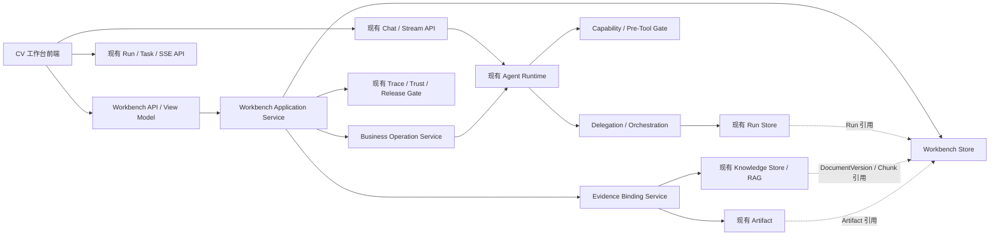
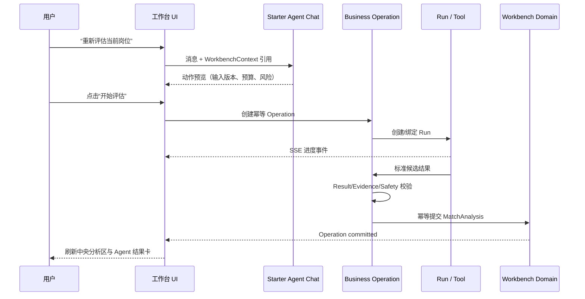
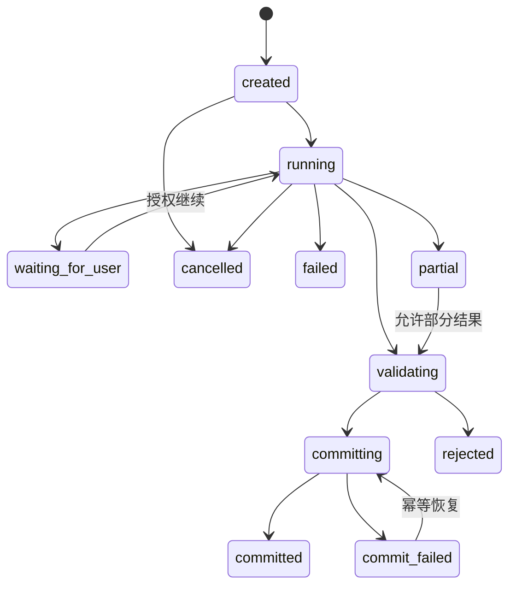

# CV 工作台设计文档

## 文档信息

- 文档阶段：总体与详细设计
- 文档版本：v0.1
- 日期：2026-08-15
- 对应需求：`docs/cv-workbench-requirements.md` v0.2
- 目标仓库：Starter Agent
- 主交互基准：`docs/assets/cv-workbench-interaction-flow-v2.png`
- 编辑态补充参考：`docs/assets/cv-workbench-interaction-design-v1.png`
- 本文范围：产品结构、交互、前端组织、服务边界、领域模型、API 契约、状态流、错误处理、安全、迁移、测试与发布设计
- 本文不包含：数据库 DDL、任务拆分、具体代码实现和最终视觉稿

## 1. 设计结论

CV 工作台不是替换 Starter Agent，而是在现有 Agent 平台上增加一层稳定的求职业务系统。最终采用以下设计：

1. 页面以 v2 基准图为主：顶部全局导航、左侧档案与 Starter Agent、中间主工作区、右侧候选岗位栏。
2. v1 基准图只补充简历编辑态：正文画布、行内证据标记、匹配侧栏和底部版本保存条。
3. 外部参考网站只吸收暖白纸张风格、紧凑控件、清晰空态、Chat 建议项和响应式降级，不复制其业务自动化边界。
4. 左下角 Agent 完整沿用 Starter Agent 的 Chat、Session、stream、Tool Gate、确认、Run、SSE 和邮件审批能力，不创建第二套聊天 Runtime。
5. Agent 始终在显式 `WorkbenchContext` 中工作；它可以解释、检索和生成候选结果，但不能把消息直接当成岗位、正式分析、简历版本或投递事件。
6. 所有业务写入通过 `BusinessOperation` 提交：`Run succeeded` 只表示执行完成，只有 `Operation committed` 才表示工作台成功。
7. MVP 使用规范化 Markdown 作为简历正文权威源，结构化区块只是带稳定 ID 的投影；避免维护两份可漂移正文。
8. 前端保持 FastAPI 静态托管和原生浏览器能力，先把单文件页面拆为原生 ES Module 与分层 CSS；是否引入框架另做 ADR，不作为 MVP 前置条件。
9. Multi-Agent、PDF/DOCX、邮件和自动岗位调研均为可插拔增强；关闭时核心手工 JD 闭环仍成立。

## 2. 设计依据与取舍

### 2.1 本地基准图

#### v2：主交互基准

采用：

- 左栏上部为当前档案、上传入口和版本列表，下部为紧凑 Starter Agent。
- 中央区域保留最高视觉权重，承载匹配亮点、能力缺口、修改建议、Diff 和版本确认。
- 右栏只承载 Agent 搜索的岗位候选；候选必须勾选并点击“评估并留存”才进入业务对象。
- 顶部使用五步进度：上传简历 → 选择 JD → 匹配评估 → 确认修改 → 导出留存。
- 新版本先进入待确认状态；确认前导出操作不可用。

需要调整：

- 图中的单一分数必须展开为版本化评分维度、要求项判断和证据覆盖。
- “已接受”建议仍只进入 Draft，不直接生成已确认 ResumeVersion。
- 任务进度不能是前端动画，必须来自 Run/Task API。

#### v1：编辑态补充

采用：

- 简历正文为中央纸张画布，支持区块导航、行内高亮和证据入口。
- 右侧匹配信息可折叠为上下文检查器，展示证据、缺口和建议动作。
- 底部固定显示本次修改数、撤销/重做、保存为新版本。

不采用：

- 不把 Agent 固定在右侧；统一保留在左下角，防止同一页面出现两套助手入口。
- 不在列表中只显示分数而隐藏 JD 快照、简历版本和分析时效。

### 2.2 外部参考网站

2026-08-15 核查到该站点采用暖白背景、白色纸张卡片、克制边框、紧凑顶部导航、约 300–360px 左栏和主 Canvas；左栏 Chat 具有快捷建议、附件预览和上下文提示；页面明确区分未建档、已建档待投递和分析完成模式，并在 900px 以下降为单栏。

吸收：

- 暖白背景、深灰文字、低饱和强调色和弱阴影。
- 卡片标题—状态—摘要—动作的稳定层级。
- 上传/粘贴双入口、空态步骤提示、上下文相关快捷建议。
- 900px 以下自然滚动、导航/Tab 横向滚动、触屏热区放大。
- `prefers-reduced-motion` 和失败后保留输入。

不吸收：

- 粘贴 JD 后自动创建投递记录。
- 分析完成后自动生成正式简历或自动改变投递状态。
- 未经用户留存确认把搜索候选变成岗位档案。
- 开发模式自报用户身份作为正式发布授权方案。
- 在未验证导入能力前宣称支持 PDF、Word、图片等全部格式。

## 3. 目标、非目标与设计原则

### 3.1 目标

- 让求职目标、岗位快照、简历版本、匹配分析和投递记录成为可恢复业务对象。
- 把现有 RAG、Run、Trace、Capability 和 Artifact 变成工作台的执行与证据基础设施。
- 让用户能在不理解 Specialist、Tool Schema 或 Policy ID 的情况下安全使用 Agent。
- 确保每个正向匹配和修改建议都有 JD 与简历证据。
- 保证刷新、断流、重试、取消、并发冲突和部分成功都有确定表现。

### 3.2 非目标

- 不重写 Agent Runtime、Tool Gate、RAG、Run Store、Trust 或邮件审批。
- 不实现自动投递、自动发信、登录绕过或站点限制绕过。
- 不在 MVP 中实现保真 PDF/DOCX 导入、多模板排版、日历联动和多人协作。
- 不允许模型编造经历或把能力缺口改写成用户事实。
- 不用前端本地状态冒充后端业务状态。

### 3.3 设计原则

- 业务对象优先于聊天文本。
- 不可变版本优先于原地覆盖。
- 证据优先于分数和文案。
- 候选、待确认与正式结果严格分层。
- 后端查询恢复优先于前端推断。
- 明确确认优先于自然语言暗示。
- 功能级可用性优先于暴露工程配置。

## 4. 总体架构



### 4.1 分层职责

| 层 | 职责 | 不负责 |
|---|---|---|
| Workbench UI | 导航、编辑、候选确认、任务展示、证据摘要、错误恢复 | 推断业务成功、直接读取受限正文、拼装隐藏 Prompt |
| Workbench API/View Model | 聚合业务对象与脱敏运行状态、校验身份、提供稳定命令/查询 | 复制 Runtime、直接执行模型循环 |
| Workbench Domain | 业务规则、版本、引用、幂等、Operation 提交、过期判定 | 保存 Child 对话和原始 HTML |
| Existing Agent Platform | Chat、Tool、RAG、Run、预算、取消、Approval、Trace | 决定正式投递或直接覆盖简历 |
| Evidence/Artifact | 正文、Chunk、Citation、原始文件与导出文件 | 充当可变业务聚合根 |

### 4.2 推荐模块边界

建议新增逻辑包 `src/starter_agent/cv_workbench/`，内部按职责划分：

- `models.py`：领域 DTO、枚举和引用类型。
- `store.py`：工作台对象、事件和 Operation 的持久化接口。
- `service.py`：命令、查询、权限和事务边界。
- `operations.py`：幂等、Run 绑定、校验、提交与恢复。
- `resume.py`：规范化 Markdown、Draft、版本和 Diff。
- `jobs.py`：Candidate 留存、JobSnapshot、来源冲突与去重。
- `matching.py`：规则版本、标准结果、过期判断和建议生成入口。
- `bindings.py`：Knowledge/Artifact/Run/Trace 引用完整性。
- `view_models.py`：面向前端的脱敏聚合。
- `migration.py`：旧 ResumeManager、Knowledge Document 和候选迁移。

建议新增 `interfaces/workbench_api.py`，只组合 Application Service，不直接访问数据库。现有 `api.py`、`runs_api.py`、`tasks_api.py`、Capability 和 Trust API 保持兼容。

## 5. 前端信息架构

### 5.1 全局导航

| 一级入口 | 内容 | MVP |
|---|---|---|
| 工作台 | 当前求职目标的岗位—简历优化主流程 | 是 |
| 档案 | 简历族/版本、岗位/JD 快照、导出文件 | 是 |
| 投递记录 | 看板、详情、状态事件 | 完整首版 |
| 面试复盘 | 面试轮次、问题与复盘 | 后续 |
| 设置 | 知识库、Agent 能力、模型/Tool/MCP、信任中心 | 保留现有能力 |

路由建议：

- `#/workbench/:workspaceId`
- `#/archives/resumes/:resumeId`
- `#/archives/jobs/:jobId`
- `#/applications`
- `#/interviews`
- `#/settings/knowledge`
- `#/settings/capabilities/*`
- `#/settings/trust/*`
- `#/runs/:parentRunId`

### 5.2 桌面布局

```text
┌──────────────────────── 顶部导航 / 当前目标 / 用户 ────────────────────────┐
│  左侧工作栏 360px       │  中央主区 min 640px        │  候选栏 300px       │
│ ┌档案与版本───────────┐ │ ┌五步进度────────────────┐ │ ┌Agent 搜索候选──────┐ │
│ │ 当前档案 / 上传 / 列表 │ │ │上传→JD→分析→修改→导出│ │ │选择 / 来源 / 查看JD │ │
│ └────────────────────┘ │ └────────────────────────┘ │ │                  │ │
│ ┌Starter Agent────────┐ │ ┌匹配/编辑/差异/档案 Tab ┐ │ │                  │ │
│ │上下文·消息·快捷动作  │ │ │ 主要阅读与编辑画布      │ │ │                  │ │
│ │任务摘要·确认·输入框   │ │ │ 固定底部操作条          │ │ └忽略 / 评估并留存──┘ │
│ └────────────────────┘ │ └────────────────────────┘ │                    │
└──────────────────────────────────────────────────────────────────────────┘
```

布局断点：

- `≥1440px`：三栏完整显示，建议 `360px minmax(640px, 1fr) 300px`。
- `1280–1439px`：左栏 320px，候选栏 280px。
- `1024–1279px`：候选栏折叠为右侧 Drawer；左栏可压缩至 300px。
- `<1024px`：单栏主内容；档案、Agent、候选分别作为 Drawer/底部 Sheet。
- `<768px`：只保证浏览、候选确认和建议审批；复杂简历编辑提示使用桌面端。

### 5.3 页面模式

#### Mode A：未建立档案

- 左侧显示 Markdown/TXT 上传和粘贴入口。
- 中央显示三步说明与结构预览骨架，不显示虚假统计。
- Agent 可回答普通问题，但所有依赖简历的快捷动作禁用并说明原因。

#### Mode B：已有档案、未选择 JD

- 中央显示简历版本摘要和“粘贴 JD / 稳定 URL / 从候选选择”。
- Agent 上下文为当前 Workspace + ResumeVersion。
- 自动调研仅在 Release Gate 可用时出现。

#### Mode C：已完成分析

- 中央默认“匹配分析”，可切换“定制简历”“版本差异”“档案详情”。
- 右侧候选仍与当前已留存 Job 分开。
- Agent 上下文增加 JobSnapshot + MatchAnalysis。

#### Mode D：修改待确认

- 中央进入建议审批或编辑器；底部固定 Diff、继续修改、确认版本。
- Agent 可以解释建议或生成新的候选 Patch，不能自动确认版本。

## 6. 视觉系统

### 6.1 设计令牌

| Token | 建议值 | 用途 |
|---|---|---|
| `--bg` | `#F7F5F0` | 暖白页面背景 |
| `--surface` | `#FFFFFF` | 纸张与卡片 |
| `--surface-subtle` | `#FAF9F6` | 次级区域 |
| `--text` | `#202522` | 主文字 |
| `--muted` | `#66706B` | 次级文字 |
| `--line` | `#E2E4DF` | 边框 |
| `--accent` | `#176B4D` | 主操作、选中、Focus |
| `--accent-soft` | `#EAF4EE` | 匹配与成功背景 |
| `--warning` | `#9A6818` | 缺口、等待确认 |
| `--warning-soft` | `#FFF6E8` | 缺口背景 |
| `--danger` | `#A14A43` | 错误、冲突 |
| `--radius-card` | `12px` | 主卡片 |
| `--radius-control` | `8px` | 控件 |

规则：

- 正文不使用纯黑；大面积不使用渐变、玻璃拟态或装饰插画。
- 普通卡片以边框、留白和层级区分，阴影只用于 Drawer、Modal 和悬浮确认。
- 状态至少同时使用颜色与文字/图标，不以颜色作为唯一信号。
- 数字分数使用等宽数字；证据原文与 JD 原文可使用轻微背景区分。

### 6.2 组件层级

- 页面标题：20–24px，600。
- 卡片标题：14–16px，600。
- 正文：13–14px，行高 1.55–1.7。
- 辅助信息：11–12px，但关键错误不得低于 12px。
- 控件最小高度：桌面 36px，触屏 44px。
- Focus ring：2px accent 外圈，不能只改变边框颜色。

## 7. 核心页面与组件

### 7.1 档案与版本栏

`ProfileSummaryCard`：当前目标、教育/项目/技能统计、最近更新。

`ResumeFamilyList`：

- 每项显示名称、版本号、来源格式、更新时间和状态。
- 选中项使用左侧强调线 + 浅绿背景。
- 状态包括使用中、草稿、待确认、已确认、已归档、解析失败。
- 菜单提供编辑名称、复制族、归档、版本历史；有引用时禁用永久删除。

上传后立即创建 Import Operation，并显示解析中；只有规范化、校验和 Knowledge 绑定完成后才标记可分析。

### 7.2 五步进度条

进度来自业务对象，不来自组件内部计数：

| 步骤 | 完成条件 |
|---|---|
| 上传简历 | 存在可分析 ResumeVersion |
| 选择 JD | 存在已确认 JobSnapshot |
| 匹配评估 | 存在 validated/partial MatchAnalysis |
| 确认修改 | 存在 Draft 或待确认版本；确认后完成 |
| 导出留存 | 存在可用 ExportRecord；MVP 标记“完整首版提供” |

### 7.3 匹配分析

顶部摘要显示：分数、岗位、公司、地点、JD 状态、来源、输入简历版本、分析时间、规则版本和重新评估。

主体采用双列：

- 匹配亮点：要求原文、简历证据、覆盖说明、Citation。
- 能力缺口：要求原文、缺失概念、风险、可采取动作；明确“不会自动写入简历”。

分数点击后打开维度明细，不以圆环或单一数字代替证据。`partial` 在标题和缺失项区域均显示。

### 7.4 修改建议与编辑器

建议表格字段：原文、建议文本、简历证据、JD 要求、风险、状态、操作。

操作：接受、拒绝、编辑后接受、查看证据。批量应用只处理仍有效且无冲突的建议，并再次显示影响摘要。

编辑器：

- 中央呈现简历纸张；区块拥有稳定 `block_id`。
- 行内高亮只表示建议或证据，不改变正文。
- 自动保存更新 Draft revision；状态栏区分保存中、已保存、失败、冲突。
- 底部固定撤销、重做、修改数、查看完整 Diff、保存为待确认版本。

### 7.5 候选岗位栏

Candidate 卡包含标题、公司、地点、来源域名、预估分（若有则标“预估”）、打开链接、查看 JD、勾选框。

候选栏底部固定“忽略”和“评估并留存”。只有用户点击后才创建 Job/JobSnapshot/Analysis Operation。无效或来源冲突的候选不能默认选中。

### 7.6 任务卡与运行详情

普通任务卡只显示业务语言：当前阶段、完成数、最近动作、预算摘要、开始/更新时间、取消/继续。

高级详情再显示 Parent/Child 树、Policy、Approval、Artifact、Trace 和规则版本。隐藏推理、Child 原始对话和原始网页正文永不展示。

## 8. Starter Agent 与工作台交互设计

### 8.1 沿用范围

左下角 Agent 直接复用当前 Starter Agent：

- `/v1/chat`、`/v1/chat/stream`。
- Session、消息历史、摘要、Token 使用和普通 Chat。
- Tool Registry、Pre-Tool Gate、Confirmation 和 Permit。
- Knowledge RAG 与 Citation。
- Parent/Child Run、Task、预算、SSE、取消和恢复。
- 邮件草稿/发送审批；首版不主动暴露发送快捷动作。

工作台只新增上下文适配、业务动作卡和 Operation 提交，不改模型循环语义。

### 8.2 WorkbenchContext

前端每次发起工作台 Chat 时发送引用信封：

```json
{
  "workspace_id": "ws_...",
  "resume_version_id": "rv_...",
  "job_snapshot_id": "js_...",
  "match_analysis_id": "ma_...",
  "draft_id": "draft_...",
  "ui_route": "workbench.match",
  "selected_block_ids": ["project-2"]
}
```

规则：

- 所有字段可选但必须属于当前 principal；后端重新鉴权并加载正文。
- 前端不发送隐藏知识库正文、原始 HTML 或 Child Context。
- 切换 Workspace/Resume/Job 时生成新上下文 epoch；旧流返回不得写入新上下文。
- Agent 面板标题下显示人类可读作用域：“当前：Canva JD · Agent Engineer v4”。
- 用户可把作用域切为“仅当前简历”“当前岗位与简历”“普通对话”，不能无提示扩大范围。

### 8.3 Agent 响应类型

| 类型 | 呈现 | 是否写业务对象 |
|---|---|---|
| 普通回答 | 消息 + Citation | 否 |
| 页面导航建议 | 快捷按钮 | 否 |
| Candidate Action | 动作预览卡 | 用户确认后才写 |
| Background Run | 任务卡 | Run 已创建，结果未必提交 |
| Approval Request | 影响、风险、目标、确认/拒绝 | 决策后继续 |
| Business Commit | 提交结果卡 | 仅 Operation committed 后 |
| Partial/Failure | 已有证据、缺失、恢复动作 | 不创建正式成功结果 |

### 8.4 Agent 可触发动作

- “解释这个分数”：读取当前 Analysis，返回维度和证据，不启动新分析。
- “重写这段”：生成 Suggestion/Patch 候选，目标为当前 Draft/block，等待用户接受。
- “重新评分”：展示输入版本与预算，确认后创建 Analysis Operation。
- “搜索相似岗位”：Release Gate 开启时创建 Run；结果只进入 Candidate rail。
- “把这个岗位留下”：显示岗位/JD 来源预览，用户确认后提交。
- “确认这个版本”：显示完整 Diff、来源版本和影响，用户点击确认后提交。
- “我已经投递”：生成 Application 状态变更预览，用户确认后写事件。

### 8.5 Agent 不可直接执行

- 不因用户一句自然语言直接创建正式岗位、确认简历版本或记录已投递。
- 不自动接受全部建议、导出或发送邮件。
- 不从当前档案跳到其他档案检索证据。
- 不把 Run 的成功消息回填为业务成功。
- 不在 Multi-Agent Gate 关闭时静默使用旧网页 Workflow。

### 8.6 Agent 与页面双向联动



### 8.7 面板布局与状态

- 默认高度不超过左栏可视高度的一半；档案操作始终可见。
- 折叠态显示在线/运行/待确认状态与未读数。
- 消息区只保留最近上下文，完整会话从“打开完整对话”进入现有 Chat 页面。
- 快捷建议随 Mode 改变，例如未选 JD 时为“粘贴 JD”“解释简历”，分析后为“查看差异”“解释缺口”“搜索相似岗位”。
- 任务卡固定提供取消；`waiting_for_user` 提供原因和安全继续。
- 附件沿用现有能力，但工作台导入文件必须走正式 Import Operation，不能只留在消息附件里。

## 9. 领域模型

### 9.1 核心聚合

| 对象 | 关键字段 | 不变量 |
|---|---|---|
| Workspace | owner、目标岗位/城市、状态、revision | 归档不级联删除 |
| Resume | owner、名称、状态、latest_version_id | 只是版本族，不承载可变正文 |
| ResumeVersion | parent、number、content_ref/hash、status | 已确认版本不可原地修改 |
| ResumeDraft | base_version/revision、content_ref/hash | 自动保存只更新 Draft |
| Job | 用户状态、目标关联 | 可关联多个 Workspace |
| JobSnapshot | job、source、content_ref/hash、verified_at | 创建后不可变 |
| MatchAnalysis | 输入版本/Hash、rule_version、result、Run refs | 新分析不覆盖旧分析 |
| Suggestion | analysis、target block/revision、evidence、status | 只能应用到匹配的 Draft revision |
| Application | job_snapshot、resume_version、current_state | 必须引用不可变版本 |
| ApplicationEvent | application、from/to、confirmed_by、time | 只追加 |
| ExportRecord | resume_version、template/version、artifact/hash | 不受后续编辑影响 |
| BusinessOperation | type、idempotency、input refs、run、state、result | Run 成功不自动等于 committed |

### 9.2 BusinessOperation 状态



终态不统一映射为成功：只有 `committed` 产生正式业务对象；`partial` 必须经过显式校验和提交。

### 9.3 版本与过期

- ResumeVersion 或 JobSnapshot Hash 改变时，旧 MatchAnalysis 标记 stale，但继续可读。
- Suggestion 目标 Draft revision 不一致时标记 invalidated。
- Draft 保存采用 `expected_revision`；冲突返回服务器版本和可比较 Diff。
- 相同内容 Hash 可以去重存储，但业务版本 ID 与审计链保持独立。

## 10. 服务与 API 设计

### 10.1 API 约定

- 路径前缀建议 `/v1/workbench`。
- principal 只来自可信认证上下文。
- 所有命令接受 `Idempotency-Key`；更新接受 `If-Match` 或 `expected_revision`。
- 异步命令返回 `202`、Operation 和真实 Run/Task 引用。
- 查询返回权威 revision、时间戳和可用动作 `allowed_actions`。
- 受限正文使用现有授权内容 API；聚合 API 只返回摘要、定位和引用。

### 10.2 最小端点

```text
GET/POST   /v1/workbench/workspaces
GET/PATCH  /v1/workbench/workspaces/{workspace_id}
GET        /v1/workbench/workspaces/{workspace_id}/home

POST       /v1/workbench/resumes/imports
GET        /v1/workbench/resumes/{resume_id}
GET        /v1/workbench/resumes/{resume_id}/versions
GET        /v1/workbench/resume-versions/{version_id}
POST       /v1/workbench/resume-versions/{version_id}/drafts
PATCH      /v1/workbench/drafts/{draft_id}
POST       /v1/workbench/drafts/{draft_id}/versions
POST       /v1/workbench/resume-versions/{version_id}/confirm
GET        /v1/workbench/resume-versions/{left}/diff/{right}

POST       /v1/workbench/job-candidates
POST       /v1/workbench/job-candidates/retain
GET        /v1/workbench/jobs/{job_id}
GET        /v1/workbench/job-snapshots/{snapshot_id}

POST       /v1/workbench/match-analyses
GET        /v1/workbench/match-analyses/{analysis_id}
POST       /v1/workbench/match-analyses/{analysis_id}/suggestions
POST       /v1/workbench/suggestions/{suggestion_id}/decisions

GET        /v1/workbench/operations/{operation_id}
POST       /v1/workbench/operations/{operation_id}/retry-commit

GET/POST   /v1/workbench/applications
POST       /v1/workbench/applications/{application_id}/events
POST       /v1/workbench/exports
GET        /v1/workbench/exports/{export_id}
```

具体命名可调整，但资源和状态边界不能被合并成一个通用 Chat 写接口。

### 10.3 View Model

`GET /workspaces/{id}/home` 聚合：

- Workspace 摘要与 revision。
- Resume/Job/待办统计。
- 最近版本、优先岗位、运行中 Operation、近期 ApplicationEvent。
- 功能可用性：手工 JD、单 URL、自动调研、导出、邮件。
- 不返回完整简历、JD、Trace 或 Artifact 正文。

### 10.4 错误契约

```json
{
  "error": {
    "code": "revision_conflict",
    "message": "草稿已在其他位置更新，请比较后重试。",
    "operation_id": "op_...",
    "retryable": true,
    "authoritative_revision": 7,
    "recovery_action": "compare_draft"
  }
}
```

稳定错误至少覆盖 requirements 中的冲突、缺证据、来源过期、需确认、Gate 关闭、预算耗尽和提交失败。

## 11. 关键流程

### 11.1 简历导入

1. 用户选择 MD/TXT 或粘贴正文。
2. 创建 Import Operation 和原文件 Artifact。
3. 规范化 Markdown、计算 Hash、解析区块、扫描敏感内容。
4. 建立 Knowledge DocumentVersion。
5. 事务提交 Resume/ResumeVersion/Binding。
6. UI 查询 Operation 后更新档案；失败保留输入并允许重试。

### 11.2 手工 JD 到分析

1. 用户粘贴 JD/稳定 URL。
2. 页面展示来源和内容确认，不创建 Job。
3. 用户点击“评估并留存”。
4. 创建 JobSnapshot、Analysis Operation；需要网络时复用现有 Tool/Gate。
5. 生成标准要求项、检索简历证据、计算规则分数。
6. Result Validator 通过后提交 Analysis；部分结果标注缺失。

### 11.3 建议到版本

1. 依据 validated/partial Analysis 生成 Suggestion 候选。
2. 用户逐条接受/拒绝/编辑；接受项应用到 Draft。
3. 自动保存 Draft revision，不创建正式版本。
4. 用户查看完整 Diff，保存为待确认版本。
5. 用户再次点击“确认版本”；确认后才允许导出/投递绑定。

### 11.4 候选岗位调研

1. Gate 可用时由 Agent 创建 Parent Run。
2. SSE 更新任务卡；刷新后 REST catch-up，再恢复 SSE。
3. 结果进入 Candidate rail，不创建 Job/Analysis/Application。
4. 用户选择并点击“评估并留存”，每项用稳定幂等键提交。

## 12. 前端工程设计

### 12.1 模块化方案

现有 `src/web/index.html` 已过度集中。MVP 建议继续原生技术栈但拆分：

```text
src/web/
  index.html                 页面 shell 与 mount points
  styles/
    tokens.css               颜色、字体、间距、圆角
    layout.css               顶栏、三栏、响应式
    components.css           卡片、状态、表单、Modal
    workbench.css            业务页面
  app/
    bootstrap.js
    router.js
    api-client.js
    event-stream.js
    store.js
    accessibility.js
  features/
    workbench/
    resumes/
    jobs/
    matching/
    applications/
    agent-panel/
    settings/
```

`agent-panel` 只包装现有 Chat/Run API 和 WorkbenchContext，不复制聊天实现。现有管理页面可以先迁为独立 feature，再改变导航层级。

### 12.2 前端状态

分三类：

- Server state：Workspace、版本、Analysis、Operation、Run；每次刷新可重建。
- Ephemeral UI state：展开、选中 Tab、Draft 本地输入、Drawer；不能表示业务成功。
- URL state：workspace、resume、job、analysis 和筛选；支持刷新与分享授权路由。

禁止把完整简历、JD、认证 Token、审批凭据和正式业务状态放入 `localStorage`。

### 12.3 SSE

- 先 GET events `after_seq` 补齐，再连接 SSE。
- 以 `(parent_run_id, event_seq)` 去重。
- 事件只触发缓存失效/状态刷新，不直接创建业务卡片。
- Operation committed 后刷新对应业务查询。
- 终态关闭连接；指数退避并显示离线状态。

## 13. 安全、隐私与信任

- 工作台 API 使用可信身份，不接受自报 owner/principal。
- WorkbenchContext 中每个引用都重新校验所有权和 Workspace 关系。
- Tool 继续经过统一 Gate；Agent 面板不能绕过 Policy、Approval 或 Release Gate。
- 简历/JD 正文通过 Knowledge/Artifact 授权读取，列表和 SSE 不返回全文。
- 日志记录 ID、Hash、规则版本和结果状态，不记录简历全文、Cookie、Token、原始 HTML 或隐藏推理。
- 外链使用安全新窗口属性；网页内容始终视为不可信数据。
- 普通安全摘要显示证据状态和失败原因；工程 Trace 只从高级详情进入。

## 14. 性能与可靠性

- 首屏先渲染 shell 与缓存的 View Model，目标 2 秒内可交互。
- 列表默认不超过 50 项；候选与版本历史分页。
- 编辑输入不等待 Agent；自动保存采用 debounce、revision 和失败重试。
- 大文件、分析、导出均使用 Operation/Task，不使用全屏无限 Loading。
- Workbench Store 与 Knowledge/Run Store 不做伪跨库事务；使用 Operation checkpoint、幂等提交和可恢复补偿。
- 取消后禁止启动新的模型/Tool 调用；已提交业务对象不因取消回滚。

## 15. 数据迁移

迁移分为扫描、预览、提交、校验和回滚：

- ResumeManager 文件/`versions.json` → Resume/ResumeVersion 候选映射。
- Knowledge `resume`/`job_description` → 待认领业务候选，不猜测 Workspace。
- `job_research_candidates` → Candidate，不升级为 Job。
- 历史 Chat 不自动解析业务对象。
- 明确关联 ID 的历史 Run/Artifact/Trace 可建立只读引用。

迁移使用稳定 source key 和内容 Hash；支持 dry-run、断点续跑和只删除本批次新映射的回滚。

## 16. 可访问性与响应式

- 主导航、卡片、Tab、编辑、建议审批、Modal 和 Drawer 全部可键盘操作。
- Tab 使用正确 ARIA tab/tabpanel；Modal 管理焦点锁定与返回。
- 图标按钮提供可访问名称，错误使用 `aria-live`，长任务避免频繁播报。
- 状态至少使用文字 + 图标/颜色两类信号。
- 满足 WCAG AA 对比度目标，支持 200% 缩放和 `prefers-reduced-motion`。
- 小屏不强求完整编辑，但必须能查看分析、处理确认、取消任务和恢复错误。

## 17. 测试策略

### 17.1 单元测试

- Markdown 规范化、block ID、Hash、Diff 和 Patch 冲突。
- 评分规则聚合、missing/conflict 和 stale 判定。
- Operation 状态机、幂等键、revision 和 commit recovery。
- Candidate/Job、Suggestion/Version、Run/Business 成功边界。

### 17.2 API/集成测试

- principal 作用域、跨 Workspace 引用拒绝。
- Import → Knowledge binding → ResumeVersion。
- JD → Analysis → Suggestion → Draft → confirmed version。
- Run 成功但校验/提交失败。
- SSE 重复、乱序、断线、刷新恢复和终态关闭。
- Multi-Agent Gate 关闭时手工闭环正常。
- 现有 Chat、RAG、Capability、Trust、邮件和 Run API 回归。

### 17.3 前端契约与视觉测试

- 四种页面 Mode、空态、loading、partial、error、conflict。
- 1440/1280/1024/768/375px 布局快照。
- Agent 作用域、动作预览、任务卡、确认和提交失败。
- 键盘路径、Focus、屏幕阅读器标签和 reduced motion。
- 与 v2 主基准图进行人工视觉对照；编辑态与 v1 对照。

## 18. 发布与回滚

### 18.1 功能开关

- `cv_workbench.enabled`
- `cv_workbench.read_only`
- `cv_workbench.import_migration_enabled`
- `cv_workbench.export_enabled`
- 自动岗位调研继续使用现有 Delegation Release Decision，不新增旁路开关。

### 18.2 发布顺序

1. Workbench Store/API + 只读首页。
2. Markdown/TXT 导入与版本绑定。
3. 手工 JD、确定性/RAG 分析。
4. Suggestion、Draft、Diff、版本确认。
5. Agent Context Adapter、Operation 卡和 Run 联动。
6. 通过 Gate 后接候选调研。
7. PDF/DOCX 导出与投递看板。

回滚前端入口不删除业务数据；关闭工作台后现有 Chat、知识库和管理路由继续可用。已创建的版本、分析和引用保持只读可审计。

## 19. 风险与待确认

1. Markdown 规范、block ID 和往返序列化需要单独冻结。
2. Workbench Store 与多个现有 Store 的 Operation/Outbox 恢复策略需要详细设计。
3. 当前单文件前端拆分边界需要先做无行为变化迁移，避免同时重构与新增业务。
4. 本地默认身份只适合可信单用户开发；公开发布前必须接真实认证。
5. Run/Artifact 保留期可能短于业务记录，需要长期脱敏证据投影。
6. 评分维度、权重和版本仍需产品确认，不能交给模型自由决定。
7. PDF/DOCX 引擎、中文字体授权和分页质量需要独立技术验证。
8. 真实 Playwright/网页环境未通过 Release Gate 前，候选调研保持关闭。

## 20. 设计完成判定

进入任务拆解前必须确认：

- Workbench 领域模型、Operation 提交协议和 API 资源边界被接受。
- Markdown 权威源与 Draft/Version 状态被接受。
- v2 三栏主布局、v1 编辑态补充和 Agent 左下角位置被接受。
- Starter Agent 复用范围、WorkbenchContext 和显式确认边界被接受。
- MVP 不依赖 Multi-Agent、PDF/DOCX、邮件和投递网站被接受。
- 身份、Artifact 保留、评分规则和前端拆分的未决项已有负责人和冻结节点。

满足以上条件后，再生成实施任务文档；在此之前不应修改生产代码。
