# CV 工作台实施任务计划

## 1. 文档目的

本文将 `docs/cv-workbench-requirements.md` v0.3 与 `docs/cv-workbench-design.md` v0.2 拆分为可顺序执行、可独立测试、可独立验收的工程任务。

本文只定义任务计划，不授权修改代码、数据库、配置、依赖、功能开关或生产数据。每个 Task 开始前仍需确认前置任务已经完成，并以执行时的真实仓库状态为准。

## 2. 全局执行约束

1. 保留唯一的 Starter Agent Runtime、Chat/Session、Tool Gate、Capability、RAG、Parent/Child Run、Budget、Approval、Trace、Trust 和 Artifact；不得在工作台内复制第二套实现。
2. 工作台新增的是求职业务层、Business Operation、稳定 API、前端 View Model 和交互，不以 Chat 消息或 Run payload 充当业务数据库。
3. `Run succeeded` 只代表执行层完成；只有 `BusinessOperation committed` 才能展示岗位、分析、版本、投递或导出成功。
4. Agent、搜索、模型和 Tool 输出先进入 Candidate/待确认状态；未经 Result Validator、证据校验和用户确认不得成为正式业务对象。
5. MVP 核心闭环不依赖 Multi-Agent、PDF/DOCX、邮件、投递网站、面试功能或真实网页调研。
6. Multi-Agent 和自动岗位调研继续复用现有 Release Decision，默认 fail-closed；任务计划不创建旁路开关。
7. 简历正文权威源为规范化 Markdown；结构化区块是带稳定 ID 的投影，不新增可漂移的第二份正文。
8. principal 必须来自可信认证上下文；请求体自报 `user_id/owner_id/principal` 不得作为授权依据。
9. 每个任务遵循“冻结契约与 Fixture → 编写失败测试 → 最小实现 → 相关回归 → 保存验收证据”的顺序。
10. 当前工作区已有大量未提交改动。执行任务时必须保存用户改动，只修改该 Task 明确列出的写集合；重叠时先审计，不得覆盖或重置。
11. 每个 Task 完成后记录：实际改动文件、迁移、测试命令与结果、已知失败、Trace/Artifact/截图、风险和后续依赖。
12. 环境或外部服务阻塞必须单列为 blocked evidence，不能把未运行、setup error 或静态 Mock 结果标记为通过。
13. 工作台是默认任务入口，版本地图是一级关系入口；地图不得复制完整编辑器，也不得用前端节点坐标或连线充当权威版本血缘。
14. 上游变化只产生提示，不自动修改下游正文、评分、导出或投递；选择性合并必须使用三方 Diff、逐条决策并在目标分支新增不可变版本。
15. Agent 可以比较版本、解释差异和生成 Merge Proposal 候选，但不得自动提交合并、移动节点、重写父子关系或替用户解决冲突。

## 3. 里程碑与任务依赖

| 里程碑 | 任务 | 完成结果 |
|---|---|---|
| M0：基础契约 | Task1–Task4 | 仓库边界、版本化契约、业务 Store、Operation 提交协议冻结 |
| M1：MVP 业务后端 | Task5–Task12 | Workspace、简历血缘/合并、岗位、分析、建议和稳定 API 可用 |
| M2：MVP 前端与 Agent | Task13–Task19 | 三栏工作台、基础版本地图、档案、分析、审批、Starter Agent、Run 恢复与 MVP Gate 完成 |
| M3：完整首版 | Task20–Task25 | 受 Gate 的候选调研、导出、投递、迁移、兼容与完整首版验收 |
| M4：首版后增强 | Task26–Task28 | 面试复盘、多模板/统计、外部联动的独立设计与实现入口 |

```mermaid
flowchart LR
    T1["Task1 审计"] --> T2["Task2 契约与 Fixture"]
    T2 --> T3["Task3 业务 Store"] --> T4["Task4 Operation"]
    T4 --> T5["Task5 Workspace"]
    T4 --> T6["Task6 Evidence Binding"]
    T5 --> T7["Task7 简历导入"] --> T8["Task8 Draft/血缘/合并"]
    T5 --> T9["Task9 Job/JD"]
    T6 --> T10["Task10 匹配分析"]
    T8 --> T10
    T9 --> T10 --> T11["Task11 Suggestion/Patch"]
    T11 --> T12["Task12 API/View Model"]
    T12 --> T13["Task13 前端拆分"] --> T14["Task14 Shell/布局"]
    T14 --> T15["Task15 档案/版本地图 UI"] --> T16["Task16 分析/编辑 UI"]
    T12 --> T17["Task17 Agent 融合"]
    T12 --> T18["Task18 Run/Operation UI"]
    T16 --> T19["Task19 MVP Gate"]
    T17 --> T19
    T18 --> T19
    T19 --> T20["Task20 候选调研"]
    T19 --> T21["Task21 PDF/DOCX 导出"]
    T19 --> T22["Task22 投递看板"]
    T19 --> T23["Task23 数据迁移"]
    T22 --> T24["Task24 兼容/安全/可访问性"] --> T25["Task25 完整首版 Gate"]
```



## Task1：重新审计仓库并冻结工作台复用边界

### 任务目标

以执行时真实仓库为准验证 requirements 1.1 和 design 4.2 的能力映射，形成工作台实施审计基线，避免复制已有 Runtime、Store、Gate、RAG、Run 或 Trace。

### 子任务

1. 扫描现有 Chat/Session/Memory、Resume tools、Knowledge、Job Research、Delegation、Orchestration、Capability、Trust、Email、API 和前端入口。
2. 为每项能力记录权威实现、状态来源、启用条件、测试、可复用接口、写副作用和禁止复制边界。
3. 复核当前未提交改动，列出与建议 `cv_workbench/`、`workbench_api.py` 和前端拆分的文件重叠。
4. 核对 Multi-Agent Release Decision、真实网页 Smoke、Artifact 保留期、身份模式和 PDF/DOCX 依赖状态。
5. 保存基线测试清单及当前环境阻塞，不修改生产代码。

### 依赖关系

- 无；全部后续任务的前置任务。

### 交付物

- 工作台实现审计记录、组件映射、写集合冲突表、基线测试报告。

### 验收标准

- 每个新组件都有唯一复用落点或明确新增理由。
- 能证明现有 Runtime、Knowledge、Run、Gate、Trust 各自仍是唯一权威实现。
- 条件可用与正式可用能力被区分；未启用能力未被写成已发布。
- 审计无产品代码、配置、依赖或数据改动。

### 预估复杂度

- 中（1–2 人日）。

## Task2：冻结领域、API、事件和错误契约及固定 Fixture

### 任务目标

把 requirements 8.16–8.18 与 design 9–11 转为版本化 Schema 和固定 Fixture，为后续 Store、Service、API 和 UI 提供单一契约。

### 子任务

1. 定义 Workspace、Resume、ResumeBranch、ResumeVersion、ResumeDraft、MergeProposal、MergeDecision、VersionViewPreference、Job、JobSnapshot、MatchAnalysis、Suggestion、Application、ExportRecord、BusinessOperation 的 Schema。
2. 定义 ID、revision、时间戳、content hash、引用、状态枚举、合法转移和 `allowed_actions`。
3. 定义 WorkbenchContext、标准分析结果、要求项/evidence ref、Suggestion/Patch 和业务错误 envelope。
4. 定义 Candidate/Job、CandidateResult/Analysis、Patch/Version、Run/Operation 的边界测试。
5. 建立无数据、基础/方向/公司版本图、上游变化、合并冲突、完整匹配、缺证据、来源冲突、partial、stale、revision conflict、commit failure 等固定 Fixture。

### 依赖关系

- 依赖 Task1 的真实组件映射和边界结论。

### 交付物

- 版本化契约、Fixture 目录、Schema 往返测试、状态转移测试。

### 验收标准

- Schema 可序列化、版本化且非法状态被确定性拒绝。
- 每个正向要求项至少需要一个 evidence ref。
- `Run succeeded` 无法被反序列化或投影为 `Operation committed`。
- Fixture 不包含真实个人简历、凭据或受限网页正文。

### 预估复杂度

- 高（3–4 人日）。

## Task3：实现 Workbench Store 与业务引用完整性

### 任务目标

建立求职业务层的持久化边界、乐观并发和事件记录，不复制 Knowledge/Run/Artifact 正文。

### 子任务

1. 实现工作台对象、不可变版本、Draft、业务事件和 Operation 的 Store 接口及 SQLite 实现。
2. 增加 revision/CAS、归档、引用保护、稳定分页和事务边界。
3. 业务表只保存必要投影与 Knowledge/Artifact/Run/Trace 引用。
4. 定义删除 restrict、归档和长期断链检测。
5. 增加 Store 生命周期、并发、回滚、重开数据库和迁移版本测试。
6. 增加分支、父子血缘、有向无环校验、Merge Proposal 单次提交和用户视图偏好持久化。

### 依赖关系

- 依赖 Task2 的领域与状态契约。

### 交付物

- Workbench Store、迁移、Store 测试和数据库恢复测试。

### 验收标准

- 已确认 ResumeVersion、JobSnapshot 和 ApplicationEvent 不可原地改写。
- revision 冲突不会覆盖先提交内容。
- 有 Analysis/Application/Export/Trace 引用的版本不能物理删除。
- 前端节点移动不能改变 `parent_version_id`；循环或跨 Resume 挂接被 Store/Service 拒绝。
- Store 未保存完整 Child 对话、原始 HTML 或重复 Knowledge 正文。

### 预估复杂度

- 高（4–5 人日）。

## Task4：实现 Business Operation、幂等提交与恢复

### 任务目标

实现 design 9.2 的 Operation 状态机，把用户命令、Run、校验和业务事务串为可恢复且幂等的提交协议。

### 子任务

1. 实现 create/reuse、input snapshot、Run/Task binding、validation、commit、cancel 和 retry-commit。
2. 实现同键同 payload 返回原结果、同键异 payload 冲突。
3. Run 结果先经 Result Validator、Evidence/Safety Gate，再进入业务提交。
4. commit failure 保存 checkpoint；重试只重做业务提交，不重复模型或 Tool 调用。
5. 实现 Operation 查询、审计事件和稳定错误映射。

### 依赖关系

- 依赖 Task3；复用现有 Run、Result Validator、Trust 和 Artifact 接口。

### 交付物

- Operation Service、状态机测试、重复提交/恢复/取消集成测试。

### 验收标准

- Run 成功而校验失败时不创建正式业务对象。
- commit failure 可在不重复计费的情况下恢复。
- 取消、超时、预算耗尽和 Gate 拒绝均不能生成伪成功。
- 所有业务写入可关联 operation_id 和幂等键。

### 预估复杂度

- 高（4–5 人日）。

## Task5：实现 Workspace 生命周期与首页聚合

### 任务目标

实现求职目标的创建、编辑、暂停、归档及权威首页 View Model。

### 子任务

1. 实现 Workspace command/query service 和 principal 作用域。
2. 支持目标岗位、城市、远程偏好、级别、关键词/排除词和状态。
3. 实现首页聚合：统计、最近版本、优先岗位、运行中 Operation、近期事件和功能可用性。
4. 保证归档不删除关联对象；不同 Workspace 的筛选和选中状态隔离。
5. 增加空状态、分页、并发修改和跨 principal 拒绝测试。

### 依赖关系

- 依赖 Task4。

### 交付物

- Workspace Service/API、首页 View Model 和测试。

### 验收标准

- 首页不从 Chat 文本推断统计。
- 刷新后 Workspace 和权威聚合保持一致。
- 请求体自报 principal 无法越权读取或修改 Workspace。
- 归档目标不会级联删除简历、岗位、分析或投递。

### 预估复杂度

- 中（2–3 人日）。

## Task6：实现 Knowledge、Artifact、Run 与 Trace 绑定服务

### 任务目标

建立业务对象与现有证据/执行基础设施的引用契约和授权读取路径。

### 子任务

1. 实现 ResumeVersion ↔ Knowledge DocumentVersion、JobSnapshot ↔ DocumentVersion/Artifact 的绑定。
2. 实现 MatchAnalysis ↔ Resume/Job hash、Run、Artifact、Trace 和 validator version 的绑定。
3. 校验 principal、Workspace、scope、content hash、保留期和引用存在性。
4. 提供面向普通用户的脱敏证据摘要和面向高级详情的安全跳转。
5. 实现 Artifact/Run 过期后的断链状态和长期脱敏证据投影。

### 依赖关系

- 依赖 Task3、Task4；复用现有 Knowledge/Artifact/Run/Trust。

### 交付物

- Evidence Binding Service、授权/断链测试和引用审计工具。

### 验收标准

- 工作台聚合 API 不返回受限全文。
- 跨 Workspace、跨 principal 或 hash 不一致引用被拒绝。
- 正向证据可追溯到有效 DocumentVersion/Chunk。
- 过期引用不会显示为“可追溯”。

### 预估复杂度

- 高（3–4 人日）。

## Task7：实现 Markdown/TXT 简历导入与规范化

### 任务目标

完成 MVP 简历导入流程，建立规范化 Markdown、稳定 block ID、原文件 Artifact、Knowledge 版本和 ResumeVersion。

### 子任务

1. 支持 UTF-8 Markdown/TXT 上传与粘贴，复用现有 Resume/Knowledge 安全校验。
2. 定义并实现 Markdown 规范、block ID、内容 Hash 和结构化投影。
3. 创建 Import Operation，记录解析器版本、校对状态和错误。
4. 建立 Knowledge DocumentVersion 后幂等提交 Resume/ResumeVersion/Binding。
5. 解析失败保留输入，不能创建可分析版本。

### 依赖关系

- 依赖 Task5、Task6。

### 交付物

- Import Service/API、Normalizer、Fixture 和端到端导入测试。

### 验收标准

- 相同导入幂等复用或产生相同内容 Hash，不重复创建对象。
- 原始文件、规范化正文、结构化投影可追溯但不存在双权威正文。
- 刷新后导入进度和结果可恢复。
- MVP 不宣称支持 DOCX/PDF 保真导入。

### 预估复杂度

- 高（3–4 人日）。

## Task8：实现 ResumeDraft、版本血缘、Diff 与选择性合并

### 任务目标

实现可恢复编辑草稿、不可变简历版本、基础/方向/公司血缘、版本比较、显式确认和三方选择性合并。

### 子任务

1. 基于 ResumeVersion 创建 Draft，支持 autosave revision、区块排序和规范化 Markdown。
2. 实现 block/文本 Patch、撤销/重做所需操作记录和完整 Diff。
3. 实现来源版本/hash 冲突、stale Patch 和三方比较所需响应。
4. Draft 保存为待确认 ResumeVersion；确认是独立用户命令。
5. 只有已确认版本开放 Export/Application 绑定。
6. 实现 ResumeBranch、node type、parent/branch base、共同祖先和 `upstream_changes_available`，并保证版本图有向无环。
7. 实现 base/upstream/target 三方 Diff、MergeProposal、逐条 MergeDecision、冲突重新校验和单次提交。
8. 确认合并只在目标分支新增 ResumeVersion；不改写任何输入版本，不触发下游自动同步。

### 依赖关系

- 依赖 Task7。

### 交付物

- Draft/Version Service/API、Diff/Patch 工具和并发测试。

### 验收标准

- autosave 不创建正式版本或 Knowledge 正式版本。
- 来源变化后旧 Patch 不会落到新版本。
- 相同幂等键不重复创建版本。
- 已确认版本内容不可修改，旧版本保持不变。
- 上游变化不会自动改变下游正文、Analysis、Export 或 Application。
- 未解决冲突或输入 tip/revision 已变化时拒绝提交，并保留可重新校验的用户决策。
- 合并成功可追溯到共同祖先、上游、目标、逐条决策、Operation 和新版本。

### 预估复杂度

- 很高（6–8 人日）。

## Task9：实现手工 JD、稳定 URL、JobCandidate 与 JobSnapshot

### 任务目标

实现岗位候选、内容确认、留存、不可变快照、来源冲突和去重边界。

### 子任务

1. 支持粘贴 JD、导入文本和单稳定 URL；复用现有 JD ingestion 与安全网页读取。
2. 输入先创建 Candidate/预览，不创建 Job。
3. 用户点击“评估并留存”后创建 Job/JobSnapshot 和绑定。
4. 实现 source URL、final URL、content hash 去重及冲突并列展示。
5. 页面失效时保留最后合法快照并标记时效风险。

### 依赖关系

- 依赖 Task5、Task6；不依赖 Multi-Agent。

### 交付物

- Job Service/API、Candidate/留存契约和来源冲突测试。

### 验收标准

- 未确认候选不进入岗位库、不评分、不创建投递。
- JobSnapshot 创建后不可原地修改。
- 单 URL 经过现有 Gate/网络安全边界。
- 来源冲突不静默覆盖。

### 预估复杂度

- 高（3–4 人日）。

## Task10：实现版本化匹配规则与 MatchAnalysis

### 任务目标

复用确定性比较和 RAG 证据，生成可解释、可持久化、可过期的标准匹配分析。

### 子任务

1. 定义 rule version、维度、权重、舍入、missing/conflict 处理。
2. 规范化 JD requirement_id、原文、分类、重要度和判断。
3. 检索当前 ResumeVersion 的授权证据；每个正向判断绑定 evidence ref。
4. 计算确定性分数并生成 matched/partial/missing/conflict 结果。
5. 通过 Operation/Validator 提交 Analysis；输入版本变化后标记 stale。

### 依赖关系

- 依赖 Task8、Task9、Task6。

### 交付物

- Match Service/API、评分规则、标准结果和证据充分性测试。

### 验收标准

- 模型不能自由决定最终分数。
- 无证据时保持 missing，不生成正向经历。
- 重新分析创建新记录，不覆盖旧记录。
- validated/partial/failed/stale 在 API 和 Store 中一致。

### 预估复杂度

- 高（4–5 人日）。

## Task11：实现证据化 Suggestion/Patch 与人工审批

### 任务目标

把 AI 修改限制为可追溯候选 Patch，并通过逐条用户决策进入 Draft。

### 子任务

1. 定义 Suggestion 生成输入、目标 block/revision、原文、建议、理由和双侧证据。
2. 只允许 validated 或明确 partial Analysis 生成建议。
3. 实现接受、拒绝、编辑后接受、批量应用和状态审计。
4. 接受只更新 Draft；能力缺口不能自动转换为用户经历。
5. Draft revision 变化时重新校验或 invalidated。

### 依赖关系

- 依赖 Task8、Task10。

### 交付物

- Suggestion Service/API、Patch Validator 和审批测试。

### 验收标准

- AI 输出不直接修改正文或创建已确认版本。
- 每条正向建议同时有简历证据和 JD 要求引用。
- 拒绝项不进入 Draft；批量应用仍需用户主动触发。
- stale/invalidated 建议无法应用。

### 预估复杂度

- 高（3–4 人日）。

## Task12：完成 Workbench API、View Model 与错误契约

### 任务目标

将 Task5–Task11 的服务组合为稳定、分页、鉴权、幂等的 `/v1/workbench` API，并公开版本图与合并契约。

### 子任务

1. 实现 design 10.2 的最小 endpoint 集和依赖注入。
2. 所有 command 接入 idempotency、expected revision、Operation 和可信 principal。
3. 实现首页、档案、分析、证据、allowed actions、功能可用性等 View Model。
4. 实现稳定错误码、authoritative revision、retryable 和 recovery action。
5. 保持现有 Chat、Knowledge、Run、Capability、Trust 和 Email API 兼容。
6. 实现 version-map、branch、compare/common-ancestor、upstream-changes、merge-proposal/decision/commit 和 view-preference 端点。

### 依赖关系

- 依赖 Task5–Task11。

### 交付物

- Workbench Router、OpenAPI/契约测试和跨域集成测试。

### 验收标准

- API 不从前端状态或 Chat 文本拼装权威对象。
- 所有列表稳定分页，默认不超过 50 项。
- SSE/聚合响应不含完整简历、JD、HTML 或隐藏推理。
- 现有 API 路由和响应契约无回归。
- 版本图只返回按需节点、边、摘要和 allowed actions，不批量返回简历正文；视图偏好写入不产生业务版本。

### 预估复杂度

- 高（3–4 人日）。

## Task13：无行为变化地拆分现有前端模块

### 任务目标

先把 `frontend/web/index.html` 拆为可维护的原生 ES Modules 与分层 CSS，保持现有功能行为不变，为工作台 UI 提供安全落点。

### 子任务

1. 固定现有 Chat、Knowledge、Capability、Trust、Email、Run UI 契约测试和截图。
2. 建立 design 12.1 的 `styles/app/features` 模块边界和 mount points。
3. 抽取 API client、router、event stream、store、accessibility 基础模块。
4. 保持现有路由、DOM 可访问名称、请求和错误行为。
5. 不在本 Task 新增工作台业务功能。

### 依赖关系

- 依赖 Task12 的 API 契约；可提前准备契约测试，但不能与重叠前端改动并行写同一文件。

### 交付物

- 模块化静态前端、无行为变化对比报告和现有 UI 回归。

### 验收标准

- Chat、知识库、Capability、Trust、Email、Run 页面行为和 API 调用保持一致。
- 无新增构建工具硬依赖；如需框架必须另行 ADR。
- 单文件职责显著下降，feature 间无循环依赖。
- 键盘和可访问名称不退化。

### 预估复杂度

- 高（4–6 人日）。

## Task14：实现工作台 Shell、路由、视觉令牌与响应式三栏布局

### 任务目标

按照 v2 主基准、v1 编辑补充和 design 5–6 实现工作台页面骨架，不使用静态假业务成功数据。

### 子任务

1. 实现顶部导航、Workspace 切换、“工作台/版本地图”一级入口、五步条、左/中/右 mount 区域。
2. 实现暖白视觉令牌、卡片、状态、Focus、Drawer/Modal 基础组件。
3. 实现 1440/1280/1024/768/375px 响应式规则。
4. 实现 Mode A–D 的后端驱动骨架和空态。
5. 隐藏尚未提供功能时明确标注，不显示可点击假按钮。

### 依赖关系

- 依赖 Task13、Task5 首页 View Model。

### 交付物

- Workbench Shell、路由、视觉 token、布局和视觉快照。

### 验收标准

- 桌面三栏与 v2 基准一致；Agent 位置固定在左下角。
- 1024px 下候选和 Agent 可降级为 Drawer/Sheet。
- 无数据时不显示虚假统计或成功态。
- 状态不只依赖颜色，Focus 可见。

### 预估复杂度

- 高（4–5 人日）。

## Task15：实现档案、版本地图、导入、Diff 与合并前端

### 任务目标

完成 Mode A/B 的档案工作流、基础/方向/公司版本地图和简历版本管理 UI；完整正文编辑仍由工作台承担。

### 子任务

1. 实现上传/粘贴、导入 Operation、处理进度、错误保留和重试。
2. 实现 ResumeFamilyList、状态、版本历史、归档和引用保护提示。
3. 实现 Draft autosave 状态、revision conflict 和恢复。
4. 实现版本比较、完整 Diff、待确认版本和确认动作。
5. 页面刷新后从 API 恢复当前选择和状态。
6. 实现 Version Map Canvas、节点检查器、类型/状态视觉、筛选搜索、聚焦链路、迷你地图和小屏分层列表降级。
7. 实现创建方向/公司分支、从节点在工作台打开、双节点比较、共同祖先和上游变化提示。
8. 实现三方合并面板、逐条接受/拒绝/编辑、冲突阻止提交和成功后聚焦新版本。
9. 通过 GraphRenderer 适配层隔离具体图渲染器；拖拽、缩放和折叠只保存 VersionViewPreference。

### 依赖关系

- 依赖 Task14、Task7、Task8、Task12。

### 交付物

- 档案/版本前端、契约测试、关键状态截图。

### 验收标准

- 保存失败保留输入，不显示“已保存”。
- 待确认版本不可导出/投递。
- 冲突不会覆盖服务器版本，用户可比较并重新应用。
- 上传文件立即显示处理状态，但未完成前不可分析。
- 节点坐标变化不会发送父子关系修改命令，刷新后业务血缘保持不变。
- 上游变化只显示提示；用户完成三方决策并确认前，下游内容不变。
- 地图不复制完整编辑器，任一节点可在两次点击内进入工作台。

### 预估复杂度

- 很高（7–9 人日）。

## Task16：实现岗位、匹配、建议审批与简历编辑主区

### 任务目标

完成 Mode B–D 的手工 JD、匹配分析、证据详情、建议审批和编辑器。

### 子任务

1. 实现 JD 粘贴/URL、来源预览和“评估并留存”。
2. 实现分析摘要、评分维度、匹配亮点、能力缺口、冲突和 stale/partial。
3. 实现建议表格、证据引用、逐条/批量决策和 Patch 状态。
4. 实现 Markdown 区块编辑、行内建议、高亮、撤销/重做和底部保存条。
5. 实现 Citation 定位和脱敏安全摘要。

### 依赖关系

- 依赖 Task15、Task9–Task12。

### 交付物

- 主工作区前端、编辑器、证据/审批交互和视觉/契约测试。

### 验收标准

- 分数可展开解释，不能替代证据。
- 缺口明确显示“不会自动写入简历”。
- 用户接受建议后只更新 Draft。
- 保存、取消、Diff、审批在主要流程不超过两次点击。

### 预估复杂度

- 很高（6–8 人日）。

## Task17：实现 Starter Agent WorkbenchContext 与业务动作卡

### 任务目标

沿用现有 Starter Agent，在工作台与版本地图的左下角增加显式上下文、候选动作预览和业务 Operation 提交。

### 子任务

1. 为现有 Chat 接入 WorkbenchContext 引用信封和后端重新鉴权。
2. 实现 context epoch，切换 Workspace/Resume/Job 后丢弃旧流的业务回填。
3. 实现普通回答、导航建议、Candidate Action、Approval、Background Run、Business Commit、Failure 卡。
4. 实现“解释分数、重写这段、重新评分、搜索相似岗位、确认版本、记录投递”的动作边界。
5. 保留普通 Chat、完整会话入口、附件、知识问答和现有确认/邮件审批。
6. 扩展 Context 引用 `resume_branch_id/lineage_focus_version_id/merge_proposal_id`，支持“比较版本、查找可复用经历、解释上游变化、生成 Merge Proposal”。

### 依赖关系

- 依赖 Task12、Task14；业务动作分别依赖对应 Service。

### 交付物

- Context Adapter、Agent panel、动作卡和跨上下文安全测试。

### 验收标准

- Agent 不直接创建正式岗位、版本或投递事件。
- 自然语言消息不构成业务确认。
- 后端不信任前端传入正文或自报 principal。
- 现有 Starter Agent Chat/Session/Tool/Approval 行为无回归。
- Agent 不能自动提交合并、移动节点、改写父子关系或静默解决冲突；Proposal 必须进入工作台业务对象并由用户逐条确认。

### 预估复杂度

- 高（4–5 人日）。

## Task18：实现 Operation/Run 任务卡、SSE 恢复与高级详情

### 任务目标

把现有 Run/Task/SSE 与业务 Operation 状态统一投影到工作台，真实展示进度、取消、恢复和提交失败。

### 子任务

1. 实现 REST catch-up + SSE、event_seq 去重、终态关闭和指数退避。
2. 任务卡显示阶段、Child 进度、最近动作、预算、开始/更新时间和取消。
3. `waiting_for_user` 显示原因和安全继续。
4. 区分 Run succeeded、validating、committing、committed 和 commit_failed。
5. 高级详情复用现有父子树、Policy、Approval、Artifact、Trace，继续隐藏正文/推理。

### 依赖关系

- 依赖 Task4、Task12、Task14；复用现有 Run/Task API。

### 交付物

- 任务卡、事件客户端、高级详情和断线/重复/取消测试。

### 验收标准

- 刷新、断线、乱序和重复事件不重复业务写入或卡片。
- Run 成功但提交失败不会显示业务成功。
- 取消后不再产生新模型/Tool 调用。
- 终态停止 SSE 重连。

### 预估复杂度

- 高（3–4 人日）。

## Task19：执行 MVP 核心闭环验收与发布 Gate

### 任务目标

独立验证“创建目标—导入 MD/TXT—建立基础/方向/公司血缘—确认 JD—匹配—审批修改—保存并确认版本”的真实闭环，并决定 MVP 是否可启用。

### 子任务

1. 建立固定 E2E Fixture 与干净数据库。
2. 验证空态、刷新、幂等、冲突、missing、conflict、partial、取消、SSE 和 commit recovery。
3. 验证 Multi-Agent、PDF/DOCX、邮件不可用时闭环仍完成。
4. 运行现有 Chat、RAG、Capability、Trust、Email、Run API 回归。
5. 保存桌面/平板/手机截图、Trace、Operation 和测试报告。
6. 验证基础版本地图、节点打开工作台、节点拖拽不改血缘和上游变化不自动传播；MVP 可暂不开放完整合并 UI，但底层契约必须稳定。

### 依赖关系

- 依赖 Task15–Task18 全部完成。

### 交付物

- MVP 验收报告、失败清单、发布/不发布决策和回滚说明。

### 验收标准

- requirements 15.1 全部满足。
- 无静态 Mock、前端假成功或手工改库完成验收。
- 所有正向匹配/建议可追溯到 ResumeVersion、JobSnapshot 和证据。
- 相关回归无未解释新增失败。
- 基础/方向/公司节点来自真实 API，地图不是静态 Mock；小屏可通过分层列表完成同等浏览和打开动作。

### 预估复杂度

- 高（3–5 人日）。

## Task20：接入受 Release Gate 控制的自动岗位调研与候选栏

### 任务目标

在 MVP 之后复用现有 Parent/Child 调研，完成右侧 Candidate rail，保持候选与正式 Job 的严格边界。

### 子任务

1. 读取真实 Delegation Release Decision 和功能可用性。
2. Gate 关闭时隐藏/禁用自动调研，保留手工 JD 和单 URL。
3. Gate 开启时创建真实 Parent Run，展示预算和 Child 状态。
4. 结果只进入候选栏；实现查看来源、查看 JD、选择、忽略、评估并留存。
5. 失败不静默回退旧网页 Workflow。

### 依赖关系

- 依赖 Task19；还依赖现有 Delegation Release Gate 正式通过。

### 交付物

- Candidate rail、Gate 集成、真实/Fixture Smoke 和边界测试。

### 验收标准

- 无有效决策时自动调研不可执行。
- 未点击“评估并留存”不创建 Job/Analysis/Application。
- partial/failed 候选不补齐缺失字段。
- Parent/Child、预算、取消和 Trace 可追溯。

### 预估复杂度

- 高（3–5 人日，不含外部环境修复）。

## Task21：实现指定 ResumeVersion 的 PDF/DOCX 预览与导出

### 任务目标

实现 ATS 友好模板、受控异步导出、中文字体/分页质量和不可变 ExportRecord。

### 子任务

1. 评估并选择 PDF/DOCX 引擎、中文字体、链接和分页方案，记录 ADR。
2. 实现模板版本、渲染设置和导出 Operation。
3. 只允许已确认 ResumeVersion 导出。
4. 生成受控 Artifact、Hash、访问授权和过期下载。
5. 相同版本/格式/模板/设置幂等复用，避免重复计费。

### 依赖关系

- 依赖 Task19、Task6、Task8；不依赖自动调研。

### 交付物

- 导出 Service/API/UI、模板、渲染视觉 QA 和 Artifact 测试。

### 验收标准

- PDF 中文正确、文本可复制、分页无明显截断。
- DOCX 可继续编辑且标题/列表/链接结构完整。
- 后续编辑不改变既有导出 Artifact。
- 待确认版本按钮禁用且说明原因。

### 预估复杂度

- 很高（5–8 人日）。

## Task22：实现基础投递看板与只追加状态事件

### 任务目标

实现 Application、看板、状态时间线、提醒字段和用户确认边界，不执行自动投递。

### 子任务

1. 实现 Application Service/API，绑定 JobSnapshot 和已确认 ResumeVersion。
2. 实现待决定、待投递、已投递、笔试、面试、Offer、拒绝、撤回、归档状态。
3. 状态变化使用 append-only ApplicationEvent 和幂等键。
4. 实现看板、搜索/筛选、详情时间线、下一步和提醒时间。
5. Chat“我投了”只生成待确认动作卡，点击确认后提交事件。

### 依赖关系

- 依赖 Task19、Task8、Task9；Task21 的 ExportRecord 为可选关联，不是创建投递记录的前置条件。

### 交付物

- Application Service/API/UI、时间线和重复提交测试。

### 验收标准

- 每条记录绑定不可变 JD 快照和简历版本。
- 状态历史不被覆盖，同幂等键只产生一个事件。
- 未经确认不改变投递状态。
- 不调用招聘网站或自动发送邮件。

### 预估复杂度

- 高（4–5 人日）。

## Task23：实现现有简历、Knowledge 和候选的可回滚迁移

### 任务目标

把 requirements 10.4 和 design 15 落为 scan/preview/commit/validate/rollback 迁移工具。

### 子任务

1. 扫描 ResumeManager 文件和 `versions.json`，生成稳定 source key。
2. 将 Knowledge resume/JD 生成待认领候选，不猜测 Workspace。
3. 将 `job_research_candidates` 只映射为 Candidate。
4. 历史 Chat 不自动转业务对象；明确 Run/Artifact/Trace 只建只读链接。
5. 实现 dry-run、断点续跑、幂等、批次记录和安全回滚。
6. 仅在旧数据具有可验证父版本证据时建立血缘；不确定记录迁为独立根候选并进入人工归类队列。

### 依赖关系

- 依赖 Task19；建议在 Task25 前完成。

### 交付物

- Migration Service/CLI、报告格式、Fixture 和回滚测试。

### 验收标准

- dry-run 零写入，重复 commit 不重复建对象。
- rollback 不删除原始文件、Knowledge、Session、Run、Trace 或 Artifact。
- 有后续引用的映射不被回滚删除。
- 异常 Manifest 和中断可恢复。
- 迁移不会仅根据文件名、修改时间或相似文案猜测父子关系。

### 预估复杂度

- 高（3–5 人日）。

## Task24：完成设置降级、兼容、安全、可访问性与性能收口

### 任务目标

完成完整首版的横切要求，使现有平台能力仍可访问，同时不干扰普通工作台主流程。

### 子任务

1. 将 Knowledge、Capability、模型/Tool/MCP、Trust 放入设置/高级入口，保留原路由兼容。
2. 对 Workbench API、Context、下载、SSE、日志和外链执行安全审查。
3. 完成键盘、ARIA、Focus、对比度、200% 缩放、reduced motion 测试。
4. 验证 1440/1280/1024/768/375px 布局和触屏热区。
5. 优化首屏、分页、autosave、事件 reconnect 和长任务性能。
6. 使用至少 200 个节点验证版本地图分层加载、视窗裁剪、键盘导航和高对比/无颜色可辨识性。

### 依赖关系

- 依赖 Task20–Task23 的发布范围；安全/可访问性规则需从早期任务持续执行。

### 交付物

- 兼容矩阵、安全审查、可访问性报告、性能报告和视觉快照。

### 验收标准

- 现有 Chat、Knowledge、Capability、Trust、Email、Run API/UI 仍可访问。
- 隐藏入口不改变后端启停、Policy 或 Release Gate。
- 关键流程可键盘完成且不只依赖颜色。
- 首屏和列表达到 requirements 性能目标，无全文泄露。

### 预估复杂度

- 高（3–5 人日）。

## Task25：执行完整首版独立验收、回归与发布决策

### 任务目标

对 requirements 12、13、15.2 逐项验收，修复失败并形成完整首版发布决策。

### 子任务

1. 执行导入—分支/版本地图—JD—分析—建议—版本—选择性合并—PDF/DOCX—投递全闭环。
2. 执行全部必验场景和跨 principal、并发、断流、取消、partial、commit failure。
3. 运行相关全量单元/集成/E2E、现有平台回归和真实环境 Smoke。
4. 对照 v2/v1 图片及 design 视觉/响应式要求进行人工 QA。
5. 保存失败修复记录、最终 Trace/Artifact/截图、发布和回滚决策。
6. 覆盖共同祖先、上游提示、三方冲突、Proposal 输入过期、单次提交和“只新增目标分支版本”的验收。

### 依赖关系

- 依赖 Task20–Task24；若 Task20 因 Gate 关闭，则验收关闭态而不是伪造开启态。

### 交付物

- 完整首版验收报告、发布决策、已知限制和回滚手册。

### 验收标准

- requirements 15.2 全部满足。
- 没有未解释的新增回归、权限绕过或业务假成功。
- PDF/DOCX、Application 和工作台 UI 均使用真实后端对象。
- Multi-Agent 未通过时保持关闭且不阻塞核心闭环。
- 版本地图在 200 节点 Fixture 下可用；拖拽不改血缘，Agent 不可绕过用户确认提交合并。

### 预估复杂度

- 高（3–5 人日）。

## Task26：设计并实现面试复盘最小闭环

### 任务目标

在完整首版稳定后实现 InterviewRound/Review，关联 Application 并限制 AI 只总结用户提供事实。

### 子任务

1. 先补独立需求/设计增量，冻结轮次、问题、回答、反馈、结果和改进项。
2. 实现业务模型、API、页面和 Application 关联。
3. AI 总结使用 Candidate/确认边界，不自动修改正式简历。
4. 增加隐私、引用、删除和时间线测试。

### 依赖关系

- 依赖 Task25；开始前必须批准增量设计。

### 交付物

- 面试复盘增量需求/设计、业务模型/API/UI、隐私与事实边界测试。

### 验收标准

- 不虚构面试事实；AI 生成内容与用户事实分开。
- 可从投递记录追溯面试轮次。
- 音频转写、日历和邮件不被隐式纳入。

### 预估复杂度

- 高（4–6 人日）。

## Task27：设计并实现多模板、漏斗统计与提醒增强

### 任务目标

把多模板排版、求职漏斗和本地提醒作为独立增强，不破坏不可变版本/导出和投递事件模型。

### 子任务

1. 冻结模板参数、模板版本、统计口径和提醒触发规则。
2. 多模板只改变 ExportRecord，不改变 ResumeVersion 正文。
3. 漏斗只从 ApplicationEvent 聚合，不从 Chat 推断。
4. 提醒只创建用户可见待办，不自动发送外部消息。

### 依赖关系

- 依赖 Task25；可与 Task26 在写集合隔离时并行。

### 交付物

- 模板与统计增量设计、Export/聚合/提醒实现及可复现性测试。

### 验收标准

- 相同版本/模板/设置导出可复现。
- 漏斗口径版本化且可解释。
- 提醒失败不改变投递状态。

### 预估复杂度

- 高（4–6 人日）。

## Task28：外部日历、邮箱线程与招聘网站辅助的独立立项

### 任务目标

为任何外部账号联动建立新的需求、威胁模型、权限设计和 Release Gate；本 Task 不默认授权实现或发布。

### 子任务

1. 分别审计日历、邮箱线程和招聘网站的认证、权限、服务条款、验证码和 robots 边界。
2. 定义只读/写入动作、最小权限、确认、撤销、幂等、审计和数据保留。
3. 禁止自动投递、自动联系 HR、绕过登录/验证码或站点限制。
4. 通过独立评审后再生成新的实施 Task 文档。

### 依赖关系

- 依赖 Task25；不是当前首版发布条件。

### 交付物

- 外部系统审计、威胁模型、权限矩阵、Release Gate 方案和新任务计划输入。

### 验收标准

- 仅完成立项材料不等于功能启用。
- 每个外部系统有独立权限矩阵和 fail-closed Gate。
- 未获明确授权前无生产代码、凭据或外部写操作。

### 预估复杂度

- 中（设计 2–3 人日；实现另行估算）。

## 4. 需求追踪矩阵

| 需求域 | 主要任务 | 最终门禁 |
|---|---|---|
| 仓库融合与三层边界 | Task1–Task4、Task6 | Task19/25 |
| 工作台首页与求职目标 | Task5、Task12、Task14 | Task19 |
| 简历导入、版本、Draft、Diff | Task7、Task8、Task15 | Task19 |
| 版本地图、分支血缘与选择性合并 | Task2、Task3、Task8、Task12、Task15、Task17 | Task19 基础图 / Task25 完整合并 |
| 岗位、JD、候选与快照 | Task9、Task16、Task20 | Task19/25 |
| 匹配分析与证据 | Task6、Task10、Task16 | Task19 |
| AI 修改与人工审批 | Task11、Task16、Task17 | Task19 |
| Starter Agent 融合 | Task17、Task18 | Task19 |
| Run、SSE、取消、恢复 | Task4、Task18 | Task19 |
| PDF/DOCX 导出 | Task21 | Task25 |
| 投递看板 | Task22 | Task25 |
| 数据迁移 | Task23 | Task25 |
| 导航兼容、安全、性能、可访问性 | Task13、Task14、Task24 | Task25 |
| 面试复盘 | Task26 | 独立增强 Gate |
| 多模板、统计与提醒 | Task27 | 独立增强 Gate |
| 外部日历/邮箱/招聘网站 | Task28 | 新需求与新 Release Gate |

## 5. 顺序与并行规则

1. Task1–Task4 严格串行；它们冻结后续所有状态、Store 和提交边界。
2. Task5 与 Task6 可在 Task4 后并行，但不得修改同一 Store 迁移或 API 装配文件。
3. Task7 与 Task9 可在 Workspace/Binding 稳定后并行；Task10 等待 Task8、Task9、Task6。
4. Task13 的前端拆分必须先于 Task14–Task18；不得在同一轮同时大规模移动文件和新增业务交互。
5. Task15 的图渲染适配与业务交互可由不同执行者并行，但节点/边 Schema、view preference 和共享状态接口必须先冻结，且不能同时修改同一前端文件。
6. Task17 与 Task18 可并行，但 Agent 动作卡和任务卡的共享组件/状态归属必须预先冻结。
7. Task19 是硬 MVP Gate；未通过不得开始宣称 MVP 完成。
8. Task20、Task21、Task23 可在 Task19 后并行；Task22 等待不可变版本/导出边界稳定。
9. Task25 是完整首版硬 Gate；Task26–Task28 不得反向阻塞或污染首版闭环。

## 6. 每个任务的完成报告模板

```text
Task: TaskN · <名称>
状态: completed | blocked | failed
实际范围:
改动文件:
Schema/迁移:
测试命令与结果:
人工验收:
Trace/Artifact/截图:
已知失败与环境阻塞:
安全与隐私结论:
兼容性结论:
后续任务是否解锁:
```

任何任务只有在验收标准、相关回归和完成报告同时齐备时才算完成；“代码已写完”“页面看起来正常”或“Mock 能运行”都不构成完成。
