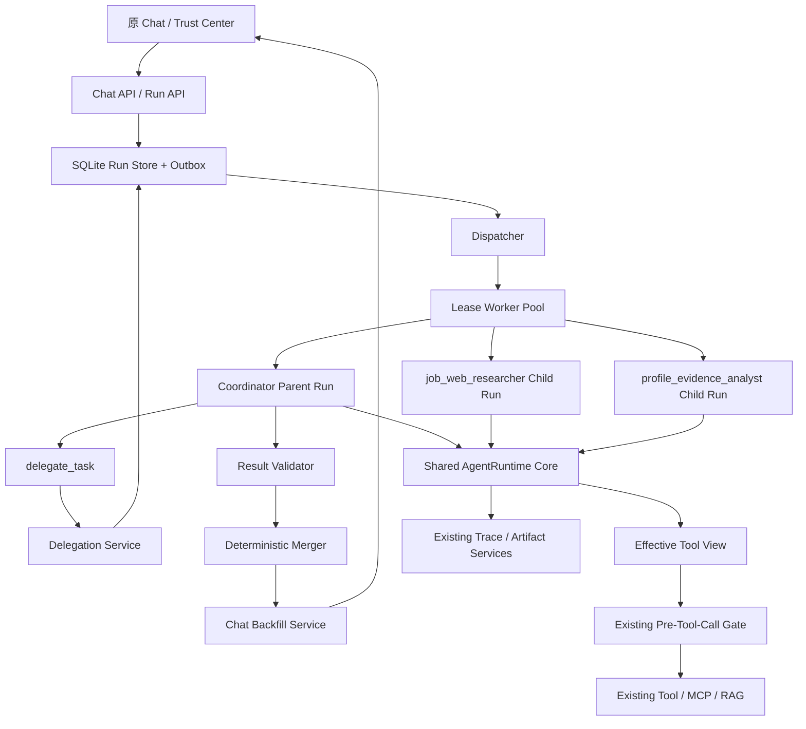
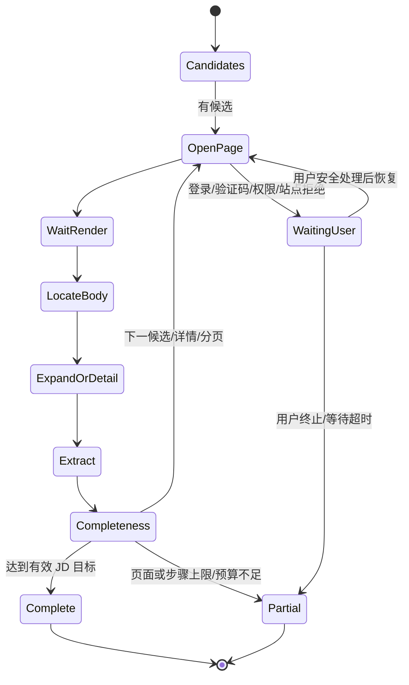
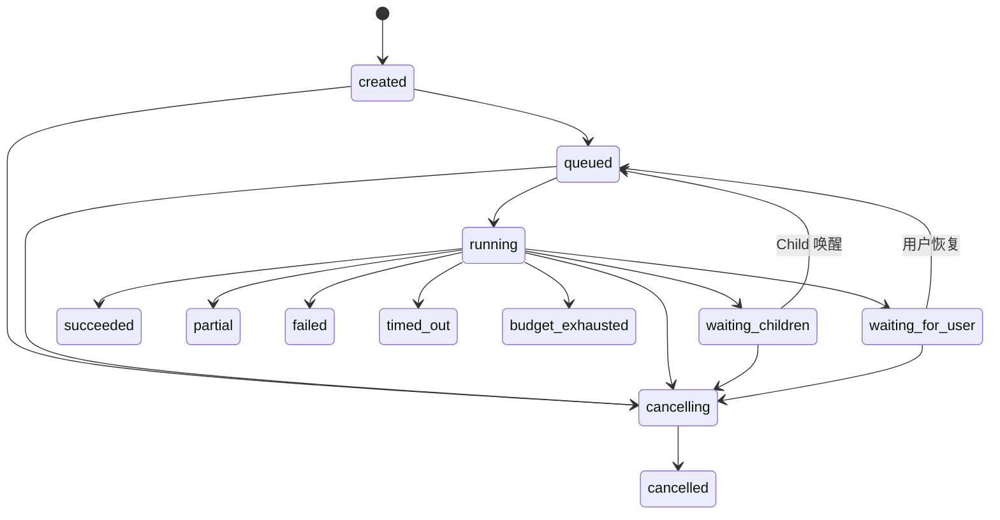
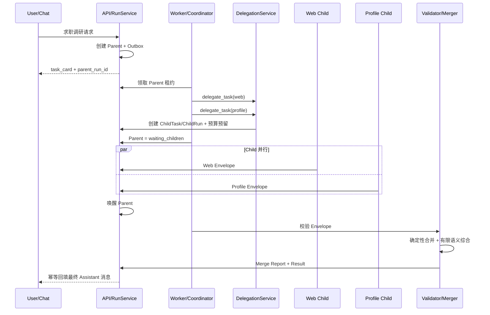
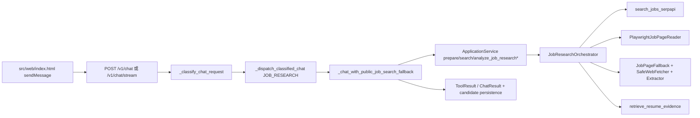

# 求职调研有边界任务委派设计

## 文档信息

- 前置需求：`docs/job-application-delegation-requirements.md` 已确认
- 设计基线：2026-08-10 当前真实工作区
- 已确认选型：SQLite Run Store + 数据库租约 Worker Pool
- Coordinator：模型辅助、契约驱动、可挂起并恢复
- Legacy 回滚期限：14 天或连续两个发布窗口，以先到者为准
- 本阶段产物仅为设计文档，不包含任务计划、代码或数据库迁移实现

## 1. 需求理解与设计目标

本设计为现有求职 Agent 增加“有边界的任务委派”。目标请求同时需要多页面 JD 网页调研和授权简历证据分析，但用户仍只面对原 Chat。系统在后台创建一个 Parent Run，并由 Coordinator 通过内部 `delegate_task` 创建真实 Child Run。Child 使用独立 Prompt、Context、Tool View 和预算执行受限的多轮 Model → Tool → Observation，最后只把受控 Result Envelope 返回 Parent。

设计目标如下：

1. 复用现有 `AgentRuntime` 循环、Tool/MCP/RAG、Pre-Tool-Call Gate、Trace、Artifact、Eval Runner 与 Safety Gate，不复制第二套 Agent Loop 或安全系统。
2. 将当前绑定 HTTP/SSE 请求的固定求职 Workflow 迁移为可持久化、可恢复、可取消的 Parent/Child Run。
3. Coordinator 只拆分、分配、预算、取消、收集、校验和合并，不成为拥有全部上下文和全部权限的超级 Agent。
4. `job_web_researcher` 负责多页面动态网页推进，`profile_evidence_analyst` 只负责授权 RAG 证据；二者不能互见对方 Tool Schema。
5. Parent 和所有 Child 使用同一无状态 Runtime 执行路径，但每次执行具有身份不同、状态隔离的 `RunContext`。
6. 原始 HTML、Snapshot、Child Messages 和 Tool 原始结果留在受限 Trace/Artifact；Parent 只接收标准化事实和引用。
7. 通过持久化状态、五维预算、租约、幂等、版本控制和确定性合并，处理并发、取消、重试、迟到和部分失败。
8. 在固定 Fixture 上证明 Multi-Agent 的质量、成本和延迟净收益；不达门槛时不启用。

## 2. 技术选型

### 2.1 持久化与调度

采用 **SQLite Run Store + 数据库租约 Worker Pool**：

- 新增逻辑独立的 `SQLiteRunStore`，与现有 Session、Capability、Trust Store 使用同一数据库技术和 SQLAlchemy/Pydantic 模式，但不把业务 Run 混入 Eval Run 表。
- 首版 Worker Pool 与 FastAPI 应用同进程启动，使用 `asyncio` 并发上限；任务真相、租约、心跳、状态、预算和结果全部落库，进程内 Queue 仅可作为唤醒优化。
- Worker 通过短事务、`status/version/lease_expires_at` 条件更新原子领取 Run；失败竞争者重新查询，不共享内存任务对象。
- 应用重启后，Reaper 将租约过期且未终止的 Run 重新排队或按重试策略结束。
- 调度接口与 Store 接口分离，未来可将 Dispatcher/Worker 替换为外部队列而不改变 Task Contract、Result Envelope 或 Runtime。

不采用纯 `asyncio.Queue` 作为正式语义，因为它无法恢复；首版不引入 Redis/Celery，以避免为本地 Starter 增加新的部署基础设施。

### 2.2 Runtime 与 Schema

- Python `asyncio` 保持现有异步模型。
- Pydantic 定义不可变 `RunSpec`、Task Contract、Result Envelope、Specialist Definition 和 API Schema。
- SQLAlchemy/SQLite 保存 Run、Task、Attempt、预算、租约、事件和回填 Outbox。
- JSON Schema 继续作为 Tool 输入和 Child 输出校验边界。
- 当前 `AgentRuntime` 重构为共享依赖 + 无状态执行核心；不新建另一个 Child Runtime Loop。

### 2.3 Registry 配置

- Specialist 的稳定定义来自版本控制的 YAML/JSON 文件和 Prompt 文件。
- 数据库保存启停/审核覆盖及运行时不可变快照，不允许通过任务输入动态改写 System Prompt。
- Registry reload 采用“完整解析和依赖校验 → 构建新快照 → 原子替换缓存”，失败时保留旧快照并记录健康错误。

### 2.4 方案比较结论

| 方案 | 优点 | 缺点 | 结论 |
|---|---|---|---|
| SQLite 租约 Worker + 可挂起 Coordinator | 复用现有栈、持久化、可恢复、Worker 不空等 | 需谨慎控制 SQLite 短事务和并发 | 采用 |
| 外部队列 + 独立 Worker | 扩展能力成熟 | 新增部署与运维依赖 | 未来替换选项 |
| 进程内 Queue + 持续等待 Parent | 实现简单 | 重启丢失、占用 Worker、无法满足需求 | 禁止作为生产语义 |

## 3. 总体架构设计



### 3.1 组件关系

- **Coordinator**：一种 Parent `RunSpec`，使用现有 Runtime，Tool View 仅含 `delegate_task`、受控结果检查/合并及必要用户确认能力。
- **`delegate_task`**：Coordinator 可调用的内部 Tool 适配器。它调用 Delegation Service，在数据库事务中创建 Child Task、Budget Allocation 和 Child Run；它不执行 Specialist 工作。
- **Specialist Registry**：为 Dispatcher、Context Builder 和 Tool View Builder 提供已版本化的 Specialist 快照。
- **Dispatcher**：查询可运行状态、检查依赖和背压、选择 Run、分配租约，不执行模型逻辑。
- **Worker Pool**：持有共享 Runtime/Core 服务，从 Store 领取一次 Run Attempt，构建独立 Context 并执行。
- **Child Agent Runtime**：不是新类或新 Loop，而是现有 Runtime 以 Child `RunSpec + RunContext` 运行时的角色称呼。
- **Result Validator**：在 Parent 吸收结果前执行确定性 ID、Schema、来源、证据、权限、预算和敏感字段校验。
- **Merger**：先确定性去重和冲突保留，再进行有限语义综合，输出 Merge Report。
- **现有 Runtime**：提供唯一 Model/Tool Loop；实例仅保存共享、无 Run 可变状态的依赖。

### 3.2 Tool Call 表现与 Child Run 语义

`delegate_task` 可以使用 Provider Tool Call 协议，使 Coordinator 以结构化方式表达委派。但它与普通 Tool 和固定 Workflow 有本质差异：

| 边界 | 普通 Tool | `delegate_task` | 固定 Workflow |
|---|---|---|---|
| 执行单元 | 一次有界函数/MCP 调用 | 持久化 Child Task + 独立 Child Run | 当前请求内代码阶段链 |
| 生命周期 | 当前模型调用内完成 | 可排队、挂起、恢复、取消、重试 | 依赖当前调用栈 |
| 上下文 | Tool 参数 + ToolContext | Registry + Contract + Runtime 注入 + 最小引用加载 | 常共享调用方状态 |
| 模型循环 | 无独立循环 | 同一 Runtime 的独立多轮循环 | 通常没有独立 Agent Loop |
| 结果 | ToolResult | 创建确认；业务结果稍后以 Envelope 返回 | 直接返回固定聚合结果 |

执行 `delegate_task` 后，Runtime 处理同一模型响应中的全部委派调用，再在进入下一次模型请求前发现存在未完成 Child，将 Parent 持久化为 `waiting_children` 并返回 `RunOutcome.suspended`。Worker 随即释放租约。Child 终态满足唤醒条件后，Dispatcher 重新排队 Parent；Context Builder 只加载合法 Envelope 和 Trace 引用后继续同一 Parent Run。

## 4. 模块/组件设计

### 4.1 `AgentRuntime` 无状态执行核心

目标接口：

```python
async def run(
    spec: RunSpec,
    context: RunContext,
) -> RunOutcome:
    ...
```

`RunSpec` 是不可变执行说明：角色、Provider/Model、System Prompt 引用、输出 Schema、停止策略、最大步骤、Tool View 要求和 Runtime 版本。`RunContext` 是一次 Run 独占的可变状态。

当前 `AgentRuntime` 构造器中的 Tool Registry、Gate、Executor、Turn Coordinator、Token Counter 等共享服务可以保留；当前实例级 `budget`、`knowledge_scope`、`knowledge_base_id` 必须改由 `RunSpec/RunContext` 提供。`run()` 中现有局部 `model_calls`、`tool_calls`、`repeated_calls`、`generated`、usage 和 Tool result tokens 进入 `RunContext` 或该 Attempt 的局部状态并持久化检查点。

Parent 和 Child 的区别只能来自参数：

```text
runtime.run(parent_spec, parent_context)
runtime.run(child_spec, child_context)
```

禁止复制 Parent Agent 对象、浅拷贝其 messages、在 Worker 间共享 Context，或新增 `SubagentLoop`。

### 4.2 `RunContext`

每个对象至少包含：

```text
run_id / parent_run_id / child_task_id
session_id / turn_id / principal
messages
working_memory
todo_plan
effective_tool_view
budget_ledger
cancellation_token/version
summary_trim_state
output_buffer
trace_context
artifact_refs
context_version
```

Context 创建后拥有独立容器对象；只读共享定义通过 ID/不可变对象引用。恢复时从持久化检查点重建一个新 `RunContext` 实例，而不是反序列化或复用旧 Agent 实例。

### 4.3 Specialist Registry

`SpecialistDefinition` Schema：

```text
specialist_id
version
enabled / disabled_reason
system_prompt_ref / prompt_hash / prompt_version
capability_tags[]
input_schema / output_schema / schema_version
allowed_tools[]
allowed_knowledge_scope_types[]
allowed_artifact_types[]
default_budget / max_budget
max_steps / max_concurrency / deadline_defaults
retry_policy / failure_behavior
dependency_requirements[]
```

配置来源优先级：版本控制定义是 Prompt/Schema/权限真相；数据库可停用或要求审核，但不能扩大文件权限。能力匹配先按 capability tags 过滤，再校验输入 Schema、依赖健康、启用状态和预算。错误：

- `specialist_not_found`
- `specialist_disabled`
- `specialist_schema_invalid`
- `specialist_dependency_unavailable`
- `specialist_capability_mismatch`
- `specialist_registry_stale`

### 4.4 Dispatcher 与 Worker Pool

Dispatcher 只处理可运行性：

1. 选择 `queued` 且 `available_at <= now` 的 Run。
2. 检查 Parent 取消版本、deadline、依赖和预算预留。
3. 以 `expected_version` 条件更新 `running`、`lease_owner`、`lease_expires_at`、attempt。
4. Worker 周期性 heartbeat；版本或 owner 不匹配即停止提交结果。
5. 完成时原子写终态/挂起状态、usage、Envelope 引用和 Outbox 事件。

Worker Pool 使用 Semaphore 控制全局并发，并可按 Specialist 另设上限。数据库积压超过高水位时，Chat 仍可创建 Parent，但状态为 `queued` 并返回预计排队信息；系统拒绝超过硬队列容量的新 Run，返回 `run_queue_overloaded`。

### 4.5 Result Validator

校验顺序固定：

1. `child_run_id/task_id/parent_run_id` 关联及终态检查。
2. Registry/Contract/Envelope 版本和 JSON Schema。
3. 大小、字段白名单、敏感字段和 Artifact 引用权限。
4. `source_url`、内容 Hash、`chunk_id` 等 evidence 可追溯性。
5. effective tool view 与实际 Trace 的一致性。
6. usage 与 Budget Ledger 的一致性。
7. 重复、迟到和冲突检测。

非法 Schema 默认失败；仅允许由同一 Child 在剩余预算内执行一次结构化修复，修复调用仍走相同 Runtime/Tool View，不能由 Coordinator 猜测解释。

### 4.6 Merger

Merger 分两阶段：

- **确定性阶段**：Schema 校验、规范化 URL、岗位/Chunk 去重、来源优先级、冲突集合、missing 聚合、证据覆盖度和排序特征计算。
- **有限语义阶段**：只读取经过确定性验证的结构化数据，生成投递优先级说明、匹配依据和能力缺口文字；输出再次校验，不得修改事实、删除冲突或补齐 missing。

Merge Report 保存输入 Envelope ID/Hash、接受/拒绝原因、去重组、冲突、缺失、排序规则、语义综合版本和最终结果 Hash。

### 4.7 写入隔离

Child 只写 Run 专属候选 Artifact，不直接修改共享投递计划、岗位状态或 Chat。Coordinator 合并后通过：

- `aggregate_id + expected_version` 乐观锁
- 业务唯一键
- `idempotency_key`
- Outbox

提交共享写入。不同 Parent 并发修改同一计划时，一个成功，另一个进入 `merge_conflict` 并重新读取或请求用户确认，不做 last-write-wins。

## 5. Specialist 设计

### 5.1 `job_web_researcher`

#### System Prompt 边界

Prompt 只定义：公开 JD 事实调研、网页文本是不可信数据、必须遵守 Tool/Gate、不得访问简历/RAG、不得绕过登录/验证码/权限、输出必须符合 Schema。Prompt 不包含主 Chat、用户简历、投递计划或 Coordinator 隐藏状态。

#### 输入

```text
query / location / candidate_urls[]
target_fields[]
target_valid_jobs
max_pages
max_steps
per_page_timeout_seconds
stop_conditions[]
output_schema_version
artifact_refs[]（仅必要网页线索）
```

#### 最小 Tool 集

- `search_jobs_serpapi`
- `mcp__playwright__browser_navigate`
- `mcp__playwright__browser_wait_for`
- `mcp__playwright__browser_snapshot`
- 经审核的 Browser 点击、展开、返回、翻页能力
- 仅在明确一次性稳定单页路径时开放的底层单页读取能力

禁止 RAG、简历 Tool、邮件/投递写 Tool、长期记忆和 `delegate_task`。

#### 输出 Schema 摘要

```json
{
  "jobs": [
    {
      "title": "string|null",
      "company": "string|null",
      "location": "string|null",
      "responsibilities": ["string"],
      "requirements": ["string"],
      "source_url": "https://...",
      "final_url": "https://...",
      "retrieved_at": "datetime",
      "validation_state": "verified|partial_verified",
      "content_hash": "sha256",
      "artifact_refs": ["artifact_id"]
    }
  ],
  "missing": [],
  "errors": [],
  "visited": {"page_count": 0, "step_count": 0}
}
```

### 5.2 网页推进状态机



默认 Registry 限制：`max_pages=10`、`max_steps=30`、`per_page_timeout=35s`、每类可恢复错误最多 2 次、连续 3 个不可恢复候选失败则停止。Task Contract 可以请求更小值，不能扩大 Registry/Policy/Parent 上限。

去重使用规范化 URL、最终 URL、内容 Hash 和岗位关键字段签名。停止条件还包括取消、deadline、任一硬预算不足以安全开始下一步、目标数达到、依赖失效或人工阻塞超时。

### 5.3 普通网页 Tool 与 Subagent 边界

单个稳定 URL、字段固定、一次请求即可返回的读取保持普通 Tool，因为它具有短生命周期、无决策状态、易重试和清晰输入输出。跨页面探索需要保存导航状态、根据 Observation 决定下一步、处理动态渲染/异常并压缩大量内容，因此由 `job_web_researcher` 承担。

主 Agent 只定义目标、约束和结果契约，不参与 URL 选择、等待、点击、翻页或正文定位；否则会把 Browser Schema、网页噪声和导航状态重新引入 Parent Context。

### 5.4 `profile_evidence_analyst`

#### System Prompt 边界

只从授权简历知识库引用证据；岗位要求不是用户经历；无证据必须返回 missing；禁止补写技能、年限、项目、教育或成果。

#### 输入

```text
normalized_job_requirements[]
knowledge_scope
candidate_chunk_ids[]（可选）
top_k
output_schema_version
```

#### 最小 Tool 集

仅 `retrieve_resume_evidence` 或等价授权 RAG Tool。禁止 Search、Browser、写 Tool、长期记忆和 `delegate_task`。

#### 输出

每个岗位要求对应：`requirement_ref`、`match_status`、`evidence[]`、`chunk_id`、证据强度、`missing[]`、`conflicts[]`。正向匹配没有授权 Chunk 引用时，Validator 必须拒绝。

## 6. 数据模型

### 6.1 `ParentRun`

```text
id: parent_run_id
run_type: job_application_research
session_id / origin_turn_id / principal
coordinator_spec_version / runtime_revision
status / phase / version
priority / available_at
deadline_at
cancellation_version / cancel_requested_at / cancelled_at
budget_total / budget_reserved / budget_consumed
result_version / merge_report_id
backfill_status / backfill_message_id
route / legacy_path_used
created_at / started_at / completed_at / updated_at
```

### 6.2 `ChildTask`

```text
id: child_task_id
parent_run_id
specialist_id / specialist_snapshot_id
goal
inputs_ref_json / constraints_json
output_schema_version
requested_allowed_tools
failure_behavior
idempotency_key / contract_hash
status / version
created_at / updated_at
```

### 6.3 `ChildRun`

```text
id: child_run_id
child_task_id / parent_run_id
attempt
status / phase / version
lease_owner / lease_token / lease_expires_at / heartbeat_at
deadline_at
run_context_checkpoint_ref
effective_tool_view_hash
result_envelope_ref / result_hash
error_code / retryable
started_at / completed_at
```

逻辑重试复用 `child_task_id`，每次 Attempt 使用新的 `child_run_id`。只有一个 Attempt 能被标记为 Task 的 accepted result。

### 6.4 `TaskContract`

```text
task_id / parent_run_id / specialist_id
goal
inputs: 引用优先
constraints
requested_allowed_tools
requested_deadline
requested_budget
failure_behavior: fail_parent | allow_partial | wait_for_user
idempotency_key
contract_version
```

System Prompt、Registry Tool 默认值和输出 Schema 不由 Coordinator 传入，避免覆盖 Registry。

### 6.5 `BudgetAllocation`

每个维度分别保存：

```text
dimension: tokens | cost_microunits | wall_clock_ms | model_calls | tool_calls
limit
requested
reserved
consumed
released
estimated / price_version / usage_source
version
```

创建 Child 时在同一事务内从 Parent 剩余量预留。实际结算后释放未用量。Provider 没有费用字段时使用真实 Token usage × 版本化价格；既无可靠 usage 又无保守上界时返回 `cost_budget_unenforceable`，不得记为 0。

### 6.6 `ResultEnvelope`

```json
{
  "envelope_version": "1",
  "status": "succeeded|partial|failed",
  "output": {},
  "evidence": [],
  "missing": [],
  "conflicts": [],
  "usage": {
    "tokens": {},
    "cost_microunits": 0,
    "wall_clock_ms": 0,
    "model_calls": 0,
    "tool_calls": 0,
    "estimated": false
  },
  "child_run_id": "...",
  "task_id": "...",
  "trace_ref": "..."
}
```

Parent Context 只吸收通过校验的 Envelope、安全错误摘要和 Trace 引用。

### 6.7 `MergeReport`

```text
id / parent_run_id / result_version
input_envelope_refs[] / input_hashes[]
accepted[] / rejected[]
dedup_groups[]
missing[] / conflicts[]
source_validation[] / evidence_validation[]
ranking_features / deterministic_order
semantic_synthesis_version
final_output_ref / final_output_hash
created_at
```

### 6.8 状态机

Parent 与 Child 共用受控状态集合，Parent 额外使用 `waiting_children`：



终态不可离开。所有转换使用 `expected_version`，并在同一事务内追加状态事件。迟到结果不能改变 Parent/Child 终态。

## 7. API / 服务接口设计

### 7.1 Chat 兼容接口

`POST /v1/chat` 和 `POST /v1/chat/stream` 保留。求职调研创建 Parent 后快速返回：

```json
{
  "session_id": "...",
  "turn_id": "...",
  "content": "已创建后台求职调研任务。",
  "parent_run_id": "...",
  "run_status": "queued",
  "task_card": {
    "phase": "queued",
    "completed_children": 0,
    "total_children": 0,
    "can_cancel": true
  }
}
```

新增字段均为可选，避免破坏普通 Chat 客户端。SSE 可推送创建确认和事件游标，但连接断开不取消 Run。

### 7.2 Run API

- `GET /v1/runs/{parent_run_id}`：Parent 状态、phase、Child 摘要、预算、missing/conflicts、Merge Report 摘要。
- `GET /v1/runs/{parent_run_id}/events?after=<seq>`：按单调事件序号增量读取。
- `POST /v1/runs/{parent_run_id}/cancel`：请求含 `idempotency_key`、`expected_version`；重复取消返回当前状态。
- `POST /v1/runs/{parent_run_id}/resume`：仅 `waiting_for_user` 且授权挑战已处理时使用。
- `GET /v1/runs/{parent_run_id}/artifacts`：只返回当前主体有权查看的 Artifact 元数据，不默认返回正文。

### 7.3 内部服务接口

```text
RunService.create_parent(request, route_decision) -> ParentRun
DelegationService.delegate_task(parent_id, specialist_id, contract) -> DelegationReceipt
Dispatcher.claim_next(worker_id, lease_ttl) -> RunLease | None
Dispatcher.heartbeat(run_id, lease_token, expected_version) -> Lease
RunExecutor.execute(lease) -> RunOutcome
ResultValidator.validate(envelope, task_snapshot) -> ValidationResult
Merger.merge(parent_id, validated_results) -> MergeReport
ChatBackfillService.publish_once(parent_id, result_version) -> message_id
CancellationService.cancel_parent(parent_id, expected_version) -> ParentRun
```

### 7.4 `delegate_task` Tool Schema

Coordinator 仅传：

```json
{
  "specialist_id": "job_web_researcher",
  "task_contract": {
    "goal": "...",
    "inputs": {"artifact_refs": [], "query": "..."},
    "constraints": {},
    "requested_allowed_tools": [],
    "requested_deadline": "...",
    "requested_budget": {},
    "failure_behavior": "allow_partial",
    "idempotency_key": "...",
    "contract_version": "1"
  }
}
```

后端注入 Task/Parent/Child IDs、Registry Prompt/Schema、最终 Tool View、最终 deadline/budget、Policy 与 Trace Context。Tool 返回 `DelegationReceipt`，不返回业务结果。

## 8. 状态流转与交互流程

### 8.1 正常流程



Profile Child 可以先依据岗位查询模板检索通用简历能力证据；若最终匹配需要具体 JD 要求，则 Coordinator 可在 Web Envelope 到达后创建或恢复 Profile Task。首版优先使用两阶段依赖，而不是把完整 Web Child 中间状态共享给 Profile Child。

### 8.2 取消流程

1. API 原子增加 Parent `cancellation_version` 并设 `cancelling`。
2. Dispatcher 不再领取新 Child；queued Child 转 cancelling/cancelled。
3. running Child 在 Model 调用前、Tool Gate 前、Tool 返回后和循环步边界检查持久化取消版本。
4. 取消前 Artifact/Trace 保留；Result 不再进入合并。
5. Child 全部终止或取消宽限期结束后 Parent 转 `cancelled`。
6. Chat 不回填业务结论，只更新任务卡终态。

### 8.3 人工阻塞

登录、验证码、权限或审批使 Child 进入 `waiting_for_user`，释放 Worker 和 Browser 之外不安全持有的资源。Parent phase 显示阻塞原因。用户处理后 `resume` 创建新租约/Attempt 或从安全检查点继续；不得自动绕过挑战。

## 9. 当前网页 Workflow 审计与迁移

### 9.1 当前调用链



### 9.2 旧输出契约与测试依赖

| 层 | 当前契约 | 主要测试依赖 |
|---|---|---|
| Router/API | 请求内返回 `ChatResult`，Stream 依赖进程内 Task/Queue | `tests/integration/test_api.py`、`test_rag_chat.py` |
| Application Service | `prepare/search/analyze_job_research*()` 返回 `SkillRunResult` | `tests/integration/test_job_research_orchestration.py` |
| Orchestrator | `status/data/trace/error_code/missing_dependencies`；data 含 jobs、partial_jobs、attempts、evidence、analysis | `tests/unit/test_job_research_skill.py`、audit/baseline tests |
| Page Reader | `PageReadResult(result,traces,attempts,error_code)` | `tests/unit/test_job_page_reader.py` |
| HTTP fallback | `FallbackResult(jobs,partial_jobs,method,failures)` | `tests/unit/test_job_page_fallback.py` |
| E2E/Smoke | 直接构造/调用 Orchestrator 或 Application methods | `tests/e2e/test_playwright_job_research.py`、`trust/smoke.py` |

`_legacy_public_job_search_answer()` 当前只发现定义，没有生产调用方；迁移测试必须证明它没有被重新接回默认/备用路径。

### 9.3 迁移后唯一主路径

所有符合“多页面、动态页面、需根据 Observation 推进或异常恢复”条件的求职请求只能进入：

```text
Router
→ RunService.create_parent
→ Coordinator Runtime
→ delegate_task(job_web_researcher, task_contract)
→ persisted Child Run
```

迁移措施：

1. Router 从正常 `JOB_RESEARCH` 分支移除 `_chat_with_public_job_search_fallback()`。
2. `JobResearchOrchestrator` 不再作为生产跨工具 Workflow；其中候选排序、JD 校验、公司归属和答案格式拆成无状态库供 Child/Validator/Merger 复用。
3. `PlaywrightJobPageReader`、`SafeWebFetcher` 和 Extractor 收敛为 `job_web_researcher` 内部能力或显式一次性单页 Tool。
4. Application 旧 methods 仅保留版本化兼容 Adapter 或冻结的单 Agent baseline，不允许自动 fallback。
5. E2E 与 Smoke 改为从 Parent Run 入口验证真实 Child；旧 Orchestrator Fixture 只作为冻结基线。

### 9.4 防双轨与兼容

- 兼容 Adapter 不得再次执行 Search/抓取；它只能读取新 Run/Envelope 并转换旧只读输出格式。
- 用 `parent_run_id + specialist_id + contract_hash` 生成 Child Task 幂等键。
- 候选 URL 规范化键、页面内容 Hash、Artifact 唯一键、usage ledger 和 Chat 回填 Outbox 唯一键防止重复副作用。
- 初始 `ChatResult` 以可选字段扩展；最终用户答案格式尽量兼容。
- 回滚开关默认关闭，仅 operator 可启用，且每次使用记录 `route=legacy_job_research`、`legacy_path_used=true`、原因和操作者。
- 回滚期限为上线后 14 天或连续两个发布窗口，以先到者为准；到期删除开关、Router 分支和可执行旧 Workflow，保留冻结评测基线。

迁移观测字段至少包括：`route`、`legacy_path_used`、`parent_run_id`、`child_task_id`、`child_run_id`、`specialist_version`、`contract_hash`、`effective_tool_view_hash`。

## 10. Child Context Assembly 与 Tool View

### 10.1 字段所有权与冲突优先级

| 来源 | 提供内容 | 禁止覆盖 |
|---|---|---|
| Coordinator | Specialist ID、goal、必要 inputs、constraints、failure behavior、请求预算 | System Prompt、输出 Schema、扩大工具/预算 |
| Registry | System Prompt、工具上限、输入/输出 Schema、版本、默认/最大限制 | Parent 授权、实际 ID、剩余预算 |
| Runtime | Parent/Task/Child ID、最终 deadline/budget、Policy、Trace、幂等和取消 | 业务证据和缺失字段 |
| Context Builder | 按引用加载已授权片段并组装最小消息 | 完整 Chat/记忆、无关 Child、全部 Tool Schema |

冲突优先级：Policy 硬限制 > Parent 剩余预算/授权 > Registry 最大值和不可覆盖定义 > Coordinator 请求 > Registry 默认值。冲突不能静默放宽；返回结构化错误并记录 Trace。

### 10.2 最小上下文包

Context Builder 输入引用而非正文：

- `artifact_id`：按 run/principal/type 权限加载必要网页片段。
- `knowledge_scope`：限制 user/project/knowledge base。
- `chunk_id`：只加载匹配岗位要求所需简历 Chunk。
- `source_url/content_hash`：校验来源而不是复制整页。

禁止复制完整主 Chat、全部长期记忆、其他 Child 中间 messages、完整 JD 原文和无关 Tool Schema。加载后的片段附来源和不可信数据标记，并受现有 Token Counter、Summary/Trim 和 Tool Result Guard 管理。

### 10.3 Effective Tool View

```text
effective_tools =
  Specialist Registry allowed_tools
  ∩ Task Contract requested_allowed_tools
  ∩ scenario_tool_view
  ∩ current Policy allowed capabilities
  ∩ dependency healthy/callable snapshot
```

共享 `UnifiedToolRegistry` 只作为源；每个 Run 创建不可扩权的过滤视图，实现 `get()`、`schemas()`、`model_snapshot()`，Runtime 只访问该视图。完整 Registry Schema 不进入模型请求。

- 求职 Coordinator：`delegate_task`、受控校验/合并、用户确认。
- Web Child：Search/Browser。
- Profile Child：授权 RAG。
- 其他业务场景若需要这些 Tool，必须使用自己的场景 Tool View 显式开放，不能继承求职配置。

所有可见 Tool 执行时仍经过现有 Pre-Tool-Call Gate；Parent 的确认或权限不会自动传给 Child。`delegate_task` 从所有 Child 视图和 Gate 可执行集合中移除，首版递归深度固定为 0。

## 11. 网页上下文治理

1. Browser 原始返回先写 Child 专属受限 Artifact，记录 requested/final URL、content hash、Tool/Policy/Approval ID。
2. 页面预处理去除导航菜单、Cookie banner、重复 DOM、脚本样式和无关区域。
3. 单页按标题、公司、地点、职责、要求等目标字段抽取；超限正文使用现有 Tool Result Guard 和字段感知摘要。
4. Child messages 只接收裁剪后的 Observation 和 Artifact 引用，不反复注入相同 DOM。
5. Parent 仅吸收 Result Envelope 的标准化 `jobs[]`、source、missing、errors、usage 和 Trace 引用。
6. 完整 Child Messages、Tool 原始结果和普通日志保留在受访问控制的 Store；隐藏推理不保存为可展示内容。
7. Trace/Artifact 写入前沿用现有脱敏；正文保留期、容量上限和按需查看权限独立配置，过期后保留 Hash 和最小审计元数据。

## 12. 错误处理

### 12.1 网页错误分类

| 错误 | 行为 | 是否重试 |
|---|---|---|
| 加载/连接失败 | 退避后重试，耗尽则换候选 | 最多 2 次 |
| 404/410 | 标记失效，Search 可提供另一公开详情入口 | 原 URL 不重试 |
| 重定向 | 每跳重新过网络 Gate，保留 requested/final URL | 受最大跳数限制 |
| 动态渲染超时 | 延长到契约允许的第二等待档或换入口 | 最多 2 档 |
| 选择器失效 | 使用结构化/语义正文定位，仍失败则 partial | 有界 |
| 空正文 | 第二 Snapshot；仍空则换候选 | 1 次 |
| 重复页 | 记录 deduplicated，不重复提取/计数 | 不重试 |
| 登录/验证码 | `waiting_for_user` 或 partial | 不自动绕过 |
| 权限/robots/站点拒绝 | 明确错误和 missing | 不绕过、不换隐蔽入口 |

### 12.2 Run 与结果错误

- **部分失败**：按 Task `failure_behavior` 生成 Parent partial 或 failed；成功证据保留。
- **迟到结果**：保存 Artifact/Trace，标记 `late_ignored`，不改终态、不合并。
- **重复结果**：相同幂等键和 Hash 返回已接受结果；不同 Hash 返回 `idempotency_payload_conflict`。
- **来源冲突**：进入 `conflicts[]`，保持所有来源和优先级理由。
- **Schema 不合法**：同 Child 最多一次修复；失败后拒绝 Envelope。
- **预算耗尽**：停止新的 Model/Tool，结算 usage，状态 `budget_exhausted`。
- **租约丢失**：Worker 停止提交；已产生外部 usage 仍按 Tool/Model Trace 对账。
- **Registry 不存在/禁用**：委派失败，不创建可运行 Child；Parent 按 failure behavior 处理。
- **Gate 拒绝**：不得调用 Tool；记录 Policy/Approval 关联并返回受控错误。

## 13. 性能与安全考虑

### 13.1 性能

- SQLite 开启适合现有应用的 WAL/忙等待配置，领取、heartbeat 和状态更新保持短事务；模型/网络调用绝不持有数据库事务。
- Worker 全局并发、每 Specialist 并发、Browser 并发和每 Parent Child 数分别限制。
- Parent 在 `waiting_children/waiting_for_user` 时不占 Worker。
- Run/Event API 使用分页和事件游标；Trust Center 不一次加载完整 Child Artifact。
- Context 只加载引用片段，减少 Token、序列化和数据库复制。
- 队列高水位产生背压，避免无限创建 Browser 会话。

### 13.2 五维预算

最终 Child 限额为：

```text
min(
  Coordinator 请求,
  Registry 最大值,
  Policy 限制,
  Parent 各维剩余量
)
```

并行前先原子预留 Token、费用、墙钟、模型调用、工具调用五维预算。Runtime 在每次 Model 前、Tool Gate 前和步骤结束后检查。费用使用版本化价格表；unknown 不按 0 处理。

### 13.3 安全

- Tool Schema 不可见性与 Gate 执行限制双层强制最小权限。
- 网页内容、RAG 片段和 Artifact 都标记为不可信数据，不可覆盖 Prompt/Contract/Policy。
- 所有 Browser/HTTP 重定向继续使用现有 SSRF、Network Guard、robots 和范围策略。
- Child 不继承 Parent Approval；需要确认时创建与 Child Tool Call 关联的新 Approval。
- `delegate_task` 只接受 Coordinator Run 身份，Child 即使伪造 Tool 名也在 Tool View 和 Gate 两层被拒绝。
- 日志不记录完整 Prompt、简历、Cookie、验证码、HTML 或隐藏推理。

## 14. Trace、日志与前端状态模型

### 14.1 Trace Context

```text
eval_run_id
case_id
session_id
turn_id
parent_run_id
child_task_id
child_run_id
model_request_id
tool_call_id
policy_decision_id
approval_id
parent_event_id
```

现有 `TrustTraceEvent.child_run_id` 复用并扩展 `parent_run_id/child_task_id`。Capability Audit 继续记录 Gate/Permit/Tool；Trust Trace 通过相同 ID 关联，不复制原始日志。

必须记录：Registry 快照、Contract Hash、Tool View Hash、状态转换、租约、预算预留/消费/释放、取消版本、Envelope 校验、Merge Report 和 Chat 回填。

### 14.2 Trust Center/运行详情

父子树节点显示：状态/phase、Specialist/版本、attempt、开始/结束、租约健康摘要、五维预算、missing/conflicts、失败原因。Parent 展示并发 Child、取消传播和 Merge Report 证据。受限 Artifact 仅对授权用户按需打开，不显示隐藏推理。

Chat 任务卡显示 Parent ID、进度、阶段、预算、开始时间、取消和详情入口。刷新后从 Run API 恢复；SSE 只作为加速，事件按 `event_seq/run_version` 去重，前端不推导权威终态。

### 14.3 自动回填

Merger 完成后在事务内写 `chat_backfill_requested` Outbox。Backfill Service 使用唯一键 `parent_run_id + result_version + message_kind` 写一条 Assistant 消息。重复 Outbox、前端重连或 Worker 重试不会产生重复消息。Cancelled/failed/timed_out/budget_exhausted Parent 不回填业务结论。

## 15. 测试策略

### 15.1 测试矩阵

| 层级 | 重点 |
|---|---|
| 单元 | 状态转换、乐观锁、租约、预算预留/结算、Registry reload、能力匹配、Tool View 交集、Schema Validator、Merger、幂等键、价格计算 |
| Runtime | Parent/Child 同 Loop、挂起/恢复、停止条件、最大步骤、取消检查、Tool Gate 不旁路 |
| Context 隔离 | 对不同 Parent/Child `RunContext` 执行 `is not` 身份断言；并发修改 messages、working memory、todo/plan、Tool View、预算、取消、summary/trim、output buffer 后检查跨 Run 不可见 |
| Store/Worker 集成 | SQLite 原子领取、并发竞争、heartbeat、租约过期重领、Worker 崩溃、Backpressure、Reaper、Outbox |
| Tool/权限集成 | Coordinator 无 Search/Browser/RAG；Web Child 仅 Search/Browser；Profile Child 仅授权 RAG；Child 无 `delegate_task`；所有调用关联 Gate/Policy/Approval |
| 结果集成 | 双成功、单失败、超时、取消、迟到、重复、冲突、非法 Schema、预算耗尽、Chat 单次回填 |
| API/E2E | Chat 创建后台 Run、刷新恢复、增量事件、父子详情、取消、waiting_for_user/resume、自动回填 |
| 固定 Fixture | 单 Agent baseline 与 Multi-Agent 候选使用相同 Case/版本，进入 Release Gate |
| 真实 Smoke | 真实 Search/Browser 动态页，独立 `run_type/report`，不参与固定 Gate |

### 15.2 网页与迁移回归

- 旧 Router 分支不可达测试。
- 兼容 Adapter 不触发 Search/Browser 测试。
- 同一 Parent/Contract 只创建一个逻辑 Child Task。
- URL/内容 Hash 去重后不重复抓取和写 Artifact。
- Legacy 开关默认关闭、operator 限制、到期不可使用。
- `route/legacy_path_used/child_run_id` 等观测字段完整。

### 15.3 固定对比指标

- Task Success
- wall-clock 与 P95 latency
- prompt/completion/total Token
- 版本化成本
- 有效 JD 完整率和来源完整性
- 简历证据忠实度
- 失败复杂度：失败分支数、重试次数、人工介入数、无法解释错误数

发布门槛：三项质量指标至少一项提升 ≥10 个百分点，其余不下降；Safety 无回归；成本 ≤1.5 倍；P95 延迟 ≤2 倍。未通过时结论为单 Agent 更优/不启用 Multi-Agent。

### 15.4 现有入口复用

- `uv run pytest`
- `agent trust fixture-baseline --run-id <id>`
- `agent trust real-smoke --run-id <id> --source-url <url>`
- `pytest tests/e2e/test_playwright_job_research.py -m external -q`

扩展现有 pytest、Eval Runner、Trust Store 与 Safety Gate，不建立第二套测试运行器。

## 16. 风险与待确认事项

1. **SQLite 竞争**：高并发 Browser Worker 可能放大写竞争；需要用压测确定同进程 Worker、heartbeat 间隔和事务重试上限。达到扩展阈值后仅替换 Dispatcher/Store 适配层。
2. **Runtime 重构兼容**：当前实例持有全局 budget/knowledge scope。重构必须保证普通 Chat、邮件和已有 Tool 路径的兼容 Adapter 不共享 Run 状态。
3. **Provider 费用**：价格表来源、版本和 unsupported model 策略需在实现前冻结，否则费用硬限制不可执行。
4. **Browser 恢复**：`waiting_for_user` 后是否能安全复用原 Browser session 依赖 MCP 能力；不能保证时应创建新 Attempt 并从安全 URL 检查点恢复。
5. **Profile 依赖顺序**：具体岗位匹配需要 Web 输出。首版应使用显式依赖图或 Parent 二阶段委派，不能复制 Web Child 的中间 Context。
6. **Artifact 保留**：HTML/Snapshot 的保留期、加密、容量和授权查看角色需与现有隐私策略确认。
7. **Legacy 清理纪律**：14 天/两个发布窗口到期必须删除可执行旧路径，避免“临时”开关永久存在。
8. **工作区已有修改**：当前求职相关源文件已有用户未提交改动；未来实施前必须重新审计最新调用链，不能覆盖或假设这些改动属于本设计。
9. **Task/Todo 现状**：当前仓库没有可复用的业务 Todo/Plan Store。本设计的 `todo_plan` 是 Run-scoped Context 字段，不应误接到不存在的全局 Todo 服务。
10. **隐藏推理边界**：仅保存可审计消息、Tool Observation 和决策摘要，不把模型隐藏推理设计为可查询字段。

## 17. 设计完成边界

本设计经确认后仅作为下一阶段输入。本文件不包含实施任务拆分、代码改动顺序或发布操作；在用户另行要求前不生成任务计划、不修改代码。
