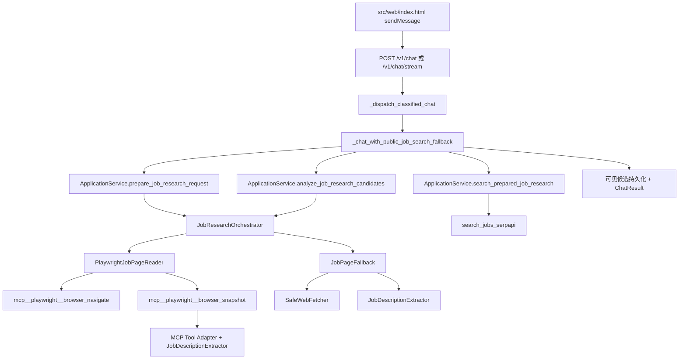

# 求职调研有边界任务委派：实施前仓库审计

## 1. 文档目的与审计边界

- 审计日期：2026-08-10。
- 对应计划：`docs/job-application-delegation-task.md` 的 Task1。
- 目的：冻结当前真实生产调用链、输入输出契约、共享状态、网络与持久化副作用、测试依赖和迁移结论，作为 Task2 至 Task22 的实施基线。
- 本文只记录事实与迁移边界，不修改 Runtime、路由、Tool、数据库或前端行为。
- 扫描范围：`src/starter_agent/**/*.py`、`src/web/index.html`、`tests/**`、`evals/job-research/**`、配置与已确认的需求/设计/任务文档。

## 2. 当前工作区基线

审计时分支为 `main`，工作区在 Task1 开始前已经存在用户未提交修改。以下重叠文件属于用户基线，本 Task 不覆盖其内容：

| 状态 | 文件 | 与后续委派工作的重叠 |
|---|---|---|
| modified | `src/starter_agent/interfaces/api.py` | 求职 Router、固定 Workflow、Chat/SSE 输出 |
| modified | `src/starter_agent/job_research/candidates.py` | 搜索候选与 JD 输入 |
| modified | `src/starter_agent/job_research/fallback.py` | HTTP/摘要降级路径 |
| modified | `src/starter_agent/skills/job_research.py` | 当前固定编排核心 |
| modified | `src/starter_agent/tools/builtin/job_search.py` | Search Tool 与候选契约 |
| modified | `tests/unit/test_job_candidates.py` | 候选契约测试 |
| modified | `tests/unit/test_job_page_fallback.py` | 网页降级测试 |
| modified | `tests/unit/test_job_research_candidate_answer.py` | Chat 合并输出测试 |
| modified | `tests/unit/test_job_research_skill.py` | 固定编排测试 |
| modified | `tests/unit/test_search_jobs_serpapi.py` | Search Tool 测试 |
| untracked | `src/starter_agent/job_research/company_attribution.py`、`tests/unit/test_company_attribution.py` | 公司归属字段与测试 |

仓库还存在与本功能有关的未跟踪文档、Fixture 和 prompt；它们同样作为用户内容保留。后续每个 Task 修改重叠文件前必须重新检查 `git diff`，不得用整文件替换吞掉用户改动。

## 3. 当前系统事实

### 3.1 Runtime、Context 与任务状态

| 能力 | 当前实现 | 事实与缺口 | 后续复用/迁移结论 |
|---|---|---|---|
| Model/Tool Loop | `src/starter_agent/agent/runtime.py` 的 `AgentRuntime.run()` | 单次调用内限制 Model/Tool 次数和 wall-clock；Runtime 对象持有依赖，并围绕 Session/Turn 运行。没有 Parent/Child `RunSpec` 或独立 `RunContext`。 | 保留唯一 Loop；重构为同一执行核心接收每次新建的 Run-scoped Context，禁止复制第二套 Child Loop。 |
| Context 构建 | `src/starter_agent/agent/context.py` 的 `ContextBuilder` | 从 Session 历史、摘要、Memory 和 Tool 结果构建模型消息；不是 Child 最小上下文装配器。 | 复用 token/summary 治理；另加委派 Context Builder，通过引用按权限装配，不复制完整 Chat。 |
| 会话状态 | `src/starter_agent/infrastructure/session_store.py` 的 `SQLiteSessionStore` | 持久化 Session、Message、`turn_usage`、Summary、Memory、`tool_artifacts` 和 JD approval；没有业务 Run、Task、Attempt、租约或 Outbox。 | 数据库技术和 store 模式可复用；业务 Run 使用新的逻辑表与 Store，不能冒充 Eval Run。 |
| Todo/plan | 生产代码只有岗位 query plan 等领域规划，没有通用 Todo、可恢复 Coordinator plan 或 Task 状态存储。 | 进程退出后不能恢复一条求职调研 Workflow。 | Parent/Child 状态必须落 SQLite Run Store；不得把内存列表当真相。 |
| Tool 调用上下文 | `src/starter_agent/tools/base.py` 的 `ToolContext` | 关联 session、turn、call 与策略上下文；没有完整 parent/child、五维预算和协作式取消句柄。 | 扩展/适配到 Run-scoped 身份，仍走现有 Tool 执行链。 |
| Tool Result 治理 | `src/starter_agent/agent/tool_result_guard.py` 和 Context token 配置 | 可裁剪 Tool Result，不能表达 Child Result Envelope 或原始网页只留 Child Artifact。 | 继续作为单次 Tool 结果保护；Child 输出另经确定性 Validator。 |

当前 `ChatResult` 位于 `src/starter_agent/domain/models.py`，包含 `session_id`、`turn_id`、内容、模型、Tool 次数、token usage、上下文预算和 summary trace；没有 `parent_run_id`、`child_run_id`、后台状态、成本、deadline 或取消证据。

### 3.2 预算与取消

| 维度 | 当前限制 | 缺口 |
|---|---|---|
| Model 调用次数 | `RuntimeConfig.max_model_calls=4` | 仅当前 Runtime 调用，未按 Parent/Child 分配与结算。 |
| Tool 调用次数 | `RuntimeConfig.max_tool_calls=4` | 无 Specialist/Child 配额和 Parent 剩余额度约束。 |
| 时间 | `RuntimeConfig.max_seconds=90`、`tool_timeout_seconds=35`；`JobResearchConfig.retrieval_budget_seconds=180` | 求职固定 Workflow 使用局部 elapsed-time，未持久化 deadline。 |
| Token | `ContextConfig.max_total_tokens=128000` 及 history/tool-result 子预算 | 主要是会话上下文窗口治理，不是 Parent/Child token ledger。 |
| 费用 | 无统一价格快照、预留、结算或硬成本上限 | Task2 以后必须在同一委派预算域增加，不另建与 Run 脱节的预算系统。 |
| 取消 | `EvalRunner.cancel()` 是进程内布尔值；前端“取消”用于 Tool/邮件确认 | 没有业务 Run 取消 API、持久化 cancel request、父到子传播或证据保留。 |

### 3.3 Tool、MCP、RAG 与权限

- `src/starter_agent/tools/registry.py` 的 `ToolRegistry` 注册普通 Tool；`src/starter_agent/capabilities/registry.py` 提供统一能力快照。
- `src/starter_agent/mcp/manager.py` 管理 MCP 生命周期和调用；Playwright 能力由 `mcp__playwright__browser_navigate` 与 `mcp__playwright__browser_snapshot` 暴露。
- `src/starter_agent/capabilities/gate.py` 的 `PreToolCallGate` 和 `UnifiedToolExecutor` 执行允许列表、风险、网络、安全策略、确认与 Permit 校验；事件包括 `gate.evaluated`、`tool.started`、`tool.completed`。
- `src/starter_agent/capabilities/store.py` 持久化能力审计、确认/Permit 相关数据。
- `src/starter_agent/knowledge/**` 与 `retrieve_resume_evidence` 提供 RAG；现有求职 Orchestrator 同时可见 Search、Browser 和 Resume Evidence，尚未按角色隔离 Schema。
- `src/starter_agent/mcp/tool_adapter.py` 会把 Playwright snapshot/navigate 结果交给 `JobDescriptionExtractor.extract_playwright_snapshot()`，因此它既是 MCP 适配器，也是隐式 JD 解析入口。

迁移时 Tool Registry、MCP Manager、RAG 服务和 Gate 必须复用；每个 Run 的可见 Schema 必须经过场景、Specialist、Task Contract 和 Policy 的安全交集。主 Agent 的求职调研请求不能继续收到 Search/Browser/raw RAG 全量 Schema。

### 3.4 Trace、Eval、日志与 Artifact

- `src/starter_agent/trust/trace.py` 的 `TraceContext` 已含 `eval_run_id`、`case_id`、`session_id`、`turn_id`、`model_request_id`、`tool_call_id`、`policy_decision_id`、`approval_id` 和 `child_run_id`。它尚缺明确 `parent_run_id` 与 `child_task_id`。
- `src/starter_agent/trust/models.py`、`trust/store.py` 保存 Trust Eval Run/Case/Trace；这是评测域，不是业务后台 Run Store。
- `src/starter_agent/trust/runner.py` 的 `EvalRunner` 支持 Fixture 并发、超时和内存取消。应复用它扩展委派评测，不能新增第二套 Eval Runner。
- `src/starter_agent/trust/smoke.py` 调用真实 Application Service 做 Search/Browser Smoke；`src/starter_agent/trust/fixture_runtime.py` 子类化当前 Orchestrator 并直接调用 Extractor，属于测试运行路径而非生产路由。
- `src/starter_agent/observability/logging.py` 已集中配置日志，并抑制可能泄漏 SerpAPI URL 的 `httpx` INFO 日志；Trust payload 由 redaction 处理。
- `SQLiteSessionStore.tool_artifacts` 可保存 Tool Artifact，但尚无 Child Trace/Artifact 的访问域、保留策略和 Parent 只接收引用的强约束。

### 3.5 API 与前端状态来源

- `POST /v1/chat` 和 `POST /v1/chat/stream` 都在 HTTP 请求内调用 `_dispatch_classified_chat()`；求职路径不会先创建持久化 Parent Run。
- SSE 的 `tool_started`/`tool_completed` 仅反映当前请求内 Tool 事件；断连后没有业务 Run ID 可查询。
- `src/starter_agent/interfaces/capabilities_api.py` 暴露 `/v1/capabilities/traces` 和 `/v1/capabilities/context-snapshots/{session_id}`。
- `src/starter_agent/interfaces/trust_api.py` 暴露 Eval Run/Case/Metric/Gate/Trace 查询。
- `src/web/index.html` 的 `sendMessage()` 调用 `/v1/chat/stream`；`#/chat`、`#/knowledge`、`#/capabilities/mcp-servers`、`#/capabilities/skills` 和 Trust 页面都从真实后端读取现有状态。
- 前端的 “本会话 tokens” 是 Session usage；“取消”是 Tool Confirmation 或邮件 Approval；Trust Evals 页展示 Eval Run。当前没有 Parent/Child 树、业务预算、协作式取消、部分结果、自动回填或 `child_run_id` UI。

## 4. 当前 JD 网页调用链



这是一条请求内固定 Workflow：API 控制 prepare → Search → candidate analysis → answer；不是 Coordinator 创建的真实 Child Run，也不能在应用重启后恢复。

## 5. 直接抓取/解析 JD 入口清单

### 5.1 生产入口与契约

| 入口 | 调用方与输入 | 当前输出契约 | Tool/网络与持久化副作用 | 测试调用方 | 迁移结论 |
|---|---|---|---|---|---|
| `src/starter_agent/interfaces/api.py::_dispatch_classified_chat()` | `/v1/chat`、`/v1/chat/stream`；输入 `ChatRequest` 和分类结果 | `ChatResult` | 选择固定求职分支；自身不直接抓取 | `tests/integration/test_rag_chat.py`、API 集成测试 | 多页/动态求职调研改为创建 Parent Run；不得保留旧 Workflow 为默认或备用。 |
| `api.py::_chat_with_public_job_search_fallback()` | Router；输入 Chat、Application、Knowledge 和 SSE callback | prepare/search/analyze 的 `SkillRunResult` 被压成同步 `ChatResult` | 触发 Search、Playwright、RAG；追加 Chat 消息并持久化可见候选 | `tests/integration/test_rag_chat.py`、`tests/unit/test_job_research_candidate_answer.py` | 移除多页主路径职责；改为后台 Run 创建/查询或兼容 Adapter，防止重复搜索、抓取、计费和写入。 |
| `src/starter_agent/application.py::prepare_job_research_request()` | API；用户请求、session/turn、模型和知识库 | `SkillRunResult(status,data,trace,error_code,missing_dependencies)`；成功含 search profile/resume evidence | 可能调用授权 RAG/模型；无业务 Run | RAG Chat、Orchestrator 集成测试替身 | 能力拆到 Coordinator 与 `profile_evidence_analyst`；保持兼容输出时显式适配。 |
| `application.py::search_prepared_job_research()` | 固定 API Workflow；prepared result、limit、session/turn | `SkillRunResult`；成功状态 `waiting_for_url_selection`，data 含 results、统计、ranking diagnostics、resume evidence | 调用 `search_jobs_serpapi`，通过 Gate/Executor | `tests/integration/test_rag_chat.py` | Search 只属于 `job_web_researcher` 的 Child Tool View；主 Agent 不再直接调用。 |
| `application.py::analyze_job_research_candidates()` | 固定 API Workflow、Trust Smoke；query、候选、目标数、预算秒数、RAG evidence | `SkillRunResult`；data 含 `jobs`、`partial_jobs`、`job_results`、`candidate_attempts` | 多次 Playwright 导航/快照，必要时 HTTP fallback；可能 Evidence Tool | `tests/integration/test_rag_chat.py`、`trust/smoke.py` | 多页/动态请求由 `delegate_task(job_web_researcher, contract)` 唯一进入真实 Child Run；Smoke 改跟踪 Child route/Trace。 |
| `src/starter_agent/skills/job_research.py::JobResearchOrchestrator` | 三个 Application 方法、Bootstrap、Trust Fixture/Smoke、集成/E2E | `SkillRunResult` 和 `SkillToolTrace`；聚合 verified/partial/errors | 同时编排 Search、Browser 和 resume RAG；当前权限过宽 | `tests/unit/test_job_research_skill.py`、`tests/integration/test_job_research_orchestration.py`、`tests/e2e/test_playwright_job_research.py` | 废弃固定跨角色编排；可复用纯函数/校验器，但网页推进迁入 Specialist，证据分析迁入另一个 Specialist。不得双轨运行。 |
| `src/starter_agent/job_research/page_reader.py::PlaywrightJobPageReader.read()` | Orchestrator；输入 URL 与 `ToolContext` | `PageReadResult(result: ToolResult\|None,traces,attempts,error_code)`；attempt 记录阶段/状态/错误 | 调 `mcp__playwright__browser_navigate`、等待、调用 snapshot；均经 Unified Executor/Gate | `tests/unit/test_job_page_reader.py`、Orchestrator integration/E2E | 收敛为 `job_web_researcher` 内部底层能力；扩展为有界网页状态机，主 Agent 不可直接调用。 |
| `src/starter_agent/mcp/tool_adapter.py` 的 Playwright 结果适配 | MCP Manager/Registry；输入 browser navigate/snapshot 原始结果 | 标准 `ToolResult`，metadata/数据可含提取后的 JD | 调 `JobDescriptionExtractor.extract_playwright_snapshot()`；原始 MCP 结果当前可能进入 Tool Trace/Context | MCP、PageReader、Extractor 测试 | 保留 MCP Tool Adapter；原始 snapshot 留 Child Trace/Artifact，Parent 仅接收 Envelope。 |
| `src/starter_agent/job_research/fallback.py::JobPageFallback.retrieve()` | Orchestrator；输入 `JobCandidate` | `FallbackResult(jobs,partial_jobs,method,failures)` | `SafeWebFetcher.fetch()` 发 HTTP，Extractor 解析；无直接 DB 写 | `tests/unit/test_job_page_fallback.py`、degradation integration | 仅作为 Child 内部有限降级或明确单页 Tool 路径；登录/验证码/拒绝访问不得绕过。 |
| `src/starter_agent/tools/adapters/safe_web_fetcher.py::SafeWebFetcher.fetch()` | JobPageFallback、网络策略复用 | `FetchedPage` 或 `FetchFailure(code,display,...)` | httpx 网络、重定向和内容限制；无业务写入 | `tests/unit/test_safe_web_fetcher.py`、`tests/integration/test_job_research_degradation.py` | 保留单页稳定读取底层能力；不得成为主 Agent 多页备用入口。 |
| `src/starter_agent/tools/adapters/job_description_extractor.py` | Fallback、MCP Tool Adapter、Trust Fixture | `ExtractedJobDescription`，含 title/company/location/responsibilities/requirements/raw_text、page/validation/extraction metadata | 纯解析，无网络/DB | `tests/unit/test_job_description_extractor.py` | 保留纯解析组件；调用面收敛到单页 Tool 或网页 Child 内部。 |
| `src/starter_agent/tools/builtin/job_search.py::SearchJobsSerpApiTool` | Orchestrator 经 Registry/Executor | `ToolResult`，data 含候选 `results`、planned/executed queries、统计与诊断 | SerpAPI HTTP，产生 Tool 审计/用量，无 JD 页面读取 | `tests/unit/test_search_jobs_serpapi.py`、Orchestrator integration、API capability tests | 保留 Search Tool，只暴露给 `job_web_researcher` 的有效 Tool View。 |
| `src/starter_agent/bootstrap.py` | 应用启动 | 构造注入完成的 `ApplicationService` | 把 Orchestrator、Fallback、Fetcher、Extractor 接成当前生产链 | Bootstrap/API integration | 后续改为装配 Registry、Run Store、Dispatcher/Worker 和同一 Runtime；移除旧多页默认链。 |

### 5.2 非生产但必须迁移的直连入口

| 入口 | 当前用途 | 迁移影响 |
|---|---|---|
| `src/starter_agent/trust/smoke.py` | 直接调用 `ApplicationService.analyze_job_research_candidates()`，读取 Browser trace | 改为真实 Parent/Child Smoke，分别记录 `route`、`legacy_path_used`、`child_run_id`、来源和父子 Trace；不能继续证明旧路径。 |
| `src/starter_agent/trust/fixture_runtime.py` | 子类化 `JobResearchOrchestrator`；直接调用 `JobDescriptionExtractor` 生成固定证据 | Fixture 必须迁移到委派契约与 Result Envelope，但继续与真实网络 Smoke 分开。 |
| `tests/integration/test_job_research_orchestration.py` | 直接构造 Orchestrator、Registry/Executor | 拆成旧兼容契约测试与新 Parent/Child 集成测试；新增“旧 Workflow 未调用”。 |
| `tests/e2e/test_playwright_job_research.py` | 直接构造 Orchestrator，真实/模拟 Playwright | 改为从 `delegate_task(job_web_researcher, ...)` 创建真实 Child Run，并检查独立 Context 与 Trace。 |
| Extractor/PageReader/Fallback/SafeWebFetcher 单元测试 | 固定底层行为 | 保留；它们验证内部单页能力，不得被解释为旧多页 Workflow 仍可路由。 |

### 5.3 扫描完整性结论

生产源代码中与 JD 网页读取/解析直接相关的命中已归类为：

1. Playwright：`JobResearchOrchestrator` → `PlaywrightJobPageReader` → MCP navigate/snapshot → MCP Tool Adapter/Extractor。
2. HTTP 降级：`JobResearchOrchestrator` → `JobPageFallback` → `SafeWebFetcher` → Extractor。
3. 搜索候选：Orchestrator → `search_jobs_serpapi`；它搜索链接但不读取 JD 页面。
4. 测试：Trust Smoke、Fixture Runtime、integration/E2E 和底层单元测试。

`rg` 对 `.fetch(`、`browser_navigate`、`browser_snapshot`、`extract_playwright_snapshot`、`JobPageFallback`、`PlaywrightJobPageReader`、`httpx` 的生产扫描未发现未归类的 JD 抓取入口。`serpapi_location.py` 的 HTTP 用于位置别名/地理信息，不读取或解析 JD，故不纳入旧网页 Workflow 迁移。

## 6. 输出契约与写入边界

### 6.1 当前契约

- 普通 Tool：`ToolResult(ok,data,display,error_code,retryable,metadata)`。
- 固定 Skill：`SkillRunResult(status,data,trace,error_code,missing_dependencies)`。
- Playwright 页面读取：`PageReadResult(result,traces,attempts,error_code)`。
- HTTP 降级：`FallbackResult(jobs,partial_jobs,method,failures)`。
- Chat：`ChatResult`；只表达同步完成/需要续轮，不表达持久化后台 Run。

这些契约都不是已确认设计中的 Child `ResultEnvelope(status,output,evidence,missing,conflicts,usage,child_run_id)`。后续不得把旧 `SkillRunResult` 政名后冒充 Child 结果；Child 必须由后端创建真实 Run、执行独立 Runtime Context，并通过 Schema Validator 后产出 Envelope。

### 6.2 当前写入与并发风险

- API 固定 Workflow 在同一请求末尾通过 `_persist_visible_job_candidates()` 和 `_append_chat_turn()` 写可见候选/聊天消息。
- Tool Artifact 和 Session usage 以 session/turn/call 为主键域，没有 Parent/Child/Attempt 幂等语义。
- 若新增 Child 路径但保留旧 Workflow 默认/备用，将发生重复 Search、重复 Browser、重复计费、重复候选写入和 Chat 回填竞态。
- 迁移后 Child 只写候选 Artifact/Result Envelope；Coordinator 校验合并后经幂等 Outbox 自动回填。需要共享业务写入时使用 expected version、锁或幂等键。

## 7. 迁移冻结清单

| 冻结项 | Task1 结论 |
|---|---|
| 多页/动态 JD 唯一主路径 | 必须为 `delegate_task(job_web_researcher, task_contract)` → 持久化 Child Task/Run → Worker 调同一 Runtime。 |
| 旧 Router/API | 从多页默认和备用路径移除；只保留创建/查询后台 Run 的兼容响应。 |
| 旧 Orchestrator | 不再作为跨 Search/Browser/RAG 的生产 Workflow；可提取纯校验/格式化逻辑。 |
| 单页能力 | Safe Fetcher、Extractor、Playwright 适配可留作 Specialist 内部能力或显式一次性稳定 URL Tool。 |
| 回滚 | operator-only、默认关闭；14 天或连续两个发布窗口先到为止；正常路径绝不自动回旧 Workflow。 |
| 迁移观测 | 所有求职路由记录 `route`、`legacy_path_used`、`parent_run_id`、`child_task_id`、`child_run_id`。 |
| 主 Agent Tool View | 仅委派、受控结果校验/合并和用户确认；不暴露 Search/Browser/raw RAG Schema。 |
| Child Tool View | 网页 Specialist 仅 Search/Browser；简历 Specialist 仅授权 RAG；两者均移除 `delegate_task`。 |
| Trace | 扩充现有 Trace Context，不另建 Trace；Child 原始消息/Tool 结果/网页 Artifact 脱敏留存。 |
| Eval | 扩充现有 Eval Runner；Fixture 与真实 Search/Browser Smoke 分开记录。 |

## 8. 风险与后续实施注意事项

1. 当前用户修改正落在 API、Orchestrator、Fallback 和 Tool 契约上；后续迁移前必须逐文件对比最新 diff。
2. `TraceContext` 已有 `child_run_id`，但生产链没有真实 Child Run；不能以写入该字段代替创建 Run。
3. 当前 Runtime 配额不是五维可分配预算；Task2/Task4 需要先确立领域契约，后续再持久化预留与结算。
4. 当前 HTTP fallback 可能把搜索摘要作为 partial JD；新路径必须明确 evidence 等级、missing 字段和来源，不让模型补齐失败字段。
5. 当前 Chat/SSE 生命周期与 Workflow 耦合；持久化后台 Run 与自动回填需要幂等 Outbox，不能让 HTTP 连接成为任务所有者。
6. SQLite Worker 租约需要短事务、版本条件更新和孤儿回收；Task1 未改变数据库。

## 9. Task1 验证证据

### 9.1 调用链扫描

```text
rg -n "_chat_with_public_job_search_fallback|_dispatch_classified_chat|prepare_job_research_request|search_prepared_job_research|analyze_job_research_candidates|JobResearchOrchestrator|PlaywrightJobPageReader|JobPageFallback|SafeWebFetcher|JobDescriptionExtractor|search_jobs_serpapi|retrieve_resume_evidence" src tests

rg -n "\.fetch\(|browser_navigate|browser_snapshot|extract_playwright_snapshot|\.extract\(|httpx|AsyncClient|JobPageFallback|PlaywrightJobPageReader" src/starter_agent --glob "*.py"
```

扫描结果对应第 5 节全部分类；没有未归类的生产 JD 网页入口。

### 9.2 指定基线测试

```text
uv run python -m pytest tests/unit/test_job_research_audit.py -q -p no:cacheprovider
......                                                                   [100%]
6 passed
```

最初直接运行出现执行器退出码 1 且无 pytest 输出；诊断确认 `uv 0.11.28`、项目 `.venv` Python 3.12.6、pytest 8.4.2 和 6 个测试均可正常收集。禁用 pytest cache provider 后基线稳定通过。工作区存在两个不可读的 `pytest-cache-files-*` 目录，因此后续验证沿用 `-p no:cacheprovider`，该现象记录为本地测试缓存/执行环境约束，不归因于产品代码。

## 10. Task1 完成判定

- Runtime、Task/Todo、预算、Trace、Gate、Eval、API 和前端已覆盖。
- 每个旧生产入口均记录调用方、输入、输出、网络/Tool/持久化副作用、测试依赖和迁移结论。
- Trust Smoke、Fixture Runtime、Integration/E2E 等非生产直连调用已单独列出。
- 生产网页扫描没有未归类入口。
- 指定基线测试通过。

Task2 可以以本文为冻结基线定义委派领域契约；在 Task2 开始前仍需重新检查工作区变化。
