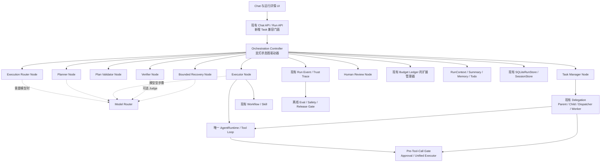
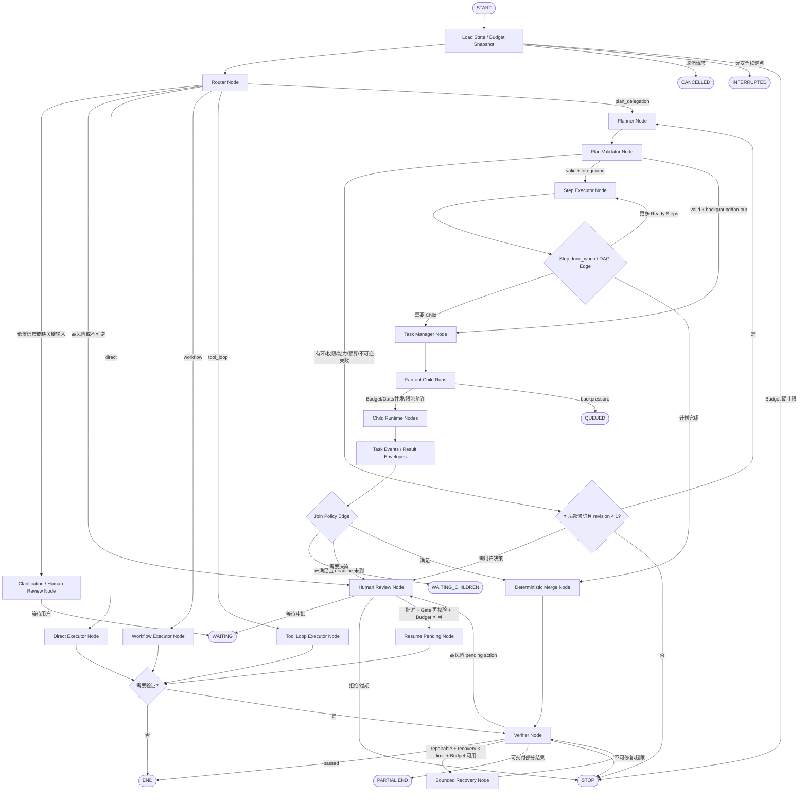
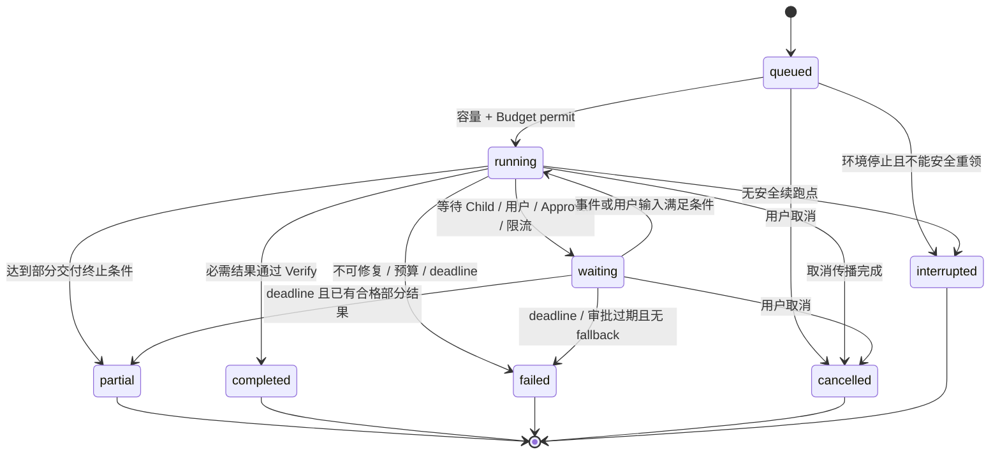

# 求职 Agent 执行编排技术设计

## 文档信息

- 状态：设计稿，等待确认
- 前置需求：`docs/job-application-orchestration-requirements.md`（已确认）
- 配套决策：`docs/agent-runtime-framework-decision.md`
- 审查基线：2026-08-14 当前工作区，包含现有委派、Trust、API、前端与测试变更
- 本阶段边界：只定义设计，不实施代码、不引入新框架、不生成实施任务

## 1. 需求理解与设计目标

### 1.1 需求理解

执行编排不是在现有 Agent 外再包一套“万能 Agent”，而是为已有能力增加一个可解释的控制面：先判断任务形状，再只激活必要的执行节点。简单问答直接结束；固定任务复用 Workflow；需要观察外部结果的任务进入现有 Tool Loop；复杂开放任务才生成 Plan，并在满足独立性、预算与权限条件时使用现有 Parent/Child Delegation；任何高风险动作继续由现有 Approval Gate 暂停。

本设计把状态图作为领域模型，而不是引入 LangGraph：

- `RunContext` 是运行中的 State 容器；后台或等待型 Run 的控制状态通过现有 `SQLiteRunStore` 持久化。
- Router、Planner、Task Manager、Executor、Verifier、Recovery 是可选择的 Node。
- Gate、Budget、Plan Validation、并行资格与 Join Policy 是 Edge Condition。
- 现有 `AgentRuntime` 是唯一 Model/Tool Loop；节点只调用它或现有确定性服务。
- 不是每个请求都经过 Planner、Delegation、Verifier Judge 或 Recovery。

### 1.2 当前仓库事实与复用映射

| 领域 | 当前实现 | 设计处理 |
| --- | --- | --- |
| 入口 Router | `knowledge/routing.py::KnowledgeRequestRouter`，三分类，无 confidence/risk/fallback | 改造成 `ExecutionRouter` 的兼容信号源；`/v1/chat` 只有一个首层 Route Decision |
| Runtime / Tool Loop | `agent/runtime.py::AgentRuntime`，支持 tool-free turn、共享 Loop、Tool Gate、取消、Token/模型/Tool/时间限制 | 保留唯一 Runtime；Direct/Tool Loop/Child 通过 `RunSpec + RunContext` 调用 |
| Workflow | `docs/workflow.md`、`skills/job_research.py` 和 API 中固定求职路径 | 用 `WorkflowExecutorAdapter` 调用；不把固定 Workflow 复制成 Plan |
| Plan/Todo | `RunContext.todo_plan` 和领域 query plan；无通用 Plan/DAG Store | 在 `RunContext` 增加版本化 orchestration state；持久 Run 同步到现有 RunStore payload |
| Context | Context Builder、Summary/Trim、Memory、Tool Result Guard、Artifact | 原样复用；增加不可裁剪 orchestration 核心项和 Child Result 引用装配 |
| Budget | Runtime 次数/时长限制；Delegation 五维 `BudgetLimits/BudgetAllocation` 账本 | 扩展同一账本支持 `steps`；保留 `model_calls` 保护维度，不建第二账本 |
| Delegation | Parent/Child、Specialist Registry、最小 Child Context、Dispatcher/Worker、Result Envelope、取消、有限重试 | 作为 Plan Step 的 `execution=child` 适配器，仅在第 10 阶段/复杂路径启用 |
| Gate / Approval | `PreToolCallGate`、`UnifiedToolExecutor`、`ConfirmationService/Broker`、邮件 Approval | 继续作为所有 Tool 与高风险动作唯一执行门；Pending Action 绑定现有 confirmation/approval ID |
| Result 校验 | `ResultValidator`、`ResultAcceptanceService`、确定性 Merger、一次 Schema repair | 扩展为通用运行时 Verifier；领域 Result Validator 作为其确定性插件 |
| 状态持久化 | `SQLiteRunStore`、Parent/Child/Task/Event/Artifact/Merge/Outbox、CAS version | 继续作为后台权威状态源；扩展 Parent payload 与事件，不另建 Orchestration Store |
| Eval / Trace | Trust Store、Eval Runner、Release/Safety Gate、Delegation Trace Bridge | 增加编排事件关联；离线 Eval 不参与线上状态转移 |
| API / 前端 | `/v1/chat`、`/v1/runs`、事件流、取消/恢复、动态 Parent/Child 详情、聊天完整展示 | 增加 `/v1/tasks` 兼容门面和编排详情字段；Run API 仍为底层真相 |

### 1.3 设计目标

1. 用最小必要路径完成任务，Direct 不付出 Planner/Delegation 成本。
2. 所有非平凡决策都产生结构化 ID、原因、输入快照和 Trace。
3. Plan 在执行前经过权限、能力、依赖、循环、预算、限流与不可逆动作校验。
4. 并行只发生在输入独立、无共享写冲突、输出契约统一且预算/限流允许时。
5. Parent/Child 通过持久化事件协作，禁止主 Agent 模型轮询。
6. Verifier 给出可定位失败，Recovery 只修失败项且最多 1–2 次。
7. 后台任务立即返回 `task_id`，状态刷新、取消与结果均来自真实服务端。
8. 不改变现有 Gate、Approval、Context、Delegation、Trace、Eval 和 Safety 的权威边界。

### 1.4 非目标

- 不实现 LangGraph Runtime、通用 Checkpoint、步骤级续跑或跨重启原节点恢复。
- 不让 Child 递归委派，不把完整主聊天复制给 Child。
- 不用 Judge 替代权限、Schema、来源、引用、预算或人工授权。
- 不硬编码仓库配置中不存在的模型、价格或 Provider。

### 1.5 可配置设计默认

需求已确认但阈值没有逐项固化，设计采用以下可配置默认：

- Router 低置信度阈值 `0.70`；硬风险规则始终优先。
- 全局 Child 并发 `4`，与当前 `WorkerPoolConfig` 兼容；Specialist/Browser/Provider 可设置更低上限。
- 业务 Recovery 默认 `1` 次、硬上限 `2` 次。
- 基础设施瞬态重试默认最多 `2` 次；与业务 Recovery 分账。
- 默认 Join Policy 为 `all_required`；其他策略必须由 Workflow/Plan 显式选择。
- 模型候选、能力、价格和 fallback 全部来自现有 Provider Registry 与版本化配置。

## 2. 技术选型

### 2.1 最终选型

本迭代选择：**保留自研 Runtime 与持久化控制面，以显式 State/Node/Conditional Edge 模式增量实现编排；不迁移 LangChain、LangGraph 或 OpenAI Agents SDK。**

详细证据、比较、适配层和回滚方式见 `docs/agent-runtime-framework-decision.md`。

### 2.2 选择理由

1. 现有 Runtime 已包含实际产品需要的 Tool Gate、MCP/RAG、确认、Context、预算和 Provider 兼容。
2. 现有 Delegation 已经实现持久 Parent/Child、Worker、Result Envelope、Trace 与前端运行树。
3. 整体引入其他 Agent Runtime 会重复 Loop、State、HITL、Trace 或 Store，破坏已确认的“只有一套权威实现”。
4. State/Node/Edge 是可以直接在现有服务中表达的控制流模式，不依赖特定图框架。
5. 未来若出现明确收益，只允许用同一 Fixture 做最小 Adapter/Spike，不直接替换主路径。

## 3. 总体架构

### 3.1 分层架构



### 3.2 控制面与执行面

| 层 | 职责 | 不负责 |
| --- | --- | --- |
| Orchestration Controller | 加载/更新 State、选择 Node、评估条件 Edge、持久化决策、终止 | 直接调用外部 Tool；生成隐藏推理 |
| Decision Nodes | Router、Planner、Model Router、Plan Validator、Verifier、Recovery 的结构化决策 | 绕过预算/Gate；自行写外部系统 |
| Execution Nodes | Direct、Workflow、Tool Loop、Local deterministic、Child delegation | 修改路由规则或扩大权限 |
| Edge Conditions | Gate、Budget、Join、风险、输入完整度、并行资格、修复次数 | 生成业务内容 |
| Durable Control Plane | Parent/Child/Task/Event/Budget/Approval/Artifact/Trace | 把 SSE 连接或浏览器内存当状态真相 |

### 3.3 组件调用顺序与责任边界

调用顺序是条件化的，不是固定大链：

1. Controller 创建最小 `ExecutionState`，Budget Manager 生成初始 Snapshot。
2. Router Node 先执行硬规则；只有规则无法确定时，Model Router 为分类选择可用模型，再输出 Route Decision。
3. Edge 根据 risk、confidence、missing inputs 和 route 分支：
   - Direct → Direct Executor → 可选轻量 Verify → END；
   - Workflow → Workflow Executor → 按 Workflow 契约决定 Verify/END；
   - Tool Loop → Budget/Gate 条件 → 现有 Runtime → 按结果决定 Verify/END/Human Review；
   - Plan/Delegation → Planner → Plan Validator → 前台 Executor 或后台 Task Manager；
   - Human Review → 现有 Approval Gate 等待，批准后只恢复 pending action 对应节点。
4. Planner Node 只生成结构化 DAG，不执行 Step。
5. Plan Validator Node 确定性校验计划；最多允许一次面向具体 validation failure 的计划修订。
6. Task Manager 只在后台、fan-out 或 Child Step 中出现；它启动/取消/限流/接收事件，不做业务推理。
7. Executor 按 Step execution type 调用确定性代码、Workflow、现有 Tool Loop 或 Delegation Adapter。
8. Join Edge 满足后才允许 Parent 进入 Merge/Verify；Child progress 不触发模型。
9. Verifier 仅在路径或输出契约要求时运行；确定性检查先执行，Judge 只处理剩余语义 Rubric。
10. Recovery 只在存在可修复 failure 且次数、预算、权限允许时运行；修复后只重新验证受影响项。
11. Budget Manager 在每个 Node/Step/fan-out 前预检，在模型/Tool/Step/Child 结束后记账，并直接决定 continue/partial/stop Edge。

## 4. 显式状态图

### 4.1 State、Node、Edge 与终止条件



图中的 `WAITING/QUEUED/WAITING_CHILDREN` 是可恢复控制状态，不是模型循环；恢复由用户输入、Approval 事件、Task Event、容量释放或 deadline 触发。

### 4.2 Node 映射

| Node | 现有映射 | 输入 | 输出 | 触发条件 |
| --- | --- | --- | --- | --- |
| Router | `KnowledgeRequestRouter` + Skill Selector + Capability snapshot 的新适配器 | 用户请求、最小会话元数据、能力/预算/策略摘要 | Route Decision | 每个新用户意图一次 |
| Planner | 新策略组件，输出写入 `RunContext.todo_plan/orchestration.plan` | 复杂目标、Artifact refs、能力与预算上限 | Plan DAG | 仅 route=`plan_delegation` |
| Plan Validator | 新确定性组件，复用 Registry/Gate policy view/Budget | Plan、权限、能力快照、限流 | Validation Result | 每个 Plan 版本执行前 |
| Task Manager | 现有 `DelegationService/Dispatcher/WorkerPool/SQLiteRunStore` 的门面 | 已验证 Child Steps、Join Policy、预算 | Background Task、Parent/Child、Task Event | 后台或 fan-out |
| Executor | `AgentRuntime`、Workflow/Skill、确定性函数、Delegation Adapter | 当前 Step/Route、RunContext | output/ref/status | 具体执行分支 |
| Verifier | 现有 Result Validator/Merger + 新 Rubric plugins | 输出、Schema、规则、证据、预算 | Verify Result | 路径/契约要求 |
| Recovery | 现有一次 Schema repair 的泛化适配器 | repairable failures、最小相关上下文 | Recovery Attempt、patch refs | Verifier 指定失败且有额度 |
| Human Review | 现有 `ConfirmationService/Broker` 与邮件 Approval | Pending Action | approved/rejected/expired | 高风险、缺输入、低置信度或决策冲突 |

### 4.3 Edge Condition 映射

| 条件 | 权威组件 | 结果 |
| --- | --- | --- |
| 权限、Tool risk、外部目标与 Approval | `PreToolCallGate` / Confirmation / Email Approval | allow、deny、require_confirmation |
| Budget | 扩展现有 Budget Ledger | continue、reduce_parallelism、partial、stop |
| Plan 可执行性 | Plan Validator | valid、revise、human_review、stop |
| 并行资格 | DAG Scheduler + Conflict Detector + Rate Limit Snapshot | parallel、serial、queued |
| Join | Join Policy Evaluator | wait、merge、human_review、fail |
| done_when | Step Verifier/Workflow contract | complete、repair、fail |
| Recovery | failure.repairable、revision_count、预算 | recover、partial、stop |

### 4.4 终止条件

- `END/completed`：必需结果满足，必要验证通过，无未批准副作用。
- `PARTIAL END/partial`：满足最小可交付规则，明确包含缺失、失败、超时和恢复方式。
- `STOP/failed`：不可修复、预算耗尽、能力不可用、计划非法或安全拒绝。
- `CANCELLED`：用户/系统取消已传播且不再接受业务结果。
- `INTERRUPTED`：运行环境中断且当前迭代无安全原节点续跑保证。
- `WAITING` 不是终态；等待用户、Approval、Child Join 或容量事件。

## 5. 模块与组件设计

### 5.1 Orchestration Controller

建议新增 `starter_agent/orchestration/` 包，但只包含控制面策略和适配器，不包含第二 Runtime：

```text
orchestration/
  models.py          # Route/Plan/Verify/Task/Decision 数据契约
  controller.py      # 状态图驱动与条件 Edge
  router.py          # Execution Router
  planner.py         # 结构化 Planner
  plan_validator.py  # 确定性校验
  executor.py        # 现有 Runtime/Workflow/Delegation 适配
  task_manager.py    # 现有 delegation facade
  join.py            # 确定性 Join Policy
  verifier.py        # 规则插件与可选 Judge
  recovery.py        # 有界局部修复
  budget.py          # 现有 ledger 的编排接口
  model_router.py    # 配置驱动模型选择
  trace.py           # 写入现有 Run Event/Trust Trace
```

Controller 每次只执行一个可运行 Node，提交 State patch 和事件，再评估下一条 Edge。后台 Worker 可多次调用 Controller 推进，但不能在单事务中执行网络 I/O。

### 5.2 Execution Router

Router 采用“硬规则 → 能力/输入规则 → 可选模型分类 → 冲突解析”的顺序：

1. **高风险优先**：检测发送、投递、修改、删除、覆盖、敏感写入，直接 `human_review`。该规则不能被模型 confidence 覆盖。
2. **输入完整度**：若动作对象、JD、收件人、附件、知识库或必要授权缺失，返回 waiting/clarification，不猜测。
3. **固定覆盖**：已有 Workflow 的稳定 trigger 命中时选择 Workflow；明显无 Tool 问答选择 Direct。
4. **能力约束**：读取 Registry/MCP/Skill/Specialist 启用与健康快照；不可用能力触发 fallback，而不是先路由再失败。
5. **模型分类**：只有剩余歧义请求才调用 Model Router 选择分类模型；结构化输出失败重试一次。
6. **冲突解析**：风险规则 > 用户明确执行形态 > 输入缺失 > 固定 Workflow > 复杂度/能力模型判断。
7. confidence `< 0.70` 或前两候选差值低于可配置 margin 时，询问用户或进入 Human Review。

Router 不调用 Tool、不创建 Parent/Child、不写外部系统。它只持久化 Route Decision 和 Trace。

### 5.3 Model Router

Model Router 是模型调用前的决策服务，不是每次必经 Node。调用方给出 `ModelRequirement`：

- capabilities：structured output、tool calling、context size、reasoning/vision 等；
- task complexity：trivial、bounded、complex；
- latency class：interactive、standard、background；
- risk policy：仅影响所需验证与可选候选，不允许降低 Gate/Human Review；
- remaining budget：tokens、cost、wall-clock、model_calls；
- provider health/rate limit 与数据治理要求。

Model Router 从现有 Provider Registry、`settings.model`、provider allowlist、pricing version 和健康快照中筛选。没有匹配模型则返回 `unavailable`，不能虚构模型名。fallback 只允许能力满足、已配置且通过对应离线 Fixture 的候选。

### 5.4 Planner

Planner 的输入只包含目标、确认事实、必要 Artifact refs、有效能力摘要、风险边界、总预算和前后台约束。输出必须按 `Plan` Schema 结构化；不得输出自然语言步骤后由 Executor 猜测。

Planner 构建 DAG 的规则：

1. 为每个 Step 声明 inputs 和 output contract；下游 input 引用上游 output 时自动产生 `depends_on`。
2. 同一外部对象的 write/write 或 read/write 产生冲突边；纯只读且输入独立可以无边。
3. Child Step 必须输出统一 `ResultEnvelope`，否则不能 fan-out。
4. 为每步声明 `done_when`，至少包含 Schema 或业务规则 ID。
5. 总预算先按必需步骤分配，再给可选步骤；不得超过 Parent 上限。
6. 并行提示只是候选，最终并行资格由 Plan Validator/Scheduler 决定。
7. 高风险 Step 输出 Pending Action，不直接执行副作用。

### 5.5 Plan Validator

Plan Validator 不调用 Judge，按以下顺序 fail-closed：

1. Schema、稳定 ID、版本和引用格式。
2. 节点/边完整性、拓扑排序、直接/间接循环。
3. 输入生产者、输出消费者与 Result Envelope 兼容性。
4. Tool/MCP/Workflow/Specialist 注册、启用、健康和版本。
5. principal、知识域、Artifact access 与有效 Tool View。
6. 风险分类、不可逆动作和 Pending Action/Human Review 边。
7. Step 总预算、并行峰值、Parent 剩余和 deadline。
8. Provider/Specialist/Browser/站点限流、共享写冲突与 backpressure。
9. Join Policy、required/optional Step、partial 最低门槛与缺失处理。

失败返回逐项 `ValidationIssue`。只有 `repairable=true` 的结构/依赖问题可触发一次 Planner 修订；权限、关闭能力、不可逆动作缺审批、硬预算不足和循环在未改变输入/授权时不得反复改写。

### 5.6 Executor

Executor 通过四个适配器复用现有执行能力：

| execution type | 适配器 | 行为 |
| --- | --- | --- |
| `direct` | `DirectExecutorAdapter` | `allow_tools=False` 调用现有 Runtime，或返回确定性确认/拒绝 |
| `workflow` | `WorkflowExecutorAdapter` | 调用注册 Workflow/Skill，遵守其固定状态和 Schema |
| `tool_loop` | `RuntimeExecutorAdapter` | 用 `RunSpec/RunContext` 调用唯一 AgentRuntime；每次 Tool 经 Gate |
| `child` | `DelegationExecutorAdapter` | 交给 Task Manager 创建真实 Child Task/Run，不在 Parent 内模拟 Child |

Executor 开始前获取 Budget permit；每个 Tool 仍由 Gate 独立决定。Executor 不改变 Plan，不选择未注册模型，不把失败项自动扩展为全文重做。

### 5.7 Task Manager 与 Delegation

`TaskManager` 是现有 Delegation Service、Dispatcher、WorkerPool、RunStore 和事件桥的统一门面：

- 原子创建 Background Task/Parent Run，并立即返回 task_id；
- 对已验证的 Ready Child Steps 预留预算并创建 Child Task/Run；
- 执行全局、Specialist、Browser、Provider/站点并发和 backpressure；
- 接收 Child Runtime 结构化事件，更新状态并评估 Join；
- 传播取消、deadline、有限基础设施重试；
- 保存 Result Envelope/Artifact 引用，不把 Child Context传给 Parent；
- 满足 Join 后发布一次 `parent_join_ready` 事件，由 Controller 恢复 Parent。

第 10 阶段 Delegation 只是 `execution=child` 的一种方式。Router 对简单问答、固定周报和单 JD 读取不能选择它。

### 5.8 Child Context 与 Result Envelope

Child 最小任务包包含：

- `task_id/parent_run_id/child_run_id/specialist_snapshot_id`；
- 单一 goal、必要 `input_refs`、constraints；
- allowed tools 与有效 Tool View hash；
- 子预算、deadline、per-tool timeout；
- output schema/version、done_when、failure behavior；
- principal/knowledge scope 的最小授权证明；
- Trace Context 与幂等键。

Child 不接收完整主对话、完整 Memory、Parent Plan 全文、其他 Child 原始输出或不相关 Tool Schema。Child Result Envelope 延用现有字段：status、output、evidence、missing、conflicts、errors、usage、child_run_id、task_id、trace_ref、idempotency_key 和 canonical hash。

### 5.9 Task Event 与事件治理

Child Runtime 至少发出：`child_started`、`child_progress`、`child_completed`、`child_failed`、`child_cancelled`、`child_timed_out`。兼容期可将现有 dotted event type 映射为这些外部规范名。

事件处理规则：

1. `event_id` 全局唯一，`event_seq` 在 Parent 内单调递增；Store 原子分配序号。
2. 相同 event_id + 相同 payload hash 幂等返回；相同 ID + 不同 hash 报冲突。
3. 乱序到达先按 event_seq 持久化/补拉；状态 reducer 只接受合法 version/transition。
4. progress 可合并和限速，不唤醒 Parent 模型。
5. 重复 completed 只有第一个合法 Result Envelope 可被 acceptance；后续相同结果幂等，不同结果冲突。
6. Parent 已终态或 Join 已选择结果后的迟到事件保存为 `late_ignored`，不重开 Merge。
7. Task Manager 依靠事件/Store 状态和 deadline timer，不调用模型轮询 Child。

### 5.10 Join Policy

| Policy | 满足条件 | 失败/超时/取消处理 | 后续 |
| --- | --- | --- | --- |
| `all_required` | 所有 required Task 有被接受的 succeeded，或契约明确允许该 Task 的 partial；optional 均终态或可忽略 | required 不可用 → failure behavior：human/failed；optional 进入 missing | Merge/Verify |
| `partial_allowed` | accepted success 数、字段覆盖率或 required subset 达到 Plan 声明的 `minimum_success` | 其余终态/到 deadline；失败、超时、取消写入 missing/errors | Merge 后必须 Verify，并显式 partial |
| `first_success` | 任一 Result Envelope 通过 Schema、权限、来源最低规则和 done_when | 未选 Child 协作取消；迟到结果 `late_ignored` | 选中结果直接 Merge/Verify |
| `deadline_reached` | join deadline 到达 | 用当时 accepted 结果；未验证结果不算成功；无可用结果 failed/human | Merge/Verify 或 Stop |

Join Decision 是确定性记录，包含全部 Child 分类和触发依据。Parent 只有在 Join 满足、需要 Human Review 或确定失败时继续。

### 5.11 Verifier 与 Judge 边界

Verifier 按顺序运行：

1. **强制确定性层**：权限/主体、Approval hash、Schema、预算、Result authority、Artifact access、来源存在性、引用绑定、业务硬规则、done_when、重复/冲突和安全策略。
2. **领域规则层**：JD 字段、简历证据归属、邮件目标/附件、排序输入与 Workflow Rubric。
3. **可选 Judge 层**：只对相关性、表达质量、语义覆盖或无法完全规则化的产品 Rubric 评分。Judge 输入只含已脱敏、已通过权限与 Schema 的最小结果。

Judge 不能批准 Tool、修改预算、认可不存在的来源、修复 Schema、覆盖安全规则或决定发布。Judge 不可用时，硬规则照常执行；需要 Judge 的软质量项可降级为 manual review 或明确未评估。

运行时 Verifier 与离线 Evaluation：

| 维度 | 运行时 Verifier | 离线 Evaluation |
| --- | --- | --- |
| 输入 | 当前 Run 输出、Schema、规则、证据、预算、Rubric | 固定 Fixture/脱敏历史、候选版本、基线版本、Judge 配置 |
| 触发 | Step/Workflow/Merge/最终输出或 pending action 前 | CI、发布前、回归、人工评测、定期任务 |
| 动作 | END、Recovery、Human Review、Partial 或 Stop | 比较版本、失败聚类、Safety/Release Gate 决策 |
| 禁止 | 决定全局发布 | 执行当前 Run 的 Tool 或外部动作 |

### 5.12 Bounded Recovery

Recovery Request 只包含 failure_id、scope/path、expected、actual summary、相关 output/evidence refs、允许操作和剩余预算。处理策略：

- Schema 字段缺失：只生成 JSON Patch/字段 patch；
- 引用缺失：只重新检索或绑定对应 Claim 的来源；
- 单个 Step 失败：只重新运行该 Step 或其受影响下游；
- 文案 Rubric：只重写对应段落；
- 已通过项冻结，除非依赖图证明受修复影响。

每次记录 Recovery Attempt。默认 1 次、硬上限 2 次；仍失败则按 Verify Decision 输出 partial、Human Review 或 Stop。权限拒绝、用户拒绝、Tool 关闭、计划环路、未知费用和不可逆动作无审批不可进入盲目 Recovery。

### 5.13 Budget Manager

不创建第二套预算系统。扩展现有 `BudgetLimits/BudgetAllocation/RunBudgetState`：

- 对外必需维度：steps、tokens、cost_microunits、wall_clock_ms、tool_calls；
- 保留内部保护维度：model_calls；
- 兼容旧持久数据：v1 五维记录由迁移适配器补 `steps`，值来自 RunSpec/Plan 上限，而非默认无限。

记账时机：

1. Run 创建：记录 total/remaining Snapshot。
2. Node/Step 前：预检最小所需额度和 deadline。
3. fan-out 前：原子预留所有 required Child；不足时降低并行度、移除 optional 或 Stop，不先启动后超额。
4. 模型/Tool 调用后：按实际 usage 记账；费用 unknown 按现有 fail-closed。
5. Step/Child 结束：结算 actual、释放未用 reservation，记录 Snapshot。
6. Join/Merge/Verify/Recovery 前后：同样预检与结算，不能把控制面消耗漏记。
7. 任一硬维度耗尽：拒绝新 permit，转 partial/stop，返回完成、未完成和恢复方式。

### 5.14 Context、Summary、Memory、Todo 与 Task Snapshot

| 数据 | 作用域 | 是否可摘要/裁剪 | 消费者 |
| --- | --- | --- | --- |
| Goal、安全策略、用户确认事实 | Run 核心 | 不可丢失 | 所有需要模型的 Node |
| 当前 Plan/DAG、current_step、Todo | Run 控制状态 | 只可结构化压缩，不能语义替换 | Controller、Planner、Executor |
| Budget Snapshot、Pending Action | Run 控制状态 | 不可丢失 | Edge、UI、Approval |
| Chat history | Session | 可按现有 Summary/Trim | Parent 模型；Child 默认不接收 |
| Long-term Memory | 用户/项目跨会话 | 按现有治理选择性注入 | Parent；Child 仅获显式引用 |
| Task Snapshot | Parent/Child | 结构化、版本化 | Task Manager、UI、Trace |
| Child Context | Child | 不回传 Parent | Child Runtime |
| Child Result Envelope | Parent 可见受控结果 | 可摘要但保留 Artifact ref/hash | Join、Merge、Verifier |
| 原始网页/Tool output | Artifact | 不进入 Parent，按保留策略 | 授权调试、Verifier 按需读取 |

Summary 是语义压缩，Memory 是跨会话治理事实，Todo/Plan 是显式任务控制，Task Snapshot 是后台状态读模型；它们均不是执行 Checkpoint。

## 6. 数据模型

所有时间为 UTC，ID 稳定且不可复用，模型 `extra=forbid`，更新使用 version/CAS。以下为逻辑字段；实现优先扩展现有 Pydantic 模型和 RunStore JSON payload。

### 6.1 RouteDecision

```text
route_decision_id, run_id?, session_id, turn_id
route: direct|workflow|tool_loop|plan_delegation|human_review
confidence: 0..1
reason_code, reason_summary
required_capabilities[]
risk_level: low|medium|high|critical
missing_inputs[]
matched_rules[], conflicting_rules[]
fallback{route, condition_code, user_prompt?}
capability_snapshot_revision, policy_revision
model_decision_id?, created_at
```

状态：`proposed|accepted|superseded|clarification_required`。高风险硬规则产生的 Decision 允许 `model_decision_id=null`。

### 6.2 Plan

```text
plan_id, parent_run_id, version, status
goal, assumptions[], input_refs[]
steps[] / edges[]
join_policy, minimum_success?
budget_total, deadline_at
validation_result_id?
revision_count, created_at, updated_at
```

状态：`draft|validating|valid|invalid|executing|waiting|completed|partial|failed|cancelled|superseded`。

### 6.3 PlanStep

```text
step_id, plan_id, ordinal, status
goal, input_refs[], capabilities[]
done_when[{rule_id, type, expected}]
risk, budget_limit, deadline_at
depends_on[], execution: local|workflow|tool_loop|child
workflow_id? / specialist_id?
output_contract_ref, result_ref?
required: bool, failure_behavior
shared_resource_keys[], rate_limit_keys[]
parallel_candidate: bool, parallel_decision_reason
attempt_count, recovery_count
```

状态：`blocked|ready|queued|running|waiting|succeeded|partial|failed|cancelled|timed_out|skipped|interrupted`。

### 6.4 BackgroundTask

```text
task_id, parent_run_id, session_id, origin_turn_id
status: queued|running|waiting|partial|completed|failed|cancelled|interrupted
internal_status, reason_code, phase
plan_id?, current_step_id?
progress{completed,total}
budget_snapshot_id
pending_action_id?
created_at, started_at?, updated_at, completed_at?
version
```

内部状态映射：`created/queued→queued`，`running→running`，`waiting_children/waiting_for_user→waiting`，`succeeded→completed`，`partial→partial`，`failed/timed_out/budget_exhausted→failed + reason`，`cancelled→cancelled`，无法安全续跑的 Worker/进程中断→`interrupted`。

### 6.5 ParentRun

扩展现有 `ParentRun`，不创建第二种父运行：

```text
现有全部字段
+ task_id
+ run_type: job_application_research|job_application_orchestration
+ route_decision_id
+ orchestration_state_version
+ plan_id?, current_step_id?
+ join_policy?, pending_action_id?
+ latest_budget_snapshot_id
+ stop_reason_code?
```

现有 status/phase、budget_total/reserved/consumed、cancellation、result_version、merge/backfill 和 version 继续权威。

### 6.6 ChildRun

沿用现有 ChildRun：id、child_task_id、parent_run_id、attempt、status/phase/version、lease/heartbeat、deadline、effective_tool_view_hash、result ref/hash、error/retryable、时间戳。增加可选 `plan_step_id`、`last_task_event_seq`、`stop_reason_code`。现有 checkpoint 字段保留兼容，但不扩展为当前编排的验收能力。

### 6.7 TaskEvent

```text
task_event_id, event_seq, event_type
task_id, parent_run_id, child_run_id?, plan_id?, step_id?
attempt, status, occurred_at
payload_summary, artifact_refs[]
budget_snapshot_id?
payload_hash, source_event_id?, late_ignored
```

状态/类型除 Child 六类事件外，还包括 route、plan、validation、join、verify、recovery、budget、approval、cancel 和 terminal 事件。

### 6.8 JoinDecision

```text
join_decision_id, parent_run_id, plan_id, policy
required_task_ids[], optional_task_ids[]
accepted[], partial[], failed[], timed_out[], cancelled[]
missing[], late_ignored[]
minimum_success?, deadline_at
satisfied: bool, outcome: wait|merge|human_review|fail
reason_code, merge_input_refs[]
decided_at, state_version
```

### 6.9 ValidationResult

用于 Plan Validator：

```text
validation_result_id, plan_id, plan_version
valid, issues[]
issues: {issue_id, code, path, severity, expected, actual_summary,
         repairable, suggested_action, related_refs[]}
capability_snapshot_revision, policy_revision
budget_snapshot_id, validated_at
decision: execute|revise|human_review|stop
```

### 6.10 VerifyResult

```text
verify_id, parent_run_id, plan_id?, step_id?, output_ref
passed, verified_items[], failures[]
failures: {failure_id, scope, path, rule_id, expected, actual_summary,
           severity, repairable, evidence_refs[]}
deterministic_result, judge_result?, judge_model_decision_id?
decision: end|recovery|human_review|partial|stop
budget_snapshot_id, created_at
```

### 6.11 RecoveryAttempt

```text
recovery_id, parent_run_id, plan_id?, step_id?, verify_id
attempt_no, failure_ids[], frozen_item_refs[]
strategy: field_patch|citation_retrieval|step_retry|section_rewrite
input_refs[], patch_ref?, output_ref?
status: proposed|running|succeeded|failed|budget_exhausted|cancelled
budget_before_id, budget_after_id?, model_decision_id?
started_at, completed_at?, error_code?
```

### 6.12 BudgetSnapshot

```text
budget_snapshot_id, parent_run_id, child_run_id?, step_id?
version, phase: preflight|reserved|consumed|settled|stopped
limit, reserved, consumed, released, remaining, overage
dimensions: steps,tokens,cost_microunits,wall_clock_ms,tool_calls,model_calls
cost_status, price_version, usage_source
stop_dimension?, created_at
```

### 6.13 ModelDecision

```text
model_decision_id, parent_run_id?, step_id?, purpose
requirements{capabilities, complexity, latency_class, context_tokens, risk_policy}
candidates[{provider,model,capabilities,cost_estimate,latency_class,health}]
selected_provider?, selected_model?
reason_code, reason_summary
fallback_chain[], config_revision, pricing_version?
budget_snapshot_id, created_at
```

候选只来自配置；若为空则 status=`unavailable`，不补造模型。

### 6.14 PendingAction

```text
pending_action_id, parent_run_id, step_id?
action_type, tool_name, target_summary
arguments_hash, content_diff_ref?, attachment_refs[]
risk_level, irreversible, impact_summary[]
confirmation_id / approval_id
status: pending|approved|rejected|expired|invalidated|consumed|cancelled
principal, expires_at, policy_revision, gate_decision_id
created_at, decided_at?, consumed_at?
```

任何参数、目标或附件变化都生成新 hash 并使旧 Approval 失效。

### 6.15 ExecutionState

`RunContext` 中的控制状态：

```text
route, plan, current_step
outputs, artifact_refs
budget, pending_action
revision_count{plan,recovery,infrastructure}
background_task, child_runs
latest_join_decision, latest_verify_result
model_decisions, stop_reason
state_version
```

前台短 Run 在请求内更新，并把决策/终态写入 Trace；后台、等待、Plan/Delegation Run 将同一结构的受控快照写入 `ParentRun` payload。它不是精确执行 Checkpoint。

## 7. API 与服务接口

### 7.1 内部服务接口

```python
class ExecutionRouter:
    async def decide(request, capability_snapshot, budget_snapshot) -> RouteDecision: ...

class Planner:
    async def create_plan(goal, input_refs, constraints, budget) -> Plan: ...

class PlanValidator:
    def validate(plan, authority, capability_snapshot, budget, limits) -> ValidationResult: ...

class OrchestrationController:
    async def advance(state, trigger) -> StateTransition: ...

class TaskManager:
    def create_background_task(spec, idempotency_key) -> BackgroundTask: ...
    def fan_out(parent_run_id, steps, budget_snapshot_id) -> tuple[ChildRun, ...]: ...
    def accept_event(event) -> TaskEvent: ...
    def cancel(task_id, reason, expected_version) -> BackgroundTask: ...

class JoinEvaluator:
    def evaluate(policy, run_tree, deadline, result_refs) -> JoinDecision: ...

class RuntimeVerifier:
    async def verify(target, policy, budget) -> VerifyResult: ...

class BoundedRecovery:
    async def repair(verify_result, state, budget) -> RecoveryAttempt: ...

class OrchestrationBudgetManager:
    def preflight(scope, requested, expected_version) -> BudgetPermit: ...
    def reserve_fanout(parent, child_requests, expected_version) -> BudgetSnapshot: ...
    def settle(scope, usage, expected_version) -> BudgetSnapshot: ...
```

所有写接口要求 idempotency key 和 expected version；网络/模型调用在 Store 事务外执行。

### 7.2 Chat API 兼容

保留 `POST /v1/chat` 与 `/v1/chat/stream` 请求结构。响应扩展：

```json
{
  "route_decision": {
    "id": "route:...",
    "route": "plan_delegation",
    "confidence": 0.91,
    "reason": "...",
    "risk_level": "medium"
  },
  "task": {
    "task_id": "task:...",
    "parent_run_id": "parent:...",
    "status": "queued",
    "details_url": "/v1/tasks/task:..."
  }
}
```

Direct/前台响应无需 task；后台创建完成后立即返回，不等待 Child。

### 7.3 Task API（建议的兼容门面）

- `GET /v1/tasks/{task_id}`：返回 BackgroundTask、Route、Plan 摘要、Child、Join、Verify、Recovery、Budget 和 stop reason。
- `GET /v1/tasks/{task_id}/events?after_seq=`：游标分页。
- `GET /v1/tasks/{task_id}/events/stream?after_seq=`：SSE 加速。
- `POST /v1/tasks/{task_id}/cancel`：reason、expected_version、idempotency_key。
- `GET /v1/tasks/{task_id}/artifacts`：只返回授权元数据/引用。

`/v1/tasks` 通过 task_id 解析现有 Parent Run；底层继续复用 `/v1/runs` 和 `SQLiteRunStore`。现有 `/v1/runs/{parent_run_id}` 保持兼容并扩展编排字段。

### 7.4 Approval API

不新增审批系统。Pending Action 返回现有 confirmation/approval URL 和 revision。批准/拒绝继续调用现有 Confirmation/Email Approval API；批准后服务端：

1. 校验 principal、status、expiry 和 action hash；
2. 再次执行 Gate 与能力快照检查；
3. 获取新的 Budget permit；
4. 只恢复 pending action 对应 Step；
5. 消费 Approval，保证最多一次执行。

### 7.5 Run Detail 响应

敏感原文不直接返回。详情包含：

- Route reason/confidence/risk/fallback；
- Plan nodes/edges/status、依赖和 parallel decision；
- task 状态、phase、进度和 stop reason；
- Child status/attempt/deadline/last event/error；
- Join Policy/Decision 和各类结果；
- Validation/Verify failures 与 Recovery attempts；
- Budget limit/reserved/consumed/remaining；
- Model Decision 摘要；
- 可授权打开的 Artifact refs。

## 8. 状态流转与交互

### 8.1 五条执行路径

| 路径 | 进入 | 正常退出 | 降级/回退 |
| --- | --- | --- | --- |
| Direct | 无 Tool、低复杂度、低风险、输入足够 | 直接 END；有产品契约时轻量 Verify | 模型不可用→确定性提示/Stop；发现需 Tool→重新 Router 一次 |
| Workflow | 固定触发、已注册 Workflow、输入 Schema 满足 | Workflow terminal + 可选 Verify | 能力关闭→clarify/Stop；任务越界→Router 转 Tool Loop/Plan |
| Tool Loop | 需要外部观察、无需完整 Plan、预算足够 | Runtime 无更多 Tool + 可选 Verify | Tool 关闭/审批→Human；复杂度显著增加→生成一次新 Route Decision 进入 Plan |
| Plan/Delegation | 多阶段/开放/跨来源/可验证依赖或安全并行 | Plan 完成、Join/Merge、Verify→completed/partial | Plan invalid→一次局部修订；能力/预算不足→缩小/串行/Human/Stop |
| Human Review | 高风险、不可逆、低 confidence、缺关键输入或规则冲突 | 批准后恢复具体节点；补输入后重新 Router/Validate | 拒绝/过期→Stop 或仅返回草稿；参数变化→新 Approval |

路径升级/降级都产生新的 Route Decision，并关联 supersedes；单个请求最多一次自动升级，防止路线震荡。

### 8.2 后台生命周期



### 8.3 Fan-out / Join 时序

```mermaid
sequenceDiagram
    participant P as Parent Controller
    participant B as Budget Manager
    participant T as Task Manager
    participant C1 as Child 1
    participant C2 as Child 2
    participant S as RunStore/Event Log
    participant J as Join Evaluator
    participant V as Verifier

    P->>B: reserve_fanout(required child budgets)
    B-->>P: permit + budget_snapshot_id
    P->>T: fan_out(validated steps, permit)
    T->>S: atomically create Child Tasks/Runs
    T-->>P: child refs; Parent waiting_children
    par independent children
      T->>C1: minimal task package
      T->>C2: minimal task package
    end
    C1->>S: child_started/progress/completed + envelope
    C2->>S: child_started/failed or completed
    S->>T: committed events
    T->>J: evaluate policy from durable tree
    alt policy not satisfied
      J-->>T: wait; no model polling
    else policy satisfied / decision needed
      J->>S: persist JoinDecision + parent_join_ready
      S->>P: resume trigger
      P->>V: merge refs + failures/missing
    end
```

### 8.4 取消与重试

- Parent 取消先持久化 cancellation_version，停止新 Child 创建，取消 queued Child，运行中 Child 在 Runtime/Tool 边界检查并协作退出。
- 外部副作用 Tool 一旦已消费 Approval，不以重试掩盖未知结果；返回 unknown 并人工核对。
- 基础设施 retry 只对 retryable、未产生不可确认副作用的 attempt；指数退避，默认最多 2 次，受 deadline/预算约束。
- Recovery 与基础设施 retry 使用不同 counter/Trace。
- Parent 终态后不接受能改变业务结果的迟到 Child。

## 9. 错误处理

### 9.1 错误分类与状态

| 类别 | 示例 | 自动处理 | 终态/用户信息 |
| --- | --- | --- | --- |
| Router | 非法 Schema、低 confidence、规则冲突 | 结构化重试一次；clarify | waiting/stop，展示需要的信息 |
| Plan | 环路、缺节点、能力关闭、权限不足 | 仅 repairable 项一次修订 | human/failed，不执行 Step |
| Budget | 预留不足、unknown cost、硬上限 | 降低并行/移除 optional；停止新调用 | partial/failed，列出完成与恢复方式 |
| Provider | 限流、超时、模型不可用 | 配置内 fallback/有限 retry | queued/waiting/failed |
| Tool/Gate | deny、confirmation required、Tool stale | Human Review 或 Stop | waiting/failed；不旁路 |
| Child | timeout、failed、cancelled、非法 Envelope | 基础设施有限 retry；结果校验 | Join 按 Policy 处理 |
| Event | duplicate、out-of-order、payload conflict | 幂等、补拉、CAS；冲突隔离 | 状态不回退，写审计 |
| Verify | Schema/引用/Rubric failure | 局部 Recovery 1–2 次 | completed/partial/human/failed |
| External write | 已发送但响应未知 | 禁止盲重试 | waiting_for_review/failed + 核对指引 |
| Process | 无通用 checkpoint | 从安全边界重试或 interrupted | 明确不声称原节点恢复 |

### 9.2 停止响应契约

任何 Stop 至少返回：`reason_code`、失败范围、已完成 outputs/artifact refs、未完成 Step、缺失/冲突、预算 Snapshot、是否有未执行 Pending Action、是否可恢复以及建议动作。

## 10. 性能与安全

### 10.1 性能、并发与 Backpressure

1. Direct 不创建 Plan/Child；硬规则可决定时 Router 不调用模型。
2. 全局 Child 并发默认 4；Specialist/Browser/Provider/站点使用独立 semaphore/token bucket，取最小有效额度。
3. DAG Scheduler 只调度 Ready Step；共享写 key 相同强制串行。
4. 队列继续使用现有 high watermark/hard capacity；高水位降低 optional fan-out，硬容量拒绝创建并返回可重试 task 状态。
5. progress 事件节流，Run/Event API 分页；Parent 只接收 Result Envelope 与引用。
6. 并行收益必须由同一 Fixture 比较 wall-clock、tokens、cost、tool_calls 和质量；质量下降时不启用。

### 10.2 安全

1. Router/Planner/模型输出均是不可信候选，能力来自 Registry/Gate 快照。
2. 所有 Tool，包括 Child Tool 和批准后的 Tool，再次经过 `PreToolCallGate`。
3. Child Tool View 使用交集：Specialist allowlist ∩ Scenario policy ∩ Global policy ∩ 当前健康能力。
4. Approval 绑定 principal、session/turn、tool、target、arguments hash、expiry 和 policy revision；内容变化失效。
5. 不在 Trace/UI 输出隐藏推理、密钥、完整简历、邮件正文或原始网页；以摘要、hash 和授权 Artifact 表达证据。
6. 高风险依靠硬规则、Verifier 和 Approval，不依靠 Model Router 选择更大模型。
7. 外部内容视为数据，沿用现有 Prompt Injection、Network Guard 和 Artifact 访问治理。

## 11. 前端运行详情设计

完整聊天仍是主界面，不把 Child 内部对话混入聊天。Assistant 消息可附一张后台任务卡；详情抽屉/页面展示：

1. **决策摘要**：route、confidence、reason、risk、required capabilities、fallback。
2. **Plan DAG**：节点 status、done_when、依赖边、串并行原因、current step；数据来自 API。
3. **后台任务**：task_id、统一状态、内部 phase、进度、时间和停止原因。
4. **Child 列表**：Specialist/version、status、attempt、deadline、最后事件、失败/超时/取消。
5. **Join**：policy、required/optional、accepted/partial/failed/missing、触发时间和决策。
6. **验证与修复**：具体 failure path/rule、repairable、Recovery attempt 与剩余次数。
7. **预算**：Parent 与 Child 的 limit/reserved/consumed/remaining，触发 stop 的维度。
8. **模型决策**：purpose、选择依据、fallback、配置/价格版本，不显示不存在候选。
9. **人工确认**：沿用现有确认卡，展示 pending action diff/目标/附件/风险。
10. **Trace 链接**：跳转到现有 Trust Trace，按关联 ID 过滤。

页面刷新先 GET 权威详情，再用 after_seq 订阅；事件只触发增量刷新，不在前端自行推导终态。受限 Artifact 仅对有权限角色提供元数据和按需打开入口。

## 12. Trace 与可观测性

### 12.1 关联字段

扩展现有 `TraceContext` 和 Run Event payload，允许以下可选字段：

```text
route_decision_id, plan_id, step_id
parent_run_id, child_run_id, child_task_id
task_id, task_event_id, join_decision_id
validation_result_id, verify_id, recovery_id
budget_snapshot_id, model_decision_id, pending_action_id
session_id, turn_id, model_request_id, tool_call_id
policy_decision_id, approval_id, eval_run_id, case_id, parent_event_id
```

### 12.2 事件类别

- Route：proposed/accepted/clarification/superseded。
- Plan：created/validated/revised/executing/terminal。
- Task/Delegation：Parent/Child/Task Event/lease/cancel。
- Join/Merge：policy evaluated、decision、merge report。
- Verify/Recovery：failure、decision、attempt、result。
- Budget：preflight/reserve/consume/settle/stop。
- Model：candidates/selected/fallback/unavailable。
- Approval/Gate：pending/decision/revalidation/consumed。

RunStore 仍保存业务状态事件；Delegation/Orchestration Trace Bridge 将脱敏摘要投影到 Trust Store。投影失败不能回滚业务事务，可按游标补录。

## 13. 测试策略

### 13.1 固定 Fixture

扩展现有 Fixture/Eval 基线，固定输入、能力快照、价格版本、时钟、Provider 输出、Tool 结果和事件序列。至少覆盖：

- 简单问答、固定周报、单 JD；
- 后台批量、三个独立 JD、JD/简历独立与依赖两种情况；
- Merge 排序、引用缺失、规则冲突；
- Child success/partial/fail/timeout/cancel/late/duplicate；
- 发送邮件、外部修改、低 confidence、缺输入、Tool 关闭；
- Plan 环、预算耗尽、Provider 限流、队列 backpressure；
- all_required、partial_allowed、first_success、deadline_reached。

### 13.2 测试矩阵

| 层级 | 重点 |
| --- | --- |
| 单元 | Router 优先级/校准、DAG 拓扑与冲突、Plan Validator、状态 reducer、Join 真值表、Budget 预留/结算、Model Router 配置过滤、Verifier failure、Recovery scope |
| 属性/模糊 | 任意 DAG 无非法执行、预算不为负、终态不可回退、事件重复不改变结果、Approval hash 变化失效 |
| 集成 | Chat→Route→各路径；Runtime/Gate 无旁路；Plan→Child→Join→Merge→Verify；Approval 恢复；RunStore CAS/Outbox/Trace bridge |
| 并行时序 | Child 不同完成顺序、progress 风暴、乱序事件、重复完成、first_success 取消、deadline 与完成竞态、Parent cancel 与 Child complete 竞态 |
| API | task_id 立即返回、状态映射、分页/after_seq、刷新恢复、取消版本冲突、权限/Artifact 脱敏 |
| 前端 | 完整聊天保留、真实 DAG/Child/Join/预算、重连去重、无静态状态、Approval 卡复用 |
| E2E | 五条路径、后台生命周期、部分结果、外部动作审批、预算停止与恢复指引 |
| 回归 | 现有 Chat、Workflow、Tool/MCP/RAG、邮件、Delegation、Trust/Eval/Safety 与全部非外部测试 |
| 真实 Smoke | 受控公开 JD 搜索/读取、真实 MCP 健康、引用和网页失败降级；发送类仅到审批预览，不实际外发 |

### 13.3 关键断言

1. Direct 没有 Plan/Child/Tool schema 暴露。
2. Router 阶段零 Tool Call。
3. Plan Validator 失败时零 Step/Child 执行。
4. 每个 Tool 都有关联 Gate decision；Child 无 `delegate_task`。
5. 模型不参与 Child 状态轮询。
6. 任意事件排列下终态唯一，late result 不改写终态。
7. Parent 总消耗不超过预算；未知费用 fail-closed。
8. Recovery 不触碰未受影响且已通过的字段，次数不超过硬上限 2。
9. 运行时 Verifier 不写 Release Gate；离线 Eval 不执行业务 Tool。
10. 没有新增第二个 Agent Loop、Approval Broker、Run Store、Trace Store 或 Eval Runner。

### 13.4 离线 Eval 指标

- Route accuracy、confidence calibration、低 confidence 召回和高风险漏拦率；
- Plan validity、环路率、无效能力引用率、并行正确率；
- 引用正确率、Schema/业务规则通过率、partial 诚实性；
- Recovery 成功率、误改通过项率、平均 attempts；
- tokens、cost、wall-clock、tool/model calls、队列等待；
- 单 Agent vs Delegation 的质量/成本/延迟净收益。

## 14. Checkpoint 与 Interrupt 的未来边界

### 14.1 概念

- Checkpoint 保存 Runtime/Graph 在某执行点的状态快照，用于恢复、故障容错、回放或时间旅行。
- Interrupt 在执行节点主动暂停，通常依赖 Checkpoint 保存当前位置，收到外部输入后从框架定义的恢复语义继续。
- Summary 只压缩语义上下文；Memory 保存跨会话事实；Todo/Plan 保存任务意图和状态；Task Snapshot 保存业务状态。它们不等同于 Checkpoint。

### 14.2 未来采用信号

只有同时出现以下证据时才启动独立 RFC/Spike：

1. 任务必须跨进程/跨重启从原节点继续，安全边界重跑不可接受；
2. 人工等待持续数小时/数天且需要恢复准确调用栈；
3. 所有副作用节点已幂等，能够承受节点重放语义；
4. 现有 RunStore/状态机维护成本量化高于框架迁移；
5. 同一 Fixture 证明 Gate、Budget、Trace、Approval、Context 隔离和现有测试契约未丢失。

当前迭代不设计 Checkpoint 表、序列化协议、Interrupt Node、恢复 API、迁移任务或相关验收门禁。现有委派代码中的 checkpoint 字段是既存实现，保持兼容但不扩展为通用编排承诺。

## 15. 迁移、发布与回滚设计

1. 新 Router 先 shadow 计算，只写 Trace，不改变旧路由；用 Fixture 校准后按 route feature flag 放量。
2. Direct/Workflow/Tool Loop 先接入，Plan/Delegation 最后启用；简单路径永远不依赖 Delegation 开关。
3. Parent/Child/Run Event 模型采用加法字段和版本化 decoder；旧记录保持可读。
4. `/v1/tasks` 是 `/v1/runs` 的兼容门面，可独立关闭；前端缺新字段时回退到现有任务卡。
5. Model Router 初期只返回当前请求已指定或默认配置模型，后续由 Eval 证明后开放 fallback。
6. 回滚只关闭 orchestration route flags，恢复现有 Router/Workflow 适配路径；不删除新事件和 Artifact，不回退已发生外部动作。
7. 任何框架 Spike 必须在独立 Adapter 后，通过相同 Fixture 后才可讨论替换；本设计不包含全面迁移。

## 16. 风险与待确认事项

1. **入口切换**：建议以 shadow → 单路径放量 → 唯一 Router 迁移，避免两个 Router 同时决定。需要确认发布开关粒度。
2. **Plan 状态落点**：设计选择将 `ExecutionState` 写入 `RunContext`，持久路径嵌入现有 Parent payload。需在实施前确认 SQLite payload 体积上限；大 Plan 只保存 Artifact ref。
3. **steps 预算迁移**：现有账本无 steps 字段，需要版本化兼容解码和历史默认规则；不能把旧记录默认为无限。
4. **状态映射**：对外统一 `completed/interrupted` 与现有内部 `succeeded/worker.interrupted` 不同，需要冻结 API 映射表和终态语义。
5. **等待与当前 checkpoint**：现有委派 Human Review 恢复可能使用 checkpoint；新通用编排不能以此宣称跨重启原节点恢复。实现时需要明确兼容路径的产品文案。
6. **并行限流来源**：Browser/站点和 Provider 限额尚未形成统一配置模型；首版应 fail-closed 使用最小已知上限，未知站点默认串行。
7. **Judge 配置**：Judge 是否启用、使用哪些 Rubric 和模型必须由离线 Eval 决定；未配置时不得阻塞硬安全校验。
8. **Approval 统一**：Tool Confirmation 与邮件 Approval 当前是相邻但不同领域入口；设计要求统一 Broker 语义而不复制系统，需确认 Pending Action API 的兼容映射。
9. **真实 Smoke**：外部网络、MCP 和 Provider 可能 blocked；必须把环境 blocked 与产品 failed 分开，不以 Smoke 不可用否定固定 Fixture 结论。

本设计确认后才进入实施任务拆分；在此之前不修改 Runtime、Store、API 或前端。
