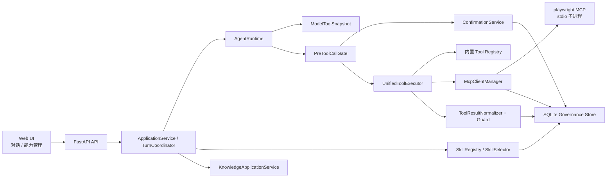
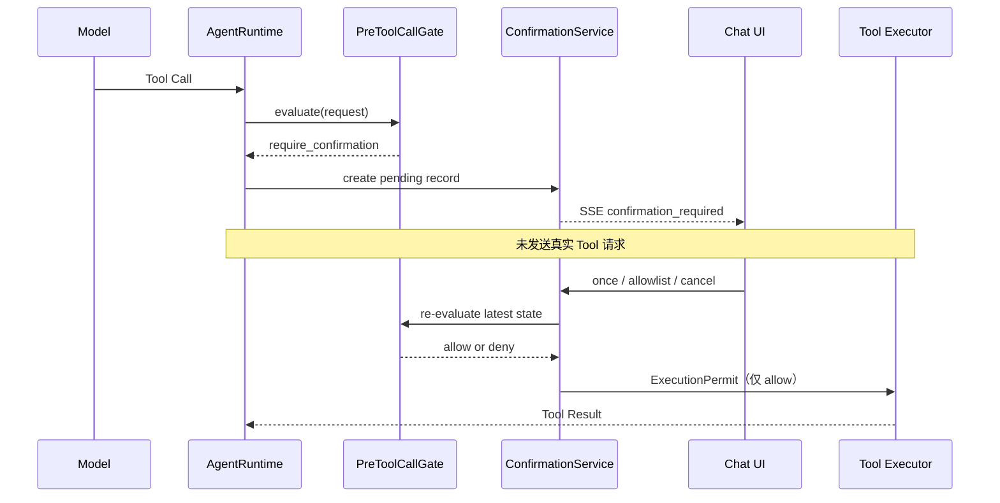

# Starter Agent 求职调研外部能力设计

## 文档状态

- 输入：已确认的 `docs/job-research-requirements.md`
- 输出范围：工程设计，不包含实施任务计划或代码修改
- 设计基线：当前仓库 `main` 分支现状

## 需求理解与设计目标

本设计把求职调研拆成四类能力，并确保所有外部调用都经过同一治理链路：

1. 现有 `search_jobs_serpapi` 搜索岗位摘要和公开来源 URL。
2. 新增 MCP Host，通过 Playwright MCP 读取公开岗位详情页。
3. 将现有知识库检索服务包装成明确的简历证据检索 Tool。
4. 新增 `job-research` Skill，编排搜索、浏览、提取、RAG、引用和 JD 确认入库。

核心目标不是“让模型知道有浏览器”，而是建立可连接、可发现、可审查、可启停、可追踪、可降级的外部能力平台。关闭或未审查的能力不得进入模型 callable tools；浏览器调用必须在真实 MCP 请求发出前通过统一 `PreToolCallGate`。

### 仓库现状确认

| 领域 | 当前实现 | 本设计结论 |
|---|---|---|
| 配置加载 | `load_settings()` 从 `config/config.yaml` 加载 YAML，支持 `STARTER_AGENT_CONFIG` 覆盖 | 增加 MCP 配置路径设置，并单独加载 JSON；不改变 Server 配置为 YAML |
| Tool Registry | `ToolRegistry` 在 `create_application()` 中一次性构建，只包含内置 Python Tool | 改为内置 Tool 与动态 MCP Tool 的统一只读快照视图 |
| Tool Schema 暴露 | `AgentRuntime` 每次模型调用直接读取 `self.tools.schemas()` | 改为每轮模型请求原子读取最新 `ModelToolSnapshot` |
| Tool 权限 | `ToolPolicy` 只按 `read/write/external/dangerous` 风险等级检查 | 新增统一 Gate；旧策略作为 Gate 的一个输入，不再单独决定执行 |
| 健康检查 | `/health` 只返回应用存活；Provider 有独立 health；Tool/MCP 无 health | 增加 MCP Server 级状态、协议 Ping、能力刷新和详情 API |
| 日志 | `structlog` JSON 日志写 stderr 和文件，并按字段名脱敏 | 复用日志设施，增加 MCP、Gate、确认和快照事件；不记录正文或凭证 |
| Tool Result | `ToolResultGuard` 按 Token 预算裁剪，超长内容可保存 `tool_artifacts` | 扩展为 MCP 结果标准化、脱敏、来源保留、完整裁剪元数据 |
| 前端 | 单文件 `src/web/index.html`，用 `showPrimaryView()` 切换“对话/知识库”；`/v1/tools` 展示内置工具 | 新增第三个“能力管理”主视图及两个页签；所有状态从后端读取 |
| SerpAPI | Tool Name 为 `search_jobs_serpapi` | 直接复用，不重命名 |
| SerpAPI Schema | `query` 必填字符串 2–300；`location` 可选字符串最长 100；`limit` 可选整数 1–10，默认 5；禁止额外字段 | Skill 按真实 Schema 调用 |
| RAG | 存在 `POST /v1/knowledge-bases/{id}/retrieve`，请求含 `question/top_k/document_ids/document_types/filenames/versions`；不存在模型 callable RAG Tool | 明确为待新增依赖：`retrieve_resume_evidence` 适配器 Tool |
| Skills | 仓库没有 `skills/`、`SKILL.md`、Skill Registry、解析器或触发机制 | 明确为待新增子系统，不假设已有实现 |
| 能力目录 | `docs/capability_catalog.md` 不存在 | 实施阶段新增，作为经审查能力的人类可读镜像，不作为运行时权限源 |

## 技术选型

### MCP Client

采用官方 Python MCP SDK 的 `StdioServerParameters`、`stdio_client` 和 `ClientSession`。连接流程使用 SDK 完成 `initialize`、Ping、`list_tools`、`list_resources`、`list_prompts` 与 `call_tool`，不手写 JSON-RPC、stdio 帧协议或 MCP 版本协商。

备选方案及取舍：

- **官方 Python MCP SDK（采用）**：与现有 Python/asyncio/FastAPI 链路一致，生命周期和协议演进由 SDK承担。
- 自行实现 JSON-RPC：控制更细，但容易错误处理 framing、取消、版本协商和通知，不采用。
- Node sidecar MCP Host：会引入第二套常驻服务、部署和鉴权边界，当前规模不需要。

当前 `pyproject.toml` 尚未依赖 `mcp`。实施时增加官方 SDK，并在锁文件中固定已通过真实 Playwright 验证的版本范围。

### 进程与生命周期

- stdio 子进程由 MCP SDK创建和管理；Starter Agent 不自行拼装 stdin/stdout 协议。
- FastAPI `_api_lifespan` 启动阶段创建 `McpClientManager`，关闭阶段先停止接收新调用、等待在途调用，再关闭所有 Session 和子进程。
- 每个 Server 拥有独立 Client、Session、锁、超时、stderr 缓冲和状态；禁止使用一个全局 Session 承载所有 Server。
- SQLite 保存治理状态、快照、确认和审计；进程对象、SDK Session、锁和 Future 只保存在内存。

### Schema 与权限

- 使用成熟 JSON Schema 校验库按服务器返回的真实 Input Schema 校验参数，不用 Pydantic 猜测任意 MCP Schema。
- 运行时权限真相源为 SQLite 治理表与当前不可变能力快照。
- `docs/capability_catalog.md` 是可审查、可提交的文档镜像，不参与实时授权。

### 认证与授权

当前应用没有用户认证。第一阶段保持本地单用户模式，仅允许 loopback 访问管理 API，并把本地操作者视为 `admin`。若未来允许非 loopback 部署，必须先接入标准 OIDC/OAuth SDK（例如成熟的 Starlette/Authlib 集成）并从可信身份映射 `viewer/operator/admin`，不得自行解析或验证 Token。

## 总体架构设计



### 调用边界

所有入口——模型自主 Tool Call、用户明确指定 Tool、Skill 编排、管理页测试——都只能向 `UnifiedToolExecutor.request_call()` 提交请求。该入口必须调用 `PreToolCallGate`。`McpClientManager.call_tool()` 是内部接口，只接受 Gate 生成的短期、不可伪造的 `ExecutionPermit`；MCP Client、Skill 和前端均不能直接调用它。

## 模块/组件设计

### 1. MCP 配置加载

在现有主 YAML 中新增非敏感入口配置：

```yaml
mcp:
  config_path: config/mcp.json
  initialize_timeout_seconds: 20
  health_timeout_seconds: 5
  call_timeout_seconds: 35
  shutdown_timeout_seconds: 10
  confirmation_timeout_seconds: 300
```

新增独立 `config/mcp.json`，内容固定兼容：

```json
{
  "mcpServers": {
    "playwright": {
      "command": "npx",
      "args": [
        "@playwright/mcp@latest"
      ]
    }
  }
}
```

设计规则：

- `McpConfigLoader` 使用项目根目录解析相对路径，禁止路径逃逸。
- JSON 模型首期支持 `command`、`args`、可选 `cwd` 和环境变量名白名单；不接受内联 Secret。
- Server 定义配置版本是规范化 JSON 的 SHA-256。
- 首次发现的新 Server 默认启用并尝试连接，以完成真实能力发现；其 Tool 默认全部为“未审查、未启用、未 allowlist”，因此不会进入模型 Context。
- 运行时 Server/Tool 启停与策略覆盖保存在 SQLite，不回写 Server JSON。
- 配置文件变化只有在显式“重新检查/刷新”时生效，不在调用中途热替换。

### 2. McpClientManager 与独立连接

`McpClientManager` 持有 `dict[server_id, ServerHandle]`。每个 `ServerHandle` 包含：

- `ClientSession` 与 stdio transport 上下文。
- 子进程 PID（SDK可观察时）、启动时间、退出码和最近 stderr 安全摘要。
- `connection_state`、`health_state`、`operation_state`。
- 初始化结果中的协议版本和 `serverInfo.name/version`。
- 当前不可变 `CapabilitySnapshot`。
- `connect_lock`、`refresh_lock`、在途调用计数与 drain 事件。
- 初始化、健康、调用和关闭超时。

连接顺序：

1. 校验 Server 已配置且启用。
2. 检查 `node` 和 `npx` 可执行文件是否可解析；只记录路径摘要和版本，不记录环境变量值。
3. 通过 SDK 以 `command=npx`、`args=["@playwright/mcp@latest"]` 建立 stdio。
4. 分离 stdout（协议）与 stderr（诊断）。stderr 绝不送入 JSON-RPC 解码器。
5. 在初始化超时内执行 `session.initialize()`。
6. 从 Initialize Result 记录协议版本和 `serverInfo.version`，该值作为运行时实际解析版本。若 Server 不报告版本，则明确记为 `unknown`，不得以配置中的 `@latest` 冒充实际版本。
7. 分页发现 Tools、Resources、Resource Templates 和 Prompts，计算 Schema 指纹。
8. 发布新能力快照，状态进入 `ready`；任何步骤失败都关闭候选 Session 和子进程。

健康检查使用 MCP 协议 Ping，不调用业务 Tool。关闭时先将 Server 标记为 `draining`，拒绝新调用，在超时内等待在途调用结束，再关闭 Session/transport；超时后取消剩余调用并记录退出码。Starter Agent 异常退出后的孤儿进程依赖 SDK 进程上下文和操作系统句柄关闭回收，启动时不按进程名误杀其他实例。

### 3. Server 级刷新

刷新状态机：

```text
idle → validating_config → starting_candidate → initializing
     → discovering → validating_snapshot → swapping → ready
任一步失败 → rollback_to_previous → degraded
```

刷新只锁定目标 Server：

- 同一 Server 并发刷新返回 `409 refresh_in_progress`，不排队重复刷新。
- 为目标 Server 建立候选 Client，不先关闭当前 Client。
- 当前 Client 和快照继续服务已开始调用；其他 Server 完全不受影响。
- 候选 Client 完成初始化、发现和 Schema 校验后，使用一次原子交换发布新 Client/快照/Context revision。
- 交换前开始的调用继续绑定旧 `snapshot_id`；交换后新调用只使用新快照。
- 旧 Client 进入 drain，完成后关闭。
- 刷新失败不替换当前 Client；上一份快照保留并标记 `stale=true`，记录错误和失败时间。
- 若 Schema 指纹变化，对应 Tool 自动退出自动执行 allowlist，状态改为 `review_required`；旧确认和 `confirm_once` Permit 全部失效。

### 4. 能力发现、Registry 与目录

`CapabilityDiscoveryService` 对每种能力保存原始协议字段与规范化字段：

- Tool：upstream name、title、description、input schema、annotations、schema hash。
- Resource/Template：URI、name、description、MIME、模板参数。
- Prompt：name、description、arguments。

内部主键为 `(server_id, upstream_name, snapshot_id)`。为避免与内置 Tool 重名，模型侧名称使用稳定别名 `mcp__{server_id}__{upstream_name}`，同时保留真实 upstream name 用于 MCP 调用和 UI 展示。

`UnifiedToolRegistry` 提供两个严格分离的视图：

- `LightweightCapabilityCatalog`：名称、所属 Server、类型、启用状态、审查状态；可包含关闭项，不含完整描述和 Schema。
- `ModelToolSnapshot`：仅包含 Server 已连接且启用、Tool 已启用且通过暴露审查的完整 Name/Description/Input Schema。

每次状态变更生成递增 `context_revision` 并原子替换快照引用。`AgentRuntime` 在每次 `provider.complete()` 前读取一次最新快照，并把 revision 写入 Trace。关闭 Tool 后的下一轮请求不能复用旧 schemas 缓存。

实施阶段新增 `docs/capability_catalog.md`。每个经审查 Tool 记录 Server、真实名称、模型别名、Schema hash、描述摘要、风险、外发数据类型、默认策略、审查时间和运行时版本。文档由经过脱敏的 Registry 导出结果生成并接受版本审查；运行时绝不从该 Markdown 读取授权。

### 5. Tool 风险与最小 Browser 集合

启动发现时不硬编码或自动批准任何 Playwright Tool。管理员必须查看该运行时版本的真实 Schema，再将满足下列能力意图的 Tool 逐个启用：

| 能力意图 | 默认风险 | 默认决策 |
|---|---|---|
| 读取页面/无障碍快照、等待只读内容 | `read` | 审查后可 `allowlist_auto` |
| 导航到公开 HTTP(S) URL、创建只读标签页 | `external` | 审查后可 `allowlist_auto`，仍检查 URL |
| 点击 | `external` | 默认 `always_confirm`；只有已证明不提交数据的精确动作范围才可自动 |
| 文本输入、键盘操作 | `write` | `always_confirm`；登录、申请、消息场景直接 `deny` |
| 上传文件 | `dangerous` | `deny` |
| 登录、提交表单、发送消息、投递 | `dangerous` | `deny` |
| 任意脚本执行、存储写入、下载 | `dangerous` | `always_confirm`，若涉及禁用场景则 `deny` |

Playwright MCP 常见工具名只能作为管理页候选提示，真实 allowlist 必须绑定运行时发现的 upstream name 与 schema hash。默认推荐配置只包含“导航、页面快照、必要等待”三个能力意图；点击展开 JD 仍先确认，直到对具体 Tool、动作和参数范围完成审查。

### 6. PreToolCallGate

Gate 输入 `ToolCallRequest`：principal、session/turn/call id、source（model/skill/user/admin）、server、tool、arguments、snapshot id、待外发数据分类和当前页面来源。

Gate 依次执行：

1. Server/Tool 存在、连接、健康、启用和快照一致性。
2. Tool 已通过暴露审查；管理测试例外只能走人工确认且不能改变暴露状态。
3. 使用当前 Schema 校验参数，拒绝额外或类型错误字段。
4. URL/资源范围检查：首期允许 HTTP(S) 域名通配，但仍拒绝 URL 凭证、非公开页面意图和禁止协议；公网 JD 约束优先。
5. 权限角色和 Tool 风险等级检查。
6. 外发数据分类检查：Cookie、Token、密码、授权码禁止；简历原文只允许发送给本地 RAG，不允许发送给 Browser。
7. 禁止动作、强制确认、allowlist 和单次确认规则计算。
8. 预算、超时、重复调用和并发限制。

权限优先级固定为：

```text
deny / disabled
  > always_confirm
  > allowlist_auto
  > confirm_once
  > require_confirmation（默认）
```

`confirm_once` 是与 user/session/turn/call/tool/schema hash/参数 hash/数据范围绑定的一次性 Permit，不是长期规则。Gate 返回：

- `allow`：包含短期 `ExecutionPermit`。
- `require_confirmation`：包含风险与外发摘要，不包含可执行 Permit。
- `deny`：包含稳定错误码和可安全展示的原因。

### 7. Allowlist 与强制确认

allowlist 主键至少包含 Server 和 Tool；可选范围包含 schemes、domains、actions、参数约束、数据分类、schema hash 和有效期。需求确认的初始网络范围为 `http/https + domains=*`，但 Tool 仍需逐个加入。

扩大 allowlist、启用写 Tool、连接/断开 Server、重新加载外部 Skill 或 MCP 定义均是管理操作，必须显示变更前后差异、风险、影响范围和在途调用数。确认后才执行并写审计。可撤销方式：删除/禁用 allowlist rule、禁用 Tool/Server、回滚到上一能力快照；审计记录不可撤销。

强制确认规则不可通过“执行并加入白名单”覆盖。确认卡在此情况下不显示可生效的持久放行选项，或将其禁用并解释原因。

### 8. 聊天内确认与可恢复暂停



- `AgentRuntime` 由 `TurnCoordinator` 暂停在 Tool Call 处，不占用线程；流式聊天发送 `confirmation_required` 事件。
- UI 对当前 turn 禁用重复发送，展示 Server、Tool、参数摘要、风险、数据去向、过期时间和三个决定。
- 三个决定的用户界面文案固定为「仅本次执行」「执行并加入白名单」「取消」；强制确认动作不得通过第二项绕过，后端应将该选项禁用并解释原因。
- Pending 记录先写 SQLite，再通知 UI；页面刷新后通过 Pending API 恢复卡片。
- `ConfirmationBroker` 使用内存 Future 唤醒当前进程中的 Turn；服务重启后旧 Pending 标记为 `expired`，不会自动执行。
- 决定接口要求 idempotency key，并以条件更新完成 `pending → approved/cancelled/expired`，重复点击只返回第一次结果。
- 用户确认后必须重新运行 Gate；Server/Tool/Schema/参数/策略变化会使确认失效。
- 超时、取消、连接中断或并发冲突均不调用 Tool。

### 9. MCP Tool Adapter 与 Result 治理

`McpToolAdapter` 把 MCP `CallToolResult` 转换为现有 `ToolResult` envelope。处理顺序：

1. 校验返回 content block 类型和 Server 错误标志。
2. 标记 `is_untrusted_external_content=true`。
3. 删除 Cookie、Token、Authorization、密码、表单值等敏感字段；日志只保存摘要。
4. 记录 requested URL、可验证的 final/source URL、server、tool、snapshot id、schema hash、call id 和时间。
5. 计算原始字节数、字符数、Token 数和 SHA-256。
6. 保存受限、脱敏的原始 Artifact；模型只得到经过 `ToolResultGuard` 的内容。
7. 超限时设置 `is_truncated`、`truncation_reason`、`raw_source_ref`、`original/returned/omitted` 计数和继续读取提示。

沿用现有 `context.per_tool_result_tokens` 和 `all_tool_results_tokens`，并增加 MCP 原始响应硬上限。来源 URL、裁剪标记、hash 和 `raw_source_ref` 属于不可裁掉的元数据。若 Tool Result 无法证明最终来源 URL，JD 状态只能是 `source_unverified`，不能入库。

### 10. Skill Registry 与 `job-research`

当前项目没有 Skill 系统。新增 `skills/` 目录、`SkillRegistry`、`SkillParser`、`SkillSelector` 和不可变 `SkillSnapshot`。Skill 文件采用带 YAML frontmatter 的 Markdown，至少包含 name、description、version、source、tool dependencies、MCP dependencies、trigger examples、negative examples、validation 和 failure policy。

启用状态与最后一次成功加载快照保存在 SQLite。重新加载先解析候选文件，验证通过后原子交换；失败保留旧快照并标记 stale。Skill 只能向 `UnifiedToolExecutor` 请求调用，不能持有 MCP Client。

`job-research` 设计契约：

- **触发**：用户明确要求搜索岗位、读取/分析公开 JD、比较 JD 与简历；仅询问通用求职建议或只改写已有文本时不触发浏览流程。
- **输入**：query、可选 location、limit、当前 knowledge base 上下文、可选用户选定 URL。
- **依赖**：`search_jobs_serpapi`、经审查的 Playwright MCP 最小 Tool、待新增 `retrieve_resume_evidence`、知识库 JD 入库服务。
- **步骤**：搜索 → 展示并选择 URL → Browser 读取 → 验证完整 JD → 提取职责/要求及引用 → RAG 取回简历证据 → 生成逐项匹配分析 → 用户确认后入库。
- **验证**：必须有最终来源 URL；标题/公司/地点和正文可定位；职责、必备要求至少一项；裁剪后未恢复完整内容则标记不完整；每条简历匹配结论必须有证据引用。
- **失败**：SerpAPI 不可用则停止搜索；MCP 不可用可展示搜索摘要但标记未读全文；RAG 不可用则只返回已验证 JD；页面拒绝、登录墙或内容不完整时不绕过、不入库。
- **输出**：岗位元数据、来源 URL/读取时间、职责与要求、匹配矩阵、简历引用、缺口、限制、Tool Trace、JD 入库状态。

### 11. RAG Tool 依赖

仓库当前不存在模型 callable 的 RAG Tool。设计新增 proposed Tool `retrieve_resume_evidence`，名称和 Schema 在实现前仍需测试确认：

```json
{
  "type": "object",
  "properties": {
    "query": {"type": "string", "minLength": 1, "maxLength": 10000},
    "top_k": {"type": "integer", "minimum": 1, "maximum": 20, "default": 6}
  },
  "required": ["query"],
  "additionalProperties": false
}
```

knowledge base、user 和 project scope 从 `ToolContext` 注入，模型不能指定其他用户作用域。适配器固定筛选 `document_type=resume`，调用现有 `KnowledgeApplicationService.retrieve()`，再解析 Chunk 形成连续原文引用。输出包含 `chunk_id/document_id/filename/version/section/start_line/end_line/quote/source_ref/rank`。该 Tool 未实现前，`job-research` Skill 状态必须显示 `dependency_unavailable`，不得退回 `read_resume` 并声称已使用 RAG。

### 12. JD 提取与确认入库

`JobDescriptionNormalizer` 从一个或多个有来源的 Browser snapshot 中构建：title、company、location、responsibilities、requirements、source_url、retrieved_at、completeness 和字段级 source refs。模型可以辅助结构化，但验证器必须检查每个字段可回溯到 Tool Artifact；外部页面文本永远作为数据而非指令。

只有 `complete + source_verified` 的 JD 才创建独立的 `knowledge_ingest` 确认。确认后复用现有 `KnowledgeApplicationService.upload()`，生成 Markdown，`document_type=job_description`，保留 URL、读取时间和内容 hash。重复 URL/hash 返回冲突提示，用户选择更新版本或取消；不得静默复制。入库确认与 Tool allowlist 确认是不同类型，互不替代。

## 数据模型

运行时可变状态保存到现有 SQLite 数据库，建议新增以下表：

| 模型 | 关键字段 |
|---|---|
| `mcp_servers` | id、name、config_source、config_hash、enabled、connection_state、health_state、operation_state、protocol_version、runtime_name/version、transport、pid、exit_code、last_error、last_checked_at、revision |
| `mcp_capability_snapshots` | id、server_id、version、schema_hash、discovered_at、stale、active、tool/resource/prompt counts、error |
| `mcp_tools` | snapshot_id、server_id、upstream_name、model_alias、title、description、input_schema_json、schema_hash、risk_level、outbound_scope、enabled、review_state |
| `mcp_resources` / `mcp_prompts` | snapshot_id、server_id、name/uri、description、schema/arguments、enabled |
| `tool_policy_rules` | id、server_id、tool_name、effect、schemes、domains、actions、parameter_constraints、data_classes、schema_hash、expires_at、enabled、created_by、revision |
| `tool_confirmations` | id、principal、session_id、turn_id、call_id、request_hash、server/tool/schema hash、arguments_summary、risk、destination、decision、status、expires_at、idempotency_key、decided_at |
| `execution_permits` | id、confirmation_id、request_hash、policy_revision、expires_at、consumed_at；仅存 hash，不存可重放 Secret |
| `skill_records` | name、source_path、version、updated_at、enabled、load_state、snapshot_hash、dependencies、last_error、revision |
| `capability_audit_events` | event_id、actor、action、target、before_hash、after_hash、decision、reason_code、session/turn/call、created_at |
| `tool_artifacts` 扩展 | server_id、snapshot_id、schema_hash、requested_url、source_url、content_hash、raw/kept sizes、is_truncated、redaction summary |

状态更新使用 revision/optimistic concurrency，避免两个管理页面互相覆盖。Description 和 Schema 只存在受控 Registry/API 响应中，不进入轻量模型目录。

## API / 服务接口设计

以下均为待新增 API；当前仓库不存在这些路由。

### MCP Servers

| Method | Path | 用途 |
|---|---|---|
| GET | `/v1/capabilities/mcp-servers` | Server 列表及摘要状态 |
| GET | `/v1/capabilities/mcp-servers/{server_id}` | Server、版本、transport、能力计数、错误详情 |
| POST | `/v1/capabilities/mcp-servers/{server_id}/connect` | 经确认连接并发现能力 |
| POST | `/v1/capabilities/mcp-servers/{server_id}/disconnect` | 经确认 drain/断开 |
| POST | `/v1/capabilities/mcp-servers/{server_id}/health-check` | 协议 Ping，不调用 Tool |
| POST | `/v1/capabilities/mcp-servers/{server_id}/refresh` | 单 Server 候选刷新 |
| PATCH | `/v1/capabilities/mcp-servers/{server_id}` | 启用/禁用，要求 revision |
| GET | `/v1/capabilities/mcp-servers/{server_id}/tools/{tool_name}` | 管理员查看真实 Schema 和审查状态 |
| PATCH | `/v1/capabilities/mcp-servers/{server_id}/tools/{tool_name}` | 启停、审查状态和风险分类 |
| GET/POST/DELETE | `/v1/capabilities/tool-policy-rules` | 查询、新增、撤销 allowlist/confirm/deny 规则 |

### Skills

| Method | Path | 用途 |
|---|---|---|
| GET | `/v1/capabilities/skills` | Skill 列表、启用与依赖状态 |
| GET | `/v1/capabilities/skills/{name}` | 详情、触发/不触发示例、验证与失败策略 |
| GET | `/v1/capabilities/skills/{name}/source` | 管理员查看脱敏后的原始定义 |
| POST | `/v1/capabilities/skills/{name}/reload` | 经确认候选解析并原子重载 |
| PATCH | `/v1/capabilities/skills/{name}` | 启用/禁用，要求 revision |

### 确认、Trace 与 Context

| Method | Path | 用途 |
|---|---|---|
| GET | `/v1/tool-confirmations?session_id=...&status=pending` | 页面刷新后恢复待确认卡 |
| POST | `/v1/tool-confirmations/{id}/decision` | once、allowlist、cancel；带 idempotency key |
| GET | `/v1/turns/{turn_id}/tool-trace` | 查看 Gate、真实调用、裁剪和来源 |
| GET | `/v1/debug/model-tool-snapshots/{revision}` | 管理员查看本轮实际 callable tool 名称与 schema hash |

所有变更接口先做身份/角色、CSRF/同源、revision 和 Gate/管理策略校验。API 返回 `operation_id`、最新 revision 和真实后端状态。前端不得在请求成功前乐观标记最终成功；失败后重新 GET 权威状态。

## 状态流转与交互流程

### Server 状态

```text
disabled
  ↕ enable/disable
disconnected → connecting → initializing → discovering → ready
      ↑             │            │             │         │
      └──────────── failure → unhealthy/degraded ← health failure
ready → draining → disconnected
```

`connection_state` 与 `health_state` 分开：已连接但 Ping 失败是 `connected + unhealthy`；刷新失败但旧 Client 仍可服务是 `connected + degraded + snapshot_stale`。

### 求职调研主流程

```text
collecting_query
→ searching_jobs
→ awaiting_url_selection
→ reading_jd
→ validating_jd
→ retrieving_resume_evidence
→ generating_match_analysis
→ awaiting_jd_ingest_confirmation
→ ingested | completed_without_ingest
```

任一外部依赖失败进入可解释降级状态，输出已完成步骤、真实来源和缺失能力，不跳过验证伪造后续结果。

### UI 路由与布局

当前前端无路由库。设计新增 hash 路由，不引入虚构现有页面：

- `#/chat`
- `#/knowledge`
- `#/capabilities/mcp-servers`
- `#/capabilities/skills`

主导航增加“能力管理”，扩展现有 `showPrimaryView()`。能力管理页顶部为标题、最后刷新时间和全局错误条；下方是 `MCP Servers` / `Skills` 页签。

桌面布局采用左侧列表、右侧详情：

- Server 列表项：名称、启用、连接、健康、过期标记、最近错误摘要。
- Server 详情：来源/版本/transport、操作按钮、Tools/Resources/Prompts 子页、Tool Schema 抽屉、allowlist/域名范围、错误与审计时间线。
- Skill 列表项：名称、版本、启用、依赖健康。
- Skill 详情：描述、来源、文件、更新时间、依赖、触发/不触发示例、验证、失败策略、原始定义。

窄屏下改为列表 → 详情单列钻取，操作区固定底部但不遮挡确认提示。空状态区分“未配置 Server”“已配置但未连接”“已连接但未发现能力”“无 Skill”。加载使用 skeleton/禁用操作；错误保留上次真实数据并标记 stale；操作中显示 operation id 和阶段。任何失败都重新读取后端，禁止残留虚假成功开关。

## 错误处理

### 稳定错误映射

| 阶段 | 错误码示例 | 状态/处理 |
|---|---|---|
| 配置 | `mcp_config_missing/invalid` | Server 不启动，显示文件与非敏感字段错误 |
| 环境 | `node_not_found`、`npx_not_found` | blocked；提示安装/修复 PATH 后重新连接 |
| 包解析 | `mcp_package_resolution_failed` | 保存 npx stderr 脱敏摘要；允许重试 |
| 进程 | `mcp_process_start_failed/exited` | unhealthy；记录退出码和 stderr tail |
| 初始化 | `mcp_initialize_timeout/protocol_error` | 关闭候选进程；保留旧快照 |
| 发现 | `mcp_discovery_failed/schema_invalid` | 不发布候选快照；旧快照 stale |
| 浏览器 | `browser_dependency_missing/launch_failed` | Server degraded；诊断浏览器安装依赖 |
| Gate | `tool_disabled/not_reviewed/schema_mismatch/scope_denied/confirmation_required` | 无真实调用；返回对应决策 |
| 页面 | `page_denied/login_required/robots_disallowed/timeout` | 不绕过；JD 未验证、不得入库 |
| 结果 | `tool_result_too_large/source_unverified` | 裁剪并保留 trace；必要时分段读取 |
| RAG | `resume_evidence_unavailable/no_evidence` | 返回 JD，跳过或拒绝匹配结论 |

### 诊断闭环

每个 Server 详情展示按顺序的诊断步骤：

1. Node.js 是否可解析及版本。
2. npx 是否可解析及版本。
3. `@playwright/mcp@latest` 包解析/缓存结果与 stderr。
4. 子进程是否启动、PID、退出码。
5. JSON-RPC/MCP 初始化、协议和 `serverInfo.version`。
6. Tools/Resources/Prompts 发现数量和 Schema 校验。
7. Browser 依赖与首次无副作用启动检查。
8. 经审查 Tool 的 Schema/allowlist/Context 暴露状态。
9. Gate 决策、真实 Tool 调用与耗时。
10. Tool Result、裁剪、来源 URL 和 Artifact 引用。

每一步都保存 `not_started/running/passed/failed`、时间、稳定错误码和安全摘要。“重试”只重跑失败步骤所需的最小上游链路；配置或包修复后执行目标 Server refresh，不刷新其他 Server。不得用 Mock 成功覆盖真实失败。

## 性能与安全考虑

- 每个 Server 独立连接与锁，慢 Server 不持有全局锁。
- 能力列表使用不可变快照和原子指针，模型请求无需在数据库长事务中等待。
- 单 Server 限制并发 Tool Call；Playwright 默认串行化会修改同一页面状态的调用。
- 初始化、健康、Tool Call、确认和关闭分别超时。
- 浏览器使用隔离、非登录 Profile，不加载用户 Cookie 或存储状态；不连接已有浏览器扩展/Profile。
- `@latest` 仅为需求指定的接入形式；必须记录 `serverInfo.version` 和 Schema hash，验收后建议通过配置评审固定版本。
- 初始 domain 为 HTTP(S) 通配不等于信任所有页面。拒绝 URL 凭证、登录/提交意图和非 HTTP(S)；私网、localhost、链路本地和云元数据地址默认拒绝自动执行。
- 重定向后的最终 URL 必须进入 Trace。若 MCP 版本无法提供足够的重定向/网络约束，标记为安全风险，不允许把“仅检查初始 URL”视为完整 SSRF 防护。
- 页面内容是 prompt injection 风险源，始终标记为不可信数据；Skill 和系统提示禁止执行网页指令。
- stdout 只用于协议；stderr 脱敏、限长、环形缓冲。日志不保存 Schema 全文、简历全文、Cookie 或 Token。
- `ToolResultGuard` 不能由前端开关绕过安全脱敏；现有“工具治理”开关只能影响展示型 Token 裁剪策略，安全校验始终开启。

## 测试策略

### 单元测试

- 独立 JSON 配置解析、路径解析、配置 hash 和 Secret 拒绝。
- Server/Tool 启停状态与 Context 轻量目录/完整 Schema 分离。
- `ModelToolSnapshot` 原子 revision 更新；关闭 Tool 后完整 Schema 消失。
- Schema 参数校验、额外字段拒绝和 schema hash 漂移。
- 权限优先级：deny/disabled、always_confirm、allowlist_auto、confirm_once。
- 自动执行、仅本次确认、加入 allowlist、强制确认、取消、超时和重复提交。
- Tool Result 脱敏、Token/字符裁剪、来源 URL 与 raw_source_ref 不丢失。
- Skill 触发/不触发、依赖缺失、候选重载失败保留旧快照。
- 刷新状态机、同 Server 并发刷新冲突和不同 Server 隔离。

### 集成测试

- 使用受控测试 MCP Server 验证 SDK 生命周期、初始化、发现、Ping、调用、退出和 stderr；这只用于协议测试，不替代 Playwright 验收。
- 验证候选刷新成功原子交换，失败回滚并标记旧快照 stale。
- 验证运行中调用绑定旧快照，新调用绑定新快照。
- 验证 `AgentRuntime` 的所有执行路径都经过 Gate，直接调用 Client 无 Permit 被拒绝。
- 验证确认前 MCP Server 没有收到调用；取消/超时/重复提交无调用。
- 验证 RAG wrapper 只检索当前作用域的 `resume` 文档并返回可定位 quote。
- 验证管理 API revision 冲突、权限拒绝、真实失败回滚与页面重新读取。

### 真实模型 Context 验证

- 使用可捕获实际 Provider 请求体的 Trace，在 Tool 启用时保存 callable tool 名称和 schema hash。
- 关闭该 Tool，发起下一轮真实模型请求，证明请求体不含其完整 Name/Description/Input Schema；轻量目录仅有名称和 disabled 状态。
- 重新启用并通过审查后，再发起下一轮请求，证明完整 Schema 恢复且 context revision 变化。
- 不能只检查 UI、Registry 内存或 Mock Provider 声明。

### 真实 Playwright 端到端验收

验收必须运行以下完整路径：

1. Starter Agent 从 `config/mcp.json` 读取 `playwright`。
2. 真实执行 `npx @playwright/mcp@latest`，记录 Node/npx、进程、初始化和实际版本。
3. 发现真实 Tools/Resources/Prompts，并在 UI 展示真实 Schema。
4. 审查并逐个启用最小 Browser Tool，加入必要 allowlist。
5. 通过 SerpAPI 或用户提供的当时有效公开 JD URL。
6. Gate 真实放行导航/读取调用；Trace 中出现 Server、Tool、参数、snapshot 和结果。
7. Playwright 读取真实公开页面，提取岗位名称、公司、地点、职责、必备要求和最终 URL。
8. `retrieve_resume_evidence` 返回真实简历引用，生成带 JD 与简历来源的匹配分析。
9. 用户确认 JD 后真实入库并完成索引。
10. UI 展示 Server 状态、Tool Trace、裁剪状态、来源 URL 和入库结果。

验收人员必须检查真实 Tool Result 与来源 URL，并将其与 UI 和 Trace 中展示的结构化结果对应；模型口述“已经调用”不能作为通过依据。

另保留一条真实 MCP 不可用降级记录。组件测试、Mock MCP、硬编码 Tool 列表、静态页面或模型生成网页内容均不能替代上述验收。

### 安全与失败端到端测试

- 越权 Tool、关闭 Tool、Schema 漂移和禁止域名/动作被 Gate 拒绝，Server 无调用记录。
- 点击/输入/上传/登录/提交按风险矩阵分别确认或拒绝。
- Server 断开、初始化超时、页面拒绝、Browser 启动失败和 RAG 不可用均展示准确降级。
- 超长 JD 产生裁剪标记、Artifact 和可追溯来源；内容不完整时禁止入库。
- Server refresh 不影响第二个测试 Server；旧调用完成、候选失败回滚可观察。

## 风险与待确认事项

1. `@latest` 的实际版本和 Schema 会变化；首次真实验收后应决定是否把配置固定为已验证版本。
2. Playwright MCP 不是安全边界。若其运行时版本无法限制重定向或网络目标，需要额外的网络隔离/代理策略，不能仅依赖 Gate 对初始 URL 的检查。
3. 当前应用无认证；能力管理只能安全地用于 loopback 单用户模式。远程部署前必须选定标准 OIDC Provider 和成熟 SDK。
4. 当前数据库迁移只支持少量手工 additive migration；新增多张治理表前需要确定正式迁移机制。
5. 当前前端是单个大型 HTML 文件；本设计保持现有形态，但能力管理会显著增加复杂度。是否拆分前端模块应在实施计划中评估，不能借此扩大为前端重写。
6. Playwright Tool 名称和 Schema 必须来自真实发现；设计中的能力意图不能转化为硬编码假能力。
7. proposed `retrieve_resume_evidence` 尚未实现，其 Tool Name/Schema 只有在实现和测试后才能成为真实能力目录项。
8. `docs/capability_catalog.md` 尚不存在；需定义生成、审查和防漂移流程，且不能把 Markdown 当成权限数据库。
9. 页面动态加载、iframe、地区限制和无障碍树缺失可能导致 JD 不完整；失败时应停止入库而不是扩大浏览权限。
10. 旧 `search_job_description` 只有在真实 Playwright 端到端覆盖、回归测试和用户单独确认后才能删除。

## 参考资料

- [Model Context Protocol 官方 Python SDK](https://github.com/modelcontextprotocol/python-sdk)
- [官方 stdio Client 示例](https://github.com/modelcontextprotocol/python-sdk/blob/main/examples/snippets/clients/stdio_client.py)
- [Microsoft Playwright MCP](https://github.com/microsoft/playwright-mcp)
